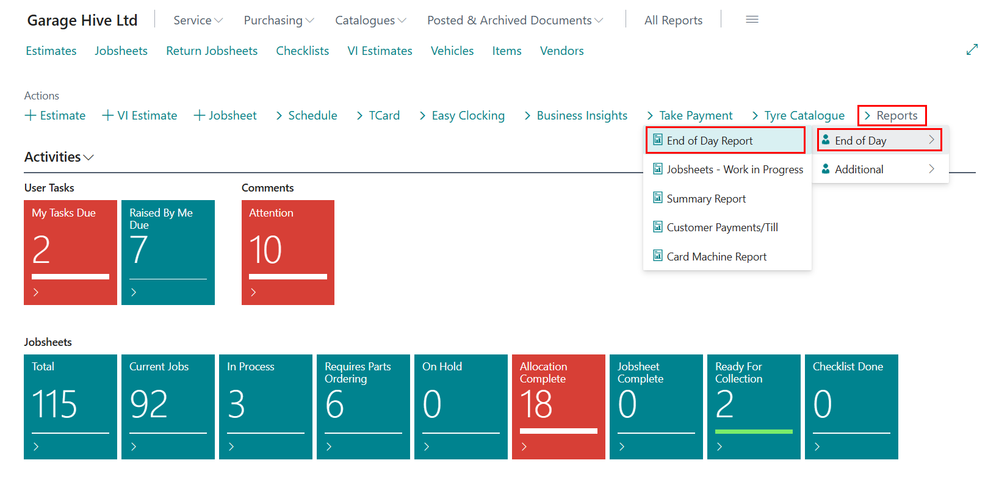

#   Summary Report 

*   In the home screen select Report tab. 

*   Select Summary Report.

*   Complete Location Code/Start and End Dates and Press Print. 

***This has produced your Summary report. This will show several figure for the date range you selected.***

    -  	Labour Sales Total 
    -	Parts/Tyres Sales 
    -	External Service Costs 
    -	Gross Takings 
    -	Costs 
    -	Gross Profit 

***Also shows the following information for each of your technicians.***

    -	Hours Worked 
    -	Labour Hours (Sold) 
    -	Jobs Completed (Invoiced)  
    -	Labour Sales 
    -	Productivity Efficiency %
    -	Recovery Rate 

**Ensure all technicians are clocked off work prior to running this report otherwise some technician's figures may not be accurate.**

