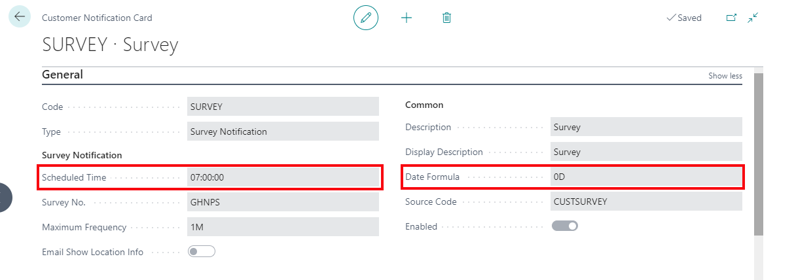
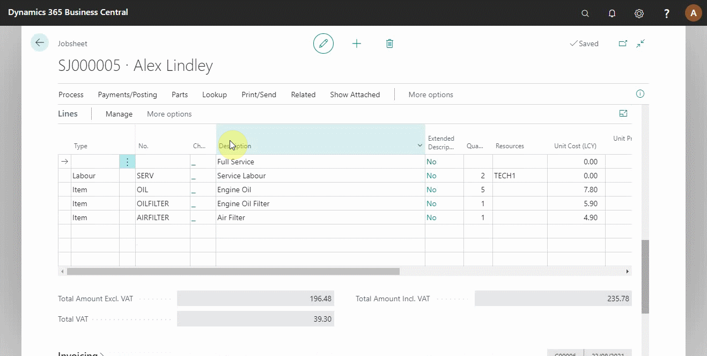
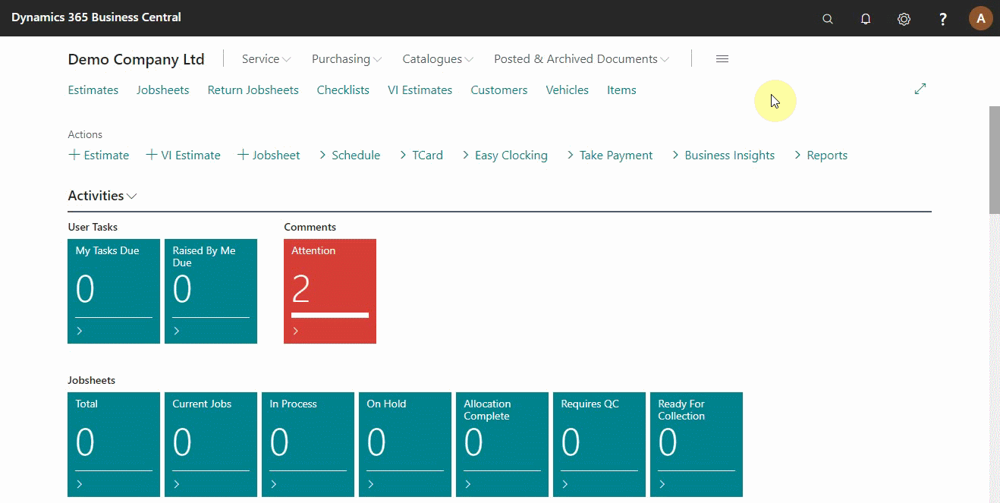
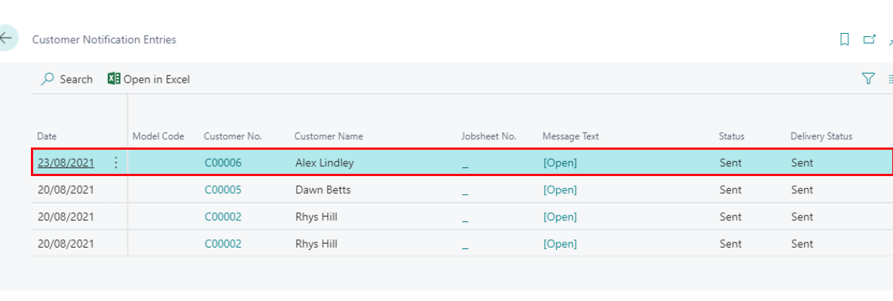

#   Confirming Surveys are Sent

Surveys are sent to customers after posting a jobsheet. There are ways to confirm that the surveys are sent and that the customer has received and filled the survey.

## In this article
1. [Check the survey is on schedule to send](#check-the-survey-is-on-schedule-to-send)
2. [Check the survey has been sent to the customer](#check-the-survey-has-been-sent-to-the-customer)
3. [Check the survey has been opened and submitted by customer](#check-the-survey-has-been-opened-and-submitted-by-customer)

### Check the survey is on schedule to send
After posting a jobsheet, the system checks on the survey settings to send the survey. In this example, the survey we send is scheduled to be sent at 07:00hrs after 0days of jobsheet posting; that means if the invoice is sent today at 11:00hrs, the survey will be sent 07:00hrs tomorrow.

**Process:**
1. Search for **Job Queue Entries** (top-right corner) and Select it from the search results.
2. From the opened list, the time and date the survey is scheduled to send to the customer (in the posted jobsheet) are displayed at the end of the lines.

### Check the survey has been sent to the customer
To check the delivery status of the survey:
1. Search for **Customer Notification Entries** and select it from the search results. 
2. From the opened list, scroll to the right to see the current status of the survey sent.

When the survey is sent, the status changes to **Sent**.

### Check the survey has been opened and submitted by customer
To check if the customer has opened and submitted the survey:
1. Search for **Customer Survey Entries** and select it from the search results.
2. From the opened list, you will see all the surveys that have been sent out with customer details.
3. Scroll to right to see the date and time of opening and answering the survey.

> **Note:**
>
> When the survey is not opened or answered the date and time column will be blank.

