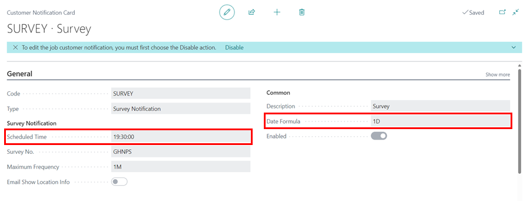
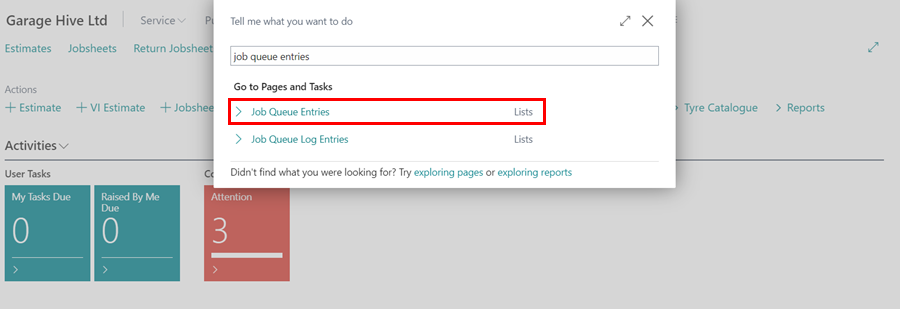
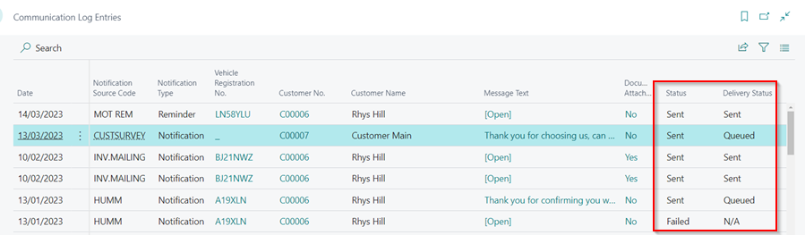

#   Confirming Surveys are Sent

Surveys are sent to customers after posting a Jobsheet. There are ways to confirm that the surveys are sent and that the customer has received and filled the survey.

## In this article
1. [Check the Survey is on Schedule to Send](#check-the-survey-is-on-schedule-to-send)
2. [Check the Survey has Been Sent to the Customer](#check-the-survey-has-been-sent-to-the-customer)
3. [Check the Survey has Been Opened and Submitted by Customer](#check-the-survey-has-been-opened-and-submitted-by-customer)

### Check the Survey is on Schedule to Send
After posting a Jobsheet, the system checks on the survey settings to send the survey. In this example, the survey we send is scheduled to be sent at 19:30hrs after 1 day of Jobsheet posting; that means if the invoice is sent today at 11:00hrs, the survey will be sent 19:30hrs tomorrow.

   

**Process:**
1. In the top right corner, choose the  icon, enter **Job Queue Entries**, and select the related link.

   

2. In the list that opens, the scheduled time and date for sending the **Run Jobsheet Survey** to the customer (for the posted Jobsheet) is displayed at the end of the row.
3. Ensure the **Run Jobsheet Survey** entry has a status of **Ready**.

   

[Go back to top](#top)

### Check the Survey has Been Sent to the Customer
To check the delivery status of the survey:
1. Search for **Communication Log Entries** and select it from the search results.

   

2. From the opened list, scroll to the right to see the current **Status** and **Delivery Status** of the survey sent.

   

3. When the survey is delivered to the customer, the **Delivery Status** changes to **Sent**.

[Go back to top](#top)

### Check the Survey has Been Opened and Submitted by Customer
To check if the customer has opened and submitted the survey:
1. Search for **Customer Survey Entries** and select it from the search results.

   

2. From the opened list, you will see all the surveys that have been sent out with customer details.
3. Scroll to right to see the date and time of opening and answering the survey.



[Go back to top](#top)
