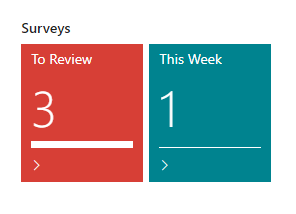
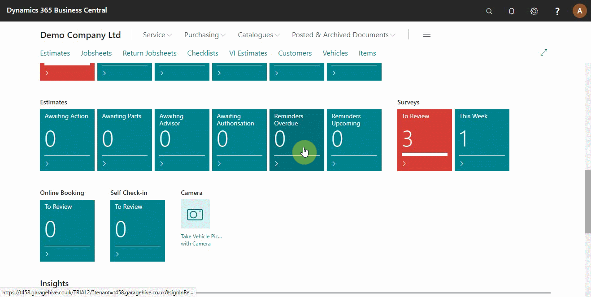
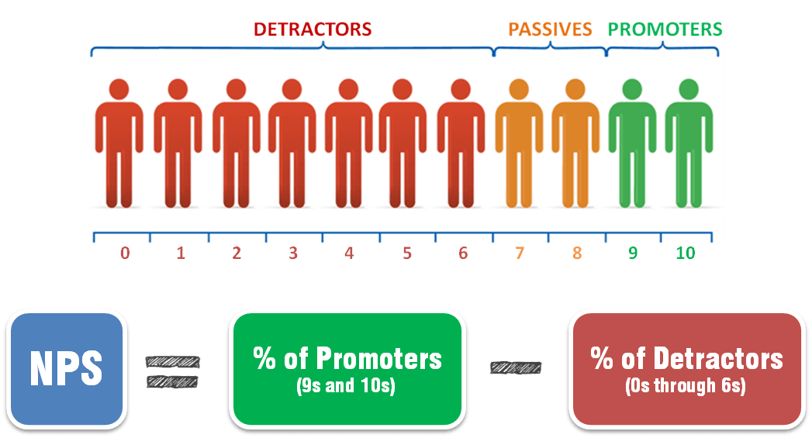
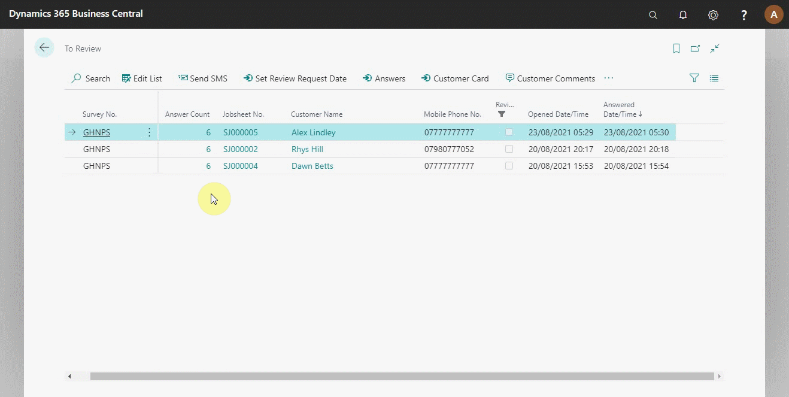

#   Reviewing Your Customer Surveys
All the surveys that the customers have submitted will need reviewing to ensure you are aware of the customer's thoughts about your business. Let us look at how to review the surveys.

## In this article
1. [Checking submitted customer surveys](#checking-submitted-customer-surveys)
2. [Marking submitted customer surveys as reviewed](#marking-submitted-customer-surveys-as-reviewed)
3. [Categorising submitted customer surveys](#categorising-submitted-customer-surveys)

###  Checking submitted customer surveys
After the customers have submitted surveys, they appear on the role centre page in the survey tiles: 
1. Survey tile **To Review** - for all the surveys that the service advisor is yet to review.
2. Survey tile **This Week** - for all the surveys submitted in the current week.

To view the list of surveys to review:
1. Click the tile **To Review**; this opens a list of all surveys submitted and not reviewed.
2. Click on the cells in column **Answers Count** on each survey to view what customers answered and any comments they have added.

Each customer is given an **NPS Group** according to how they answered the NPS question. The NPS groups are categorised as follows:

### Marking submitted customer surveys as reviewed
To mark the surveys as reviewed:
1. Select the survey from the **To Review** page, and then select **Mark as Reviewed** action from the actions bar.

### Categorising submitted customer surveys
To categorise surveys into different groups, depending on the responses given: 
1. Click on the column **Reason Code**.
2. Add a **Category** from the list or add a new one; in this example, we will mark one of the surveys submitted as requiring **Action**, so that there can be a follow-up with the customer.

### See also

[Video: How to review your customer surveys in Garage Hive](https://www.youtube.com/watch?v=UWpPgs-rJJg&t=136s){:target="_blank"}

