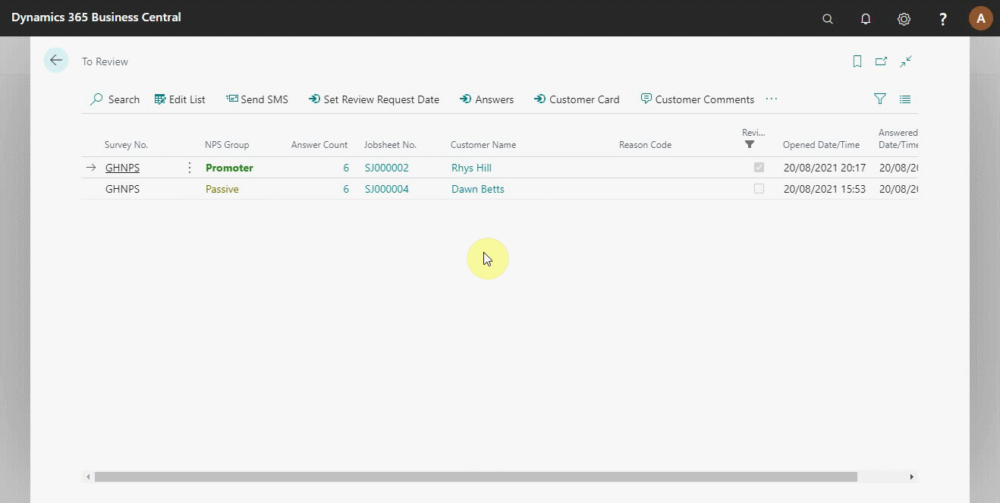

#   Sending Review Requests on Completed Survey Entries
If you want to ask for review requests for your website or google page, you can do that with the customers who have already submitted their surveys. Search **Customer Surveys Entries** (top-right corner), and select it from the search results. A list of all surveys that are submitted is displayed. Select the survey/customer you want to request for a review and click on **Send SMS**, add a message to send, or **Apply Text Template** to choose from the available template (it's recommended you add a text template to make the process faster). After adding a text to send, click on send, and the system will queue the SMS for sending. To ensure that you don't spam the customers with review requests, click **Set Review Request Date** to add a date when the review was sent (see below).

