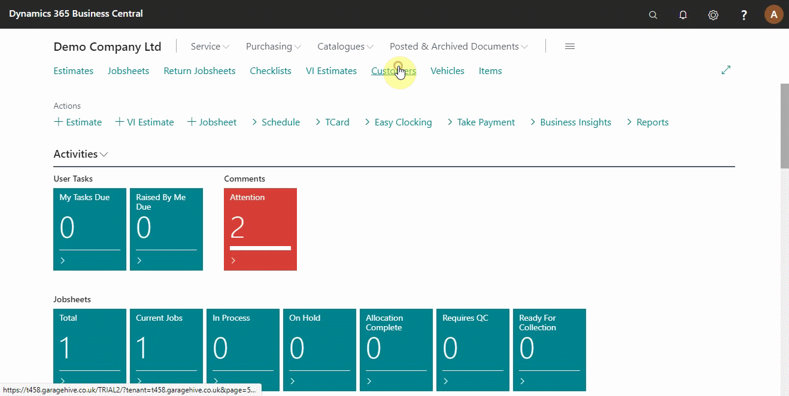
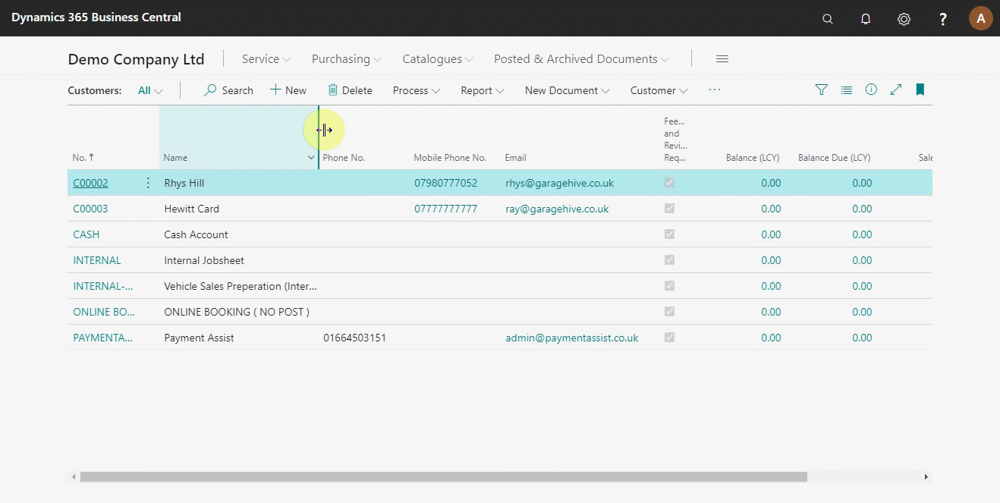
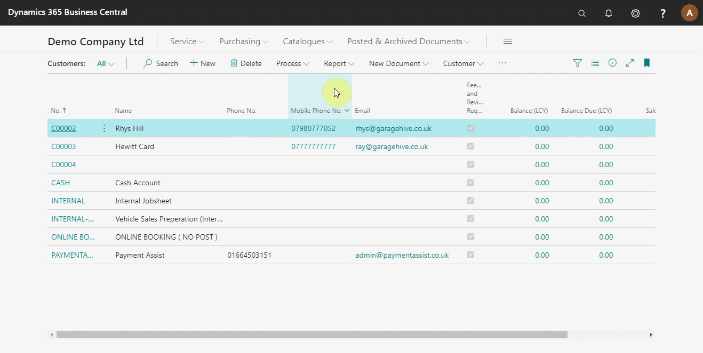
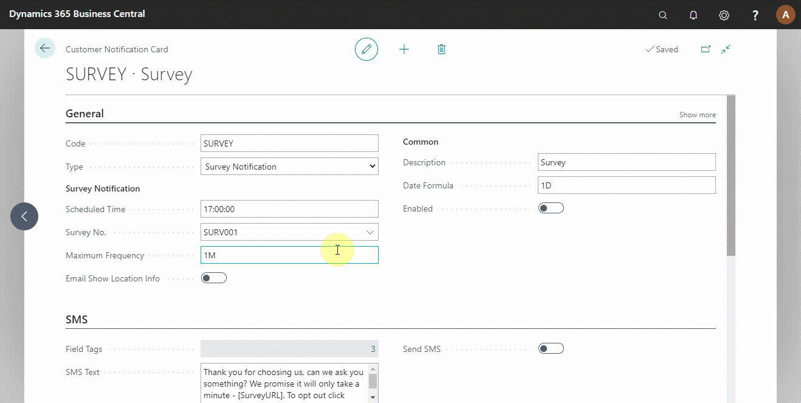
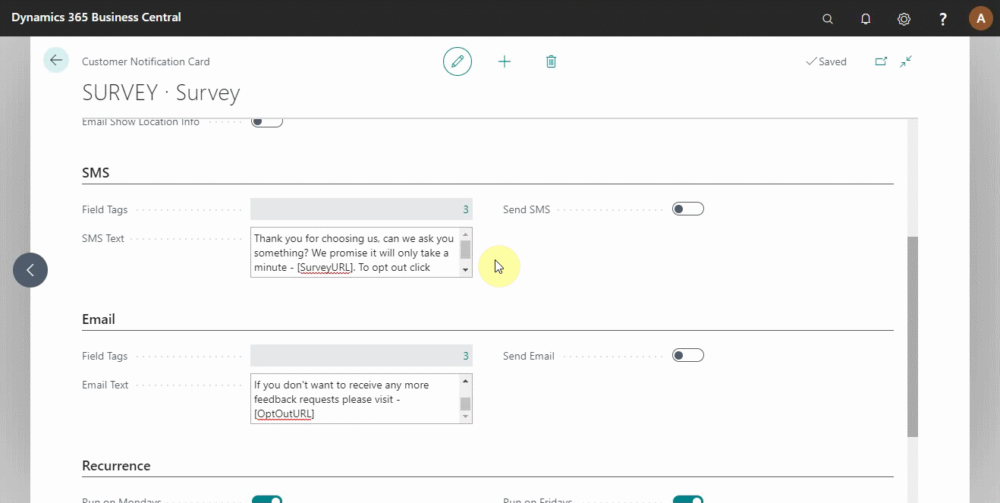

#   Setting Up NPS Customer Surveys

Here we will look at the NPS customer surveys, which help you measure the customers' overall satisfaction, loyalty, and willingness to recommend your business to more customers. Customers are surveyed by asking several questions on which they rate the business.

## In this article
1. [Opt in all customers to the survey](#opt-in-all-customers-to-the-survey)
2. [Automatically opt in new customers](#automatically-opt-in-new-customers)
3. [Confirm message to send in the surveys](#confirm-message-to-send-in-the-surveys)
4. [Preview the message to send](preview-the-message-to-send)

### Opt in all customers to the survey
For the customer surveys to work effectively, you must ensure that the system setup is correct. First, ensure that the customers' settings are correct. To check this, select the **Customers** list on the navigation bar from the role centre and add the **Feedback and Review Requests** column. This column indicates the customers who have been opted into the services. From the list, you can filter the customers who are opted into the service by right-clicking on the column and select **Filter**. From the side panel that appears, choose **No** or **Yes** from the dropdown to filter the customers who are not into the service and customers who are into the service, respectively. It is advisable to opt all your customers in, and after sending the survey, you give them the option of opting out (see below).

### Automatically opt in new customers
Secondly, you need to ensure that customers are automatically opted in when you create a new customer. If this is not the case, contact a member of our team to set this up. To confirm, click **+New** to create a new customer card from the customers' list page. Without filling in any information, scroll down to the **GDPR and Communication Policy** section and confirm **Feedback and Review Requests** is selected (see below).

### Confirm message to send in the surveys
Finally, you need to check the message that you are going to send your customers. Search **Customer Notifications** from the top right corner and select customer notifications from the search results. From the window that appears, select **Survey** from the list. In the General FastTab, set the time to send out the survey from the **Scheduled Time** field and the date, relative to the date of sending the invoice, on the **Date Formula** field. (see below).

Scroll down to the SMS section and select the **SMS Text** field to edit the message to send. Use the **Field Tags** **CustName** to insert the customer's name, **SurveyURL** to insert the survey link, and **OptOutURL** to insert the link where customers can opt-out of the survey (click on the **Fields Tag** to see these options). Do the same on the Email section (see below). 

### Preview the message to send
After confirming the message is okay to send out to the customers, select the **Send SMS** field or **Send Email Field** and fill in the customer information. Click **Okay** to preview the message to send. Before closing the **Customer Notifications** window, select **Enabled** from the General FastTab (see below).

### See Also

[Video: Essential setup before using customer surveys](https://www.youtube.com/watch?v=76r8iXfzEck)