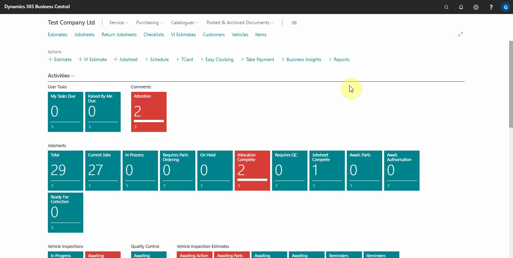
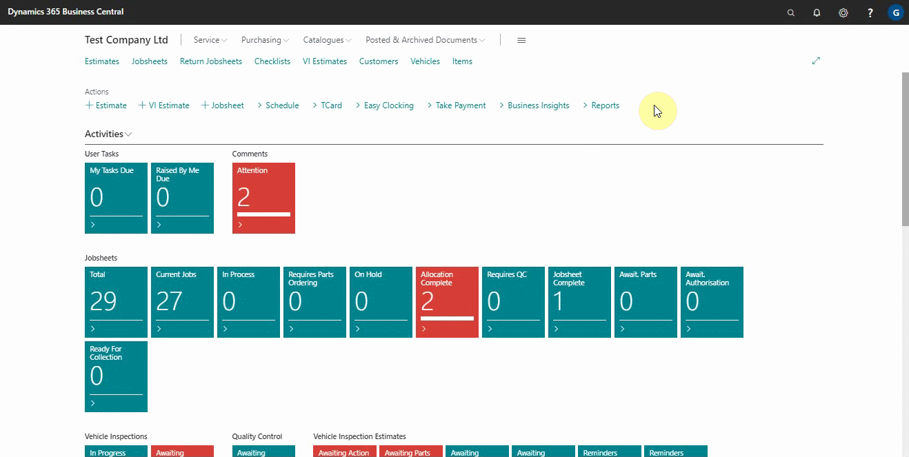
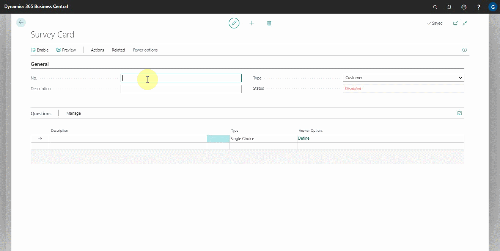
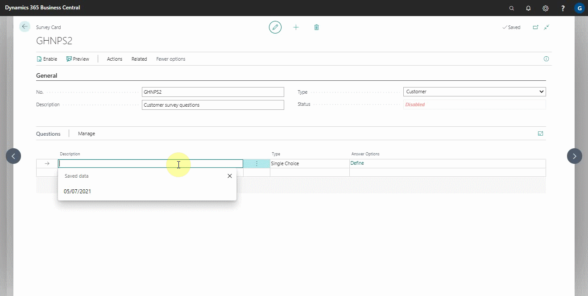
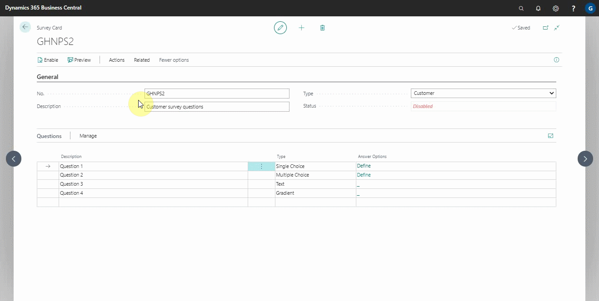
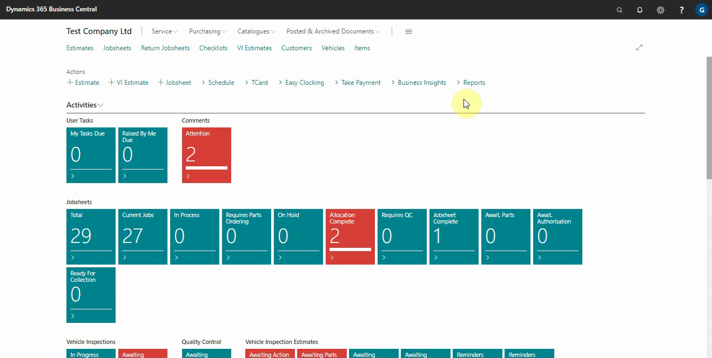

#   Setting Up NPS Customer Surveys

Here we will look at the NPS customer surveys, which help you measure the customers' overall satisfaction, loyalty, and willingness to recommend your business to more customers. Customers are surveyed by asking several questions on which they rate the business.

## In this article
1. [Enabling customer surveys](#enabling-customer-surveys)
2. [Creating a new customer survey](#creating-a-new-customer-survey)
3. [Opt in all customers to the survey](#opt-in-all-customers-to-the-survey)
4. [Automatically opt in new customers](#automatically-opt-in-new-customers)
5. [Confirm message to send in the surveys](#confirm-message-to-send-in-the-surveys)
6. [Preview the message to send](preview-the-message-to-send)

### Enabling customer surveys
To enable customer surveys, you must first contact our support team to have the service activated in your system. To see if the service is enabled, do the following:
1. Search for **Survey Setup** in the top-right corner search icon and select it from the search results.
2. In the resulting window, there is an option to enable the surveys service with a slider, which should be enabled if the service is activated.
3. When the surveys service is enabled, the customer surveys are enabled by default.

### Creating a new customer survey
1. Search for **Surveys** in the top right corner search icon and select it from the list to create a new customer survey.
2. The window that appears displays a list of the previously setup surveys. To create a new one, go to the actions bar and select **+New**.

   

3. From the window that appears, you can rename the **No.** field or press the tab button to have the survey number series automatically filled in.
4. Fill out the **Description** field with a description of the survey.
5. Select **Customer** in the **Type** field, as you are creating a customer survey.

  

6. Add the questions for the customer to answer in the **Questions** section. The question should be in the **Description** column.
7. In the **Type** column, specify the type of response you anticipate from the customer and in the **Answer Options** define the answers to be selected:
   - **Single Choice** refers to a situation in which the customer selects from the available options but can only select one.
   - **Multiple Choice** refers to a situation in which the customer can select a number of options.
   - **Text** is where the customer writes down the answer in text form.
   - **Gradient** is where the customer selects between 0 to 10 the likelihood of the answer, with 0 being **not at all likely** and 10 being **extremely likely**.

   

8. After adding the questions, you can preview and enable the survey.

   

9. Whenever you create a new customer survey, make sure it's the one that's available to send to the customer, because it's sent whenever a jobsheet is posted. To check this, search for **Customer Notifications** and select it from the results.
10. From the list that appears, open the **Survey** notification setup and check/select the survey to be sent out under the **General** FastTab in the **Survey No.** field.

   

### Opt in all customers to the survey
For the customer surveys to work effectively, you must ensure that the system setup is correct. First, confirm that the customers' settings are right. To check this:
1. Select the **Customers** list on the navigation bar from the role centre.
2. Add the **Feedback and Review Requests** column; this column indicates the customers who have been opted into the services.
3. From the list, you can filter the customers who are opted into the service by right-clicking on the column and select **Filter**. 
4. From the side panel that appears, choose **No** or **Yes** from the dropdown to filter the customers who are not into the service and customers who are into the service, respectively. 



### Automatically opt in new customers
Secondly, you need to ensure that customers are automatically opted in when you create a new customer. 



To confirm:
1. Click **+New** to create a new customer card from the customers' list page. 
2. Without filling in any information, scroll down to the **GDPR and Communication Policy** section and confirm **Feedback and Review Requests** is selected.

### Confirm message to send in the surveys
Finally, you need to check the message that you are going to send your customers:
1. Search **Customer Notifications** (top-right corner), and select customer notifications from the search results.
2. From the window that appears, select **Survey** from the list. 
3. In the General FastTab, set the **Scheduled Time** to send out the survey, and the date, relative to the date of sending the invoice, on the **Date Formula** field.

    

4. Scroll down to the SMS section and select the **SMS Text** field to edit the message to send.
5. Use the **Field Tags**, **CustName** to insert the customer's name, **SurveyURL** to insert the survey link, and **OptOutURL** to insert the link where customers can opt-out of the survey (click on the **Fields Tag** to see these options). 
6. Do the same on the Email section. 

### Preview the message to send
After confirming the message is okay to send out to the customers: 
1. Select the **Send SMS** field or **Send Email Field** and fill in the customer information. 
2. Click **Okay** to preview the message to send. 
3. Before closing the **Customer Notifications** window, select **Enabled** from the General FastTab to activate the survey.

### See Also

[Video: Essential setup before using customer surveys](https://www.youtube.com/watch?v=76r8iXfzEck)