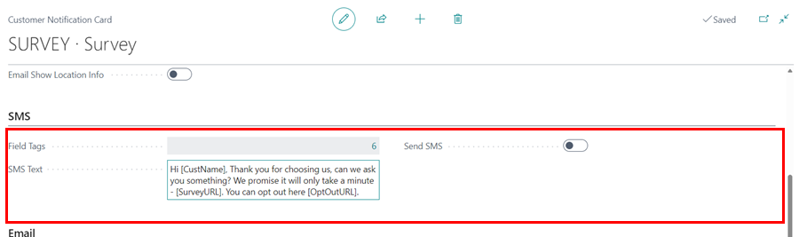

# Setting Up NPS Customer Surveys
Here we will look at the NPS customer surveys, which help you measure the customers' overall satisfaction, loyalty, and willingness to recommend your business to more customers. Customers are surveyed by asking several questions on which they rate the business.

## In this article
1. [Enabling Customer Surveys](#enabling-customer-surveys)
2. [Creating a New Customer Survey](#creating-a-new-customer-survey)
3. [Opt in All Customers to the Survey](#opt-in-all-customers-to-the-survey)
4. [Automatically Opt in New Customers](#automatically-opt-in-new-customers)
5. [Confirm Message to Send in the Surveys](#confirm-message-to-send-in-the-surveys)
6. [Preview the Message to Send](#preview-the-message-to-send)

### Enabling Customer Surveys
To enable customer surveys, you will need to contact our support team to have the service activated in your system. Once activated, follow these steps to verify if the service is enabled:
1. In the top-right corner, search for **Survey Setup** using the  icon and select the related link.

   

2. In the setup page that opens, you'll see a slider option to enable the surveys service. If the service is already activated, the slider will be enabled.
3. Once the service is enabled, customer surveys will be automatically active.

   

[Go back to top](#top)

### Creating a New Customer Survey
1. In the top-right corner, search for **Surveys** using the  icon and select the related link.

   

1. The window that appears displays a list of the previously setup surveys. To create a new one, go to the menu bar and select **+New**.

   

1. From the window that appears, you can rename the **No.** field or press the tab button to have the survey number series automatically filled in.
1. Fill out the **Description** field with a description of the survey.
1. Select **Customer** in the **Type** field, as you are creating a customer survey.

  

1. Add the questions for the customer to answer in the **Questions** section. The question should be in the **Description** column.
1. In the **Type** column, specify the type of response you anticipate from the customer and in the **Answer Options** define the answers to be selected:
   - **Single Choice:** Allows the customer to select only one option.
   - **Multiple Choice:** Allows the customer to select multiple options.
   - **Text:** The customer provides a written response.
             - **Gradient:** The customer rates their response on a scale from 0 to 10, where 0 means **not at all likely** and 10 means **extremely likely**.

      

2. Once you’ve added your questions, you can now **Preview** and **Enable** the survey.

      

3. Ensure the newly created survey is ready to be sent to customers. Surveys are typically sent when a Jobsheet is posted. To confirm this:
      - In the top-right corner, search for **Customer Notifications** using the  icon and select the related link.

         

      - From the list, open the **Survey** notification setup. 

         

      - Under the **General** FastTab, select the correct survey from the **Survey No.** field and ensure the notification is enabled.

         

[Go back to top](#top)

### Opt in All Customers to the Survey
To ensure that customer surveys work properly, it’s important to verify that the system is correctly set up and that customers are opted in. Follow these steps to check and manage the customer settings:
1. From the Role Centre, select the Customers list on the navigation bar.
2. Add the **Feedback and Review Requests** column (use personalisation), which shows which customers that have opted into the service.

   

3. To filter out the customers who are opted in, right-click on the column and select Filter. 
4. In the filter pane that appears, use the dropdown to select **No** for customers who are not opted in, or **Yes** for those who are. 

   

5. For customers who are not opted in, open their customer cards, scroll down to the **GDPR and Community Policy** section, and enable the **Feedback and Review Requests** slider. Use the arrow on the side to move to the next customer.

   



[Go back to top](#top)

### Automatically Opt in New Customers
Secondly, you need to ensure that customers are automatically opted in when you create a new customer. 



To confirm:
1. Click **+New** to create a new customer card from the customers' list page.

   

2. Without filling in any information, scroll down to the **GDPR and Communication Policy** section and confirm **Feedback and Review Requests** is selected.

   

[Go back to top](#top)

### Confirm Message to Send in the Surveys
Finally, you need to check the message that you are going to send your customers:
1. Search **Customer Notifications** (top-right corner), and select customer notifications from the search results.

   

2. From the window that appears, select **Survey** from the list.

   

3. In the General FastTab, set the **Scheduled Time** to send out the survey, and the date, relative to the date of sending the invoice, on the **Date Formula** field.

   

4. Scroll down to the SMS section and select the **SMS Text** field to edit the message to send.
5. Use the **Field Tags**, **CustName** to insert the customer's name, **SurveyURL** to insert the survey link, and **OptOutURL** to insert the link where customers can opt-out of the survey (click on the **Fields Tag** to see these options).

   

6. Do the same on the Email section. 

[Go back to top](#top)

### Preview the Message to Send
After confirming the message is okay to send out to the customers: 
1. Select the **Send SMS** field or **Send Email Field**.

   

2. Fill in the customer information and click **Okay** to preview the message to send.

   

3. Before closing the **Customer Notifications** window, select **Enabled** from the General FastTab to activate the survey.

   

[Go back to top](#top)

### See Also

[Video: Essential setup before using customer surveys](https://www.youtube.com/watch?v=76r8iXfzEck){:target="_blank"}