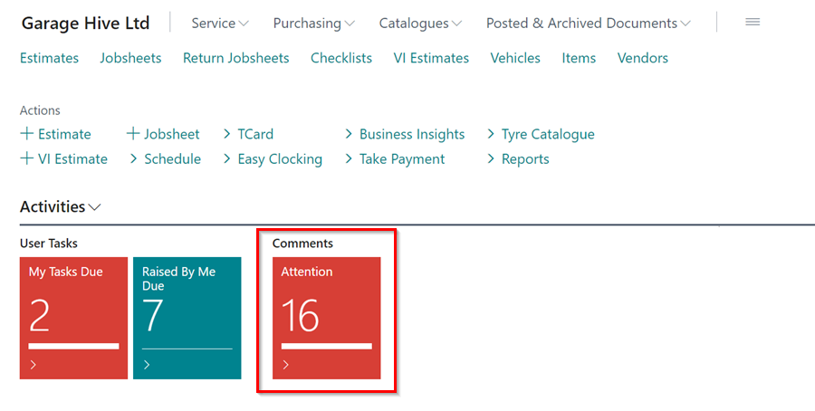
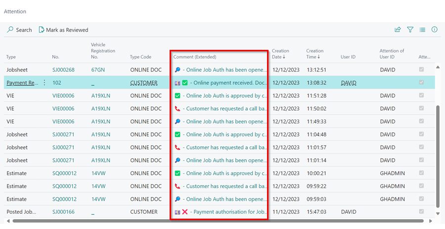

# We are still working on this article!
We are currently reviewing this article before it is published, check back later.

# System Created Comments for Attention
Whenever there's an automated interaction between the system and a customer, the system will generate comments that appear in the **Attention Tile**.  

   

These comments are prefixed with emojis to help you understand and prioritize them. Here's a quick look at how these actions appear with emojis:

   

Let's take a quick look on what each emoji means:

1. ✅ - This means that the online job has been approved by the customer.
2. 💷✅ - This means that the payment authorisation has been approved and payment received.
3. 📞 - This means that the customer has requested a call back in the online document sent.
4. 🔎 - This means that the customer has viewed the online document.
5. 💷❌ - This means that the payment authorisation has failed.
6. 🏦 - This means that the customer has requested a payment finance plan.

[Go back to top](#top)