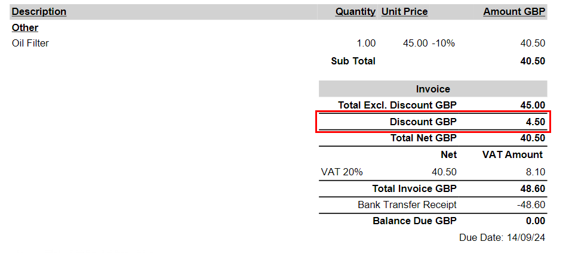
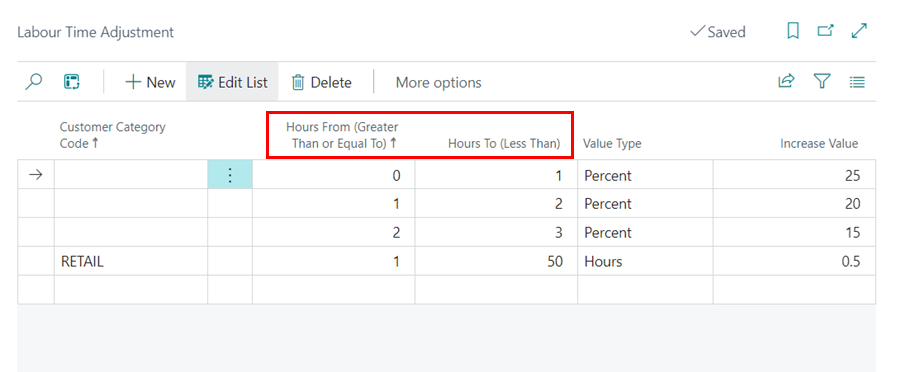

# System Improvements
The following is a list of system improvements in Garage Hive:

### 16th December 2024
* Added **IS (Iceland) checks** for SMS to improve validation.  
* Refinement for **TimeTastic** integration.  
* Made **Vehicle Information** translatable on invoice reports for enhanced localisation.  
* Improved opening the **Estimates Form Fact Box**.  

### 3rd December 2024 
* Standardised the **Vehicle History** action sorting for improved consistency.  
* Added a **Resource Location Filter** to Jobsheet selection from the schedule.   
* Enhanced the **Sales Invoice Printouts**.  
* Improved **TimeTastic** integration feature for better time accuracy.  

### 22nd November 2024
* Enhancement of the **Business Targets** page by adding a **Jobs Posted** type.  
* Refinement of the online booking system.  
* Added an **ECP Vendor Reference Number** for improved vendor tracking.  
* Updated document functionality to support **service packages** with no lines.  
* Enhancement of the Customer Import Buffet with **Credit Limit** and **Marketing Channel** fields.  

### 4th November 2024
* Improvement of the **Schedule On Hold** action functionality.
* Enhancement on the **MOT Lookup** process.
* Refinement of the **Service Comment Line Creation** by optimising DateTime field handling.
* Streamlining of the **Non-working** and **Fully Booked** schedule status.
* Enhancement on the way the system handles **Reminded not Booked** for improved reminder accuracy.
* Update on the **Line Checker**.
* Improvement on the **TimeTastic Synchronisation** process.
* Refinement on **Service Split Plan Consumption**.
* Enhancement of the **End of Day (EOD) Report**.

### 11th October 2024
* Updated **Human Resource** setup.
* Refinement on **Reminded not Booked** feature.
* Enhancement of the **MOT Reminders** notifications.
* Improvement on the **ServiceSplit** plan creation.
* Refinement to the **Line Checker** flagging and warnings.
* Enhancement to the **Castrol Lookup** mobile view and adding of Castrol oil to documents using the feature, [read more](garagehive-castrol-lookup.html){:target="_blank"}.
* Refinement to the **Online Booking** customer and address information form, [read more](garagehive-onlinebooking-setup.html){:target="_blank"}.
* Improvement to **Tyre Stock Groups** ordering process, [read more](garagehive-tyre-stock-groups.html#enable-tyre-stock-group-ordering-in-requisition-worksheet){:target="_blank"}.

### 23rd September 2024
* Refinement to GH Entitlements.
* Refinement to pay by garagelink action.
* Refinement to NAPA Auto Parts integration.
* Refinement to Jobsheet work statuses.

### 16th September 2024
* Speed improvements for publishing online authorisation.
* Speed improvements for customer notifications.
* Improved SMS sender ID management.
* Improved how vehicle model descriptions are shown in the service documents.

### 4th September 2024
* Refined email notification for **Customer Notifications**.
* Refined how support request email are handled.
* Increased character limit for **Planning and Reminder Notes** field to accommodate more detailed entries.
* Enhanced accountancy integration with the capability to define system-specific number prefixes.
* Updated **Invoice Printout** to include discount values.

   

### 27th August 2024
* Updated the **Labour Time Adjustment** page for better user clarity. The **Hours From** column is now named **Hours From (Greater Than or Equal To)**, and the **Hours To** column is renamed to **Hours To (Less Than)**.

   

* Improved the opening of document cards with filters, ensuring they focus on the correct document.
* Screen recording now available in South Africa from the **Support** tile.