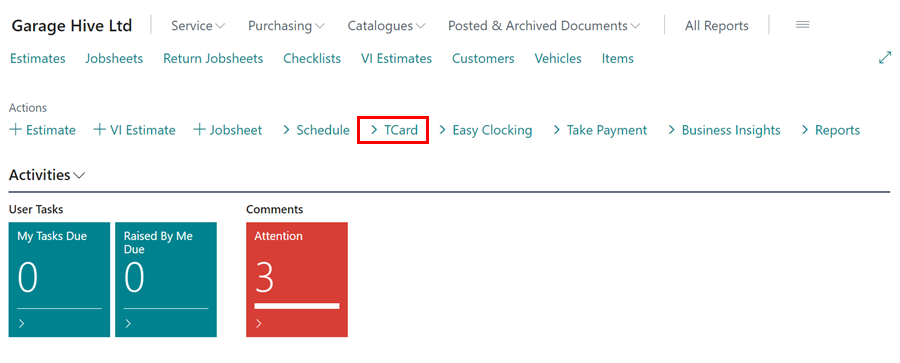
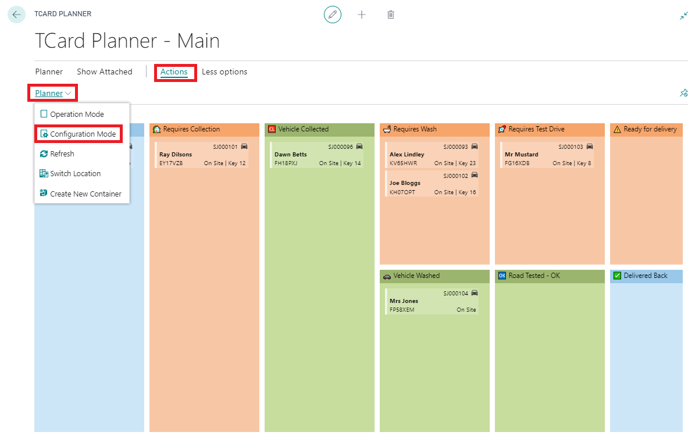
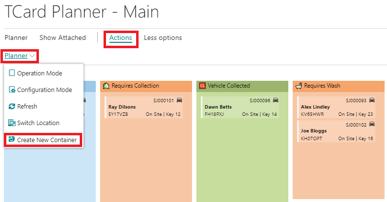
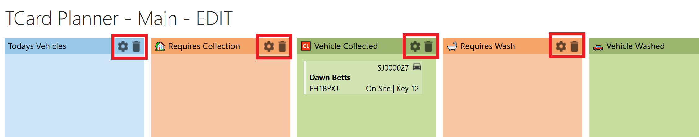
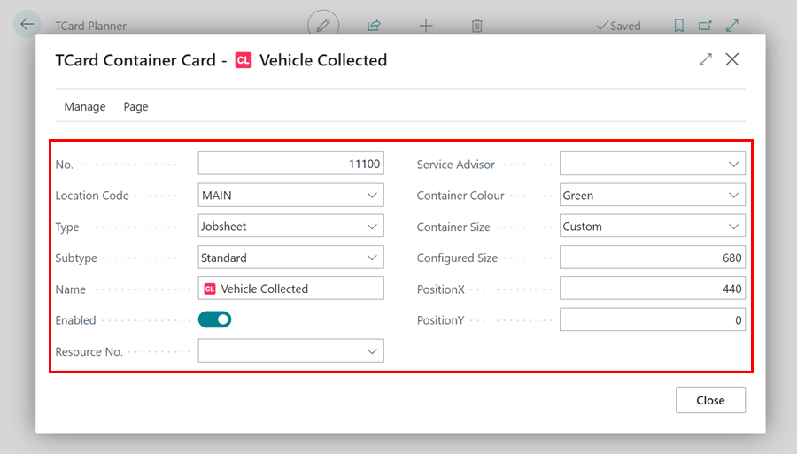

#   The TCard Planner 



The TCard Planner is a flexible tool and can a used for managing several aspects of your business.  

*i.e.*  
 *  *Collection and Deliveries* 
 *  *Car Washes*  
*    *Parts Ordered* 
 *  *Parts Arrived* 

 ###    Setting up the TCard Planner
 
 *  Front the Home Screen select TCard Planner from within the Ribbon   

 

 A. Select the Actions Tab. 

 B. Select Configuration Mode. (*this will now allow you to add/remove or personalise "Containers"*)

C.  Select Create New Container if you want to add to standard containers. 

####    **In Configuration Mode**

*   Select the ⚙ 

*   This will now enable to you customise the Container information

A. **Location Code**    - This will pre-select Location Code as **"MAIN"** 

B.  **Type** - Select **"Order"**

C.  **Subtype** - Select **"Standard"**

D.  **Name** - This will be the name you want this specific container to be called. 

E.  **Enabled** - Tick the Enabled box. 

F.  **Container Colour** - Choose your required container colour.  

G.  **Container Size** - You can choose the size you wish the container to be or customize to the required size. 

