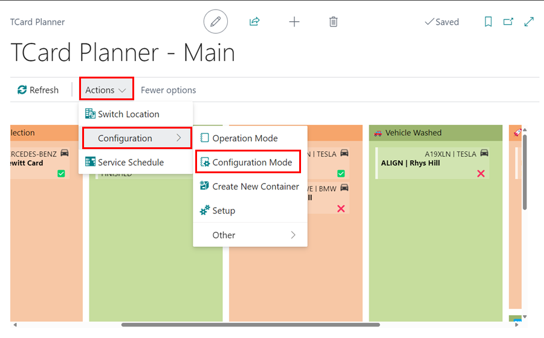
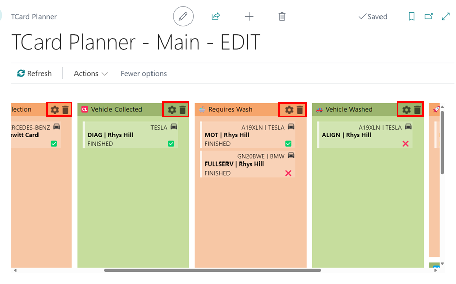
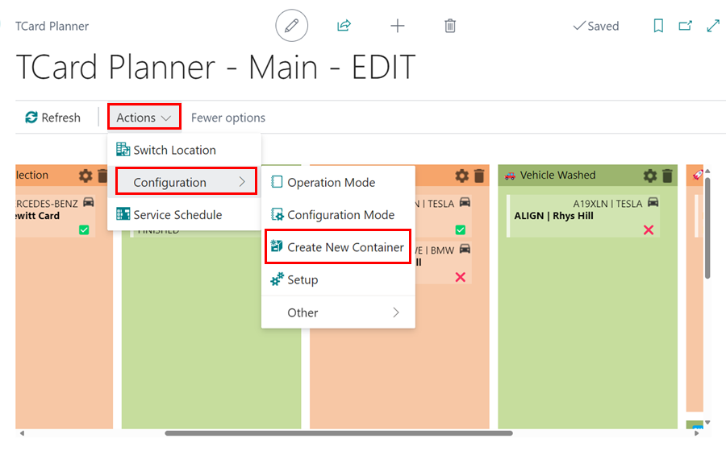

## The TCard Planner 
The TCard Planner is a flexible tool for managing various aspects of your business, such as:
  * Collection and Deliveries
  * Car Washes
  * Parts Ordered
  * Parts Arrived

## Setting up the TCard Planner
1. Front the **Role Centre** select TCard Planner.    

   

2. Select **Actions** from the menu bar, followed by **Configuration**: 

#### Enter Configuration Mode
1. Select **Configuration Mode** to add, delete or personalise Containers.

   

2. When in **Configuration Mode** you can select, the settings ⚙ icon to customise the container.

   

3. This will open a pop-up window where you can edit the container information.

   

* **Location Code** - This will pre-select Location Code as **Main**.
* **Type** - Select **Order**.
* **Subtype** - Select **Standard**.
* **Name** - Enter the name for this specific container.
* **Enabled** - Tick the Enabled box.
* **Container Colour** - Choose your preferred container colour.  
* **Container Size** - Select or customise the container size as needed.

#### Create New Container
To add to the standard containers, select Create New Container.

   

[Go back to top](#top)
