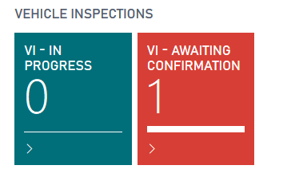

# How to perform in Vehicle Inspection Checklist as a technician



A Vehicle Inspection Checklist can either be pre-assigned to a jobsheet by a Service Advisor, or it can be created by a Technician. To create a new inspection or open an existing inspection, open the menu from the jobsheet and select "Show Vehicle Inspection." 

If there is already an inspection attached to the jobsheet it will open, otherwise the system will prompt you to create a new one. 

Press yes and select from a list of pre-defined vehicle inspections and press OK. 

Once in the Vehicle Inspection Checklist, you can use your touch screen to select from a traffic light system. You can also type any details into the available text boxes. If the Vehicle Inspection Checklist is complete, you can simply press the back button. The system will automatically save the data you enter. 

If you would like to add any pictures, select the menu option within the vehicle inspection to view the picture menu. 

In the picture menu you can view existing pictures, change the description of the pictures or add new pictures. You can either take pictures using the devices camera or upload existing pictures. 

Once the Vehicle Inspection Checklist is completed, simply press the back button until you are asked if the checklist is complete. If it is, press Yes. If you need to finish the Vehicle Inspection Checklist later, press No. 

The service advisor will now see that a Vehicle Inspection Checklist is awaiting confirmation.

# See Also
[How to setup Checklists](/docs/garagehive-checklist-how-to-create.html "How to setup Checklists in Garage Hive")

[How to use VHCs](/docs/garagehive-VHC.html "How to use VHCs")
