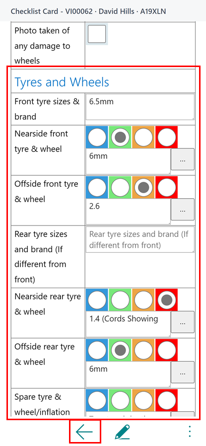

# How to perform a Vehicle Inspection Checklist as a Technician
To perform a Vehicle Inspection Checklist, you can either start a new one or open an existing checklist that has been pre-assigned to a Jobsheet by the Service Advisor.

### Opening a New or Existing Vehicle Inspection Checklist
1. From the Jobsheet menu (three dots), select **Vehicle Inspections** to open existing ones.
2. If there is already an inspection attached to the Jobsheet, it will automatically open. If not, the system will prompt you to create a new checklist.
3. Select **Yes** to create a new inspection. You will be prompted to choose from a list of predefined vehicle inspections. Select the appropriate inspection and press **OK.**
4. You can also create a new one directly by selecting **Create Vehicle Inspection** from the menu.
 
   

[Go back to top](#top)

### Completing the Checklist
1. Once in the Vehicle Inspection Checklist, use your touch screen to select options based on a traffic light system (Green for good, Amber for attention needed, Red for urgent issues).
2. You can add additional details by typing in the available text boxes.
3. When finished, press the back button to automatically save your entries.

   

[Go back to top](#top)

### Adding Pictures
1. To add or view pictures, select the menu option within the inspection to access the picture menu.
2. In the menu, you can view existing pictures by selecting **Document Media** or **Vehicle Media** & change descriptions, or add new ones by selecting **Upload Picture** or **Upload Line Picture**.
3. You can also take pictures using your device's camera by using the options **Take Picture** or **Take Line Picture**.

   

[Go back to top](#top)

### Finalising the Checklist
1. Once the checklist is complete, press the back button. The system will ask if the checklist is finished. Press "Yes" if you're done, or "No" if you need to return to it later.

   

2. Or simply click on the menu option, and select **Confirm** action.

   

3. The service advisor will now see that a Vehicle Inspection Checklist is awaiting confirmation.

   

[Go back to top](#top)

# See Also
[How to setup Checklists](garagehive-checklist-how-to-create.html "How to setup Checklists in Garage Hive"){:target="_blank"}

[How to use VHCs](/docs/garagehive-VHC.html "How to use VHCs"){:target="_blank"}
