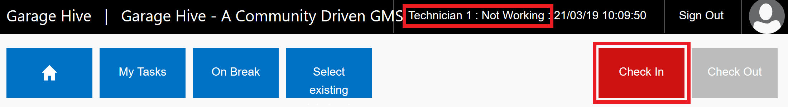
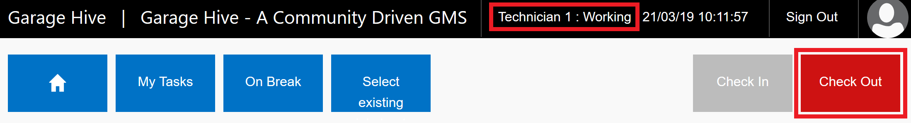
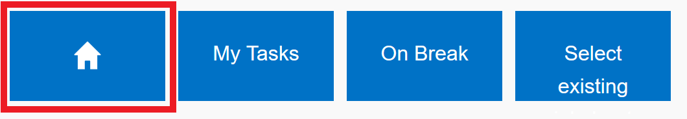
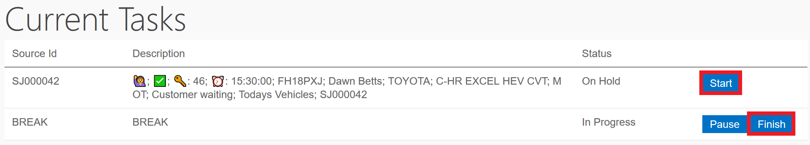
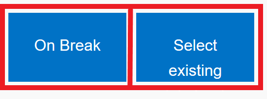
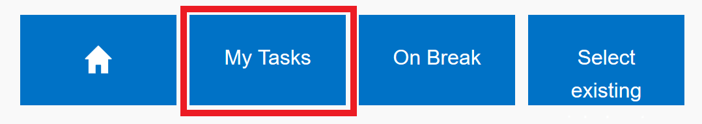
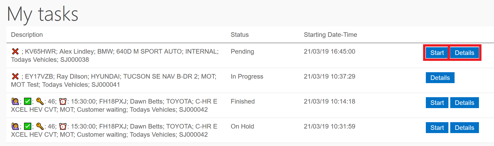
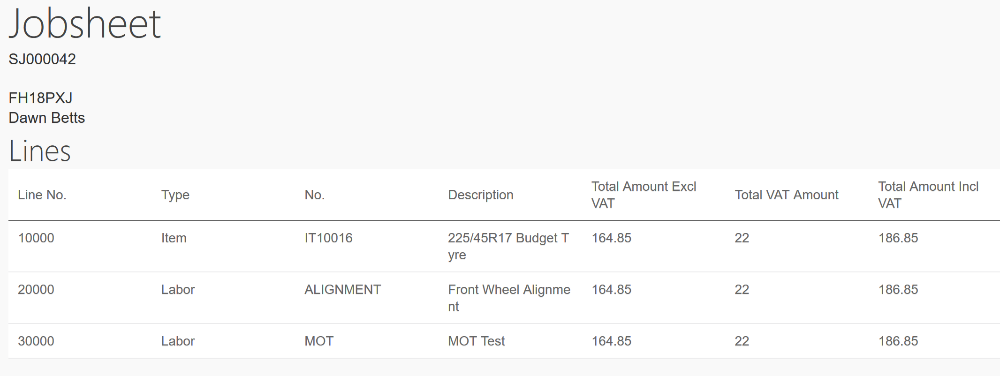

#   Terminal Users 

### What is a Terminal User?

A Terminal User will remain working from paper jobsheets. 

Their efficiencies and recovery rates can still be reported on.   

### What can they do from the Terminal? 

A technician who is using the terminal will have the ability for clock in and out of work. 

They will also be able to clock on and off jobs. 

They can see a list of all Items and Labours attached to that job, however will not be able to make any additions to this.  

All technicians, administrative staff can clock on using the terminal. (Even if a technician is a device user they can still clock in and out or on and off jobs, however they will not be able to produce checklists, add comments, Items, Labour Lines etc from the terminal.)  

## How to use a terminal. 

Your terminal will be set up for you with all required users. 

To Clock In: 

To Clock Out: 

####    Within Home:  

A technician can see what they are currently working on at that moment in time. 

They can also Finish, Pause or Start allocations. 

They can also clock on to a Break. 

Alternatively Select Existing - A technician can select a job to clock on themselves even if this is not within their tasks. This will be useful if a technician wants to clock onto another job to help another technician.
 

####    Within My Tasks: 

A technician can see all tasks which he has been allocated throughout that specific day. This will include all allocations: - 

*   Pending 
*   In Progress 
*   On Hold 
*   Finished.   

Within each allocation the technician can also see: - 

*   Extended Status Codes - i.e. Customer Waiting 🙋‍/ Urgent 🚩/ Collection & Deliveries 🏠
*   Vehicle on Site - Yes ✅ / No ❌
*   Key Number - 🔑
*   Required Time for Completion - ⏰

They can also start a task within this screen as well as see details of the job. 

