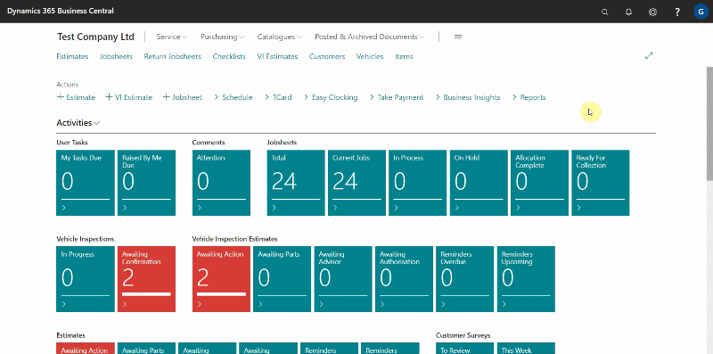
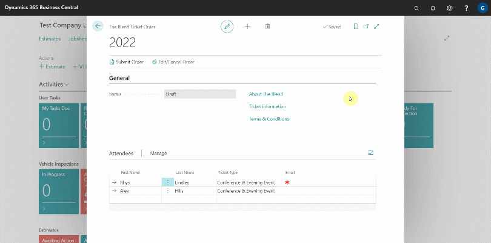
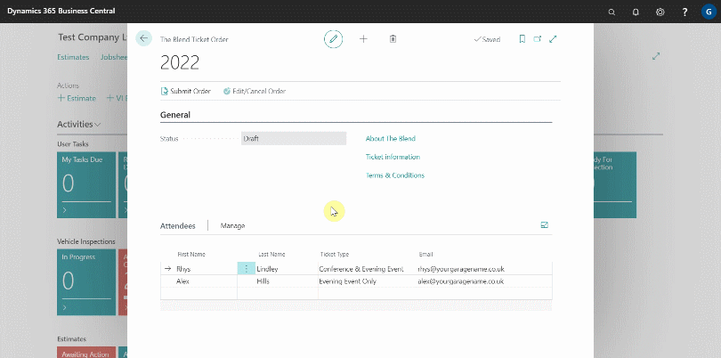
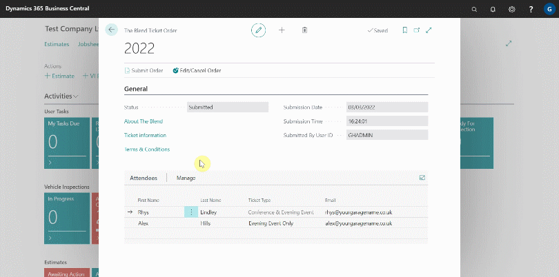

## In this article
1. [How to order The Blend ticket from Garage Hive](#how-to-order-the-blend-ticket-from-garage-hive)
2. [How to Edit or Cancel your Blend Ticket from Garage Hive](#how-to-edit-or-cancel-your-blend-ticket-from-garage-hive)

### How to order The Blend ticket from Garage Hive
If you are a Garage Hive customer, you can now order The Blend ticket(s) directly from the Garage Hive system. To order:

1. In the top-right corner, choose the search icon, enter **The Blend Ticket Order**, and select the related link.
2. Scroll down to the **Attendees** subpage and enter the **First Name** and **Last Name** of the attendee(s) in their respective field.

   

3. Choose a **Ticket Type** for the attendee; it can be **Conference & Evening Event**, which allows access to both the **Day Conference** and the **Evening Event**, or **Evening Event Only**, which only allows access to the **Evening Event**. 

   > **Note:**
   > 
   > A company cannot order only **Evening Event Only** ticket(s); a company is required to at least order one **Conference & Evening Event** ticket type.

4. Add the **Email** for the attendee(s) in the **Email** field.

   

5. When you've finished adding the list of attendees, double-check that all of the information you've entered is correct and select **Submit Order** in the actions bar.

   

6. You have now successfully ordered your **The Blend 2022** ticket(s), and the ticket amount will be charged to your monthly bill.

### How to Edit or Cancel your Blend Ticket from Garage Hive
If you made an error, need to add an attendee, or change the information you've entered, you can edit or cancel your order; select **Edit/Cancel Order** from the actions bar. This cancels the previously submitted order, and you have to resubmit it when you finish editing.

> **Important:**
> 
> Follow [this link](https://www.theblend.events/ticket-t-cs) to learn more about the **Terms and Conditions** for the Blend 2022.

