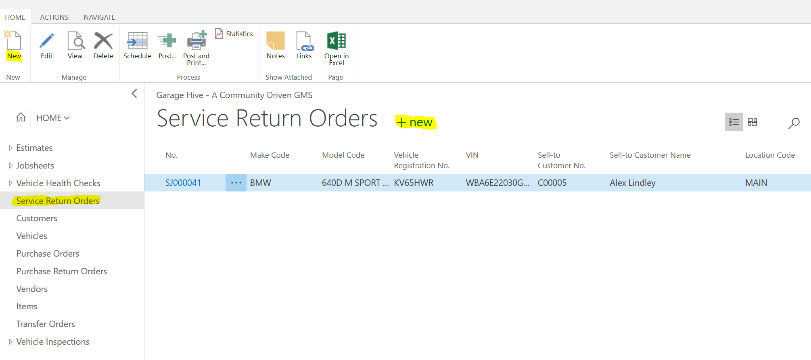
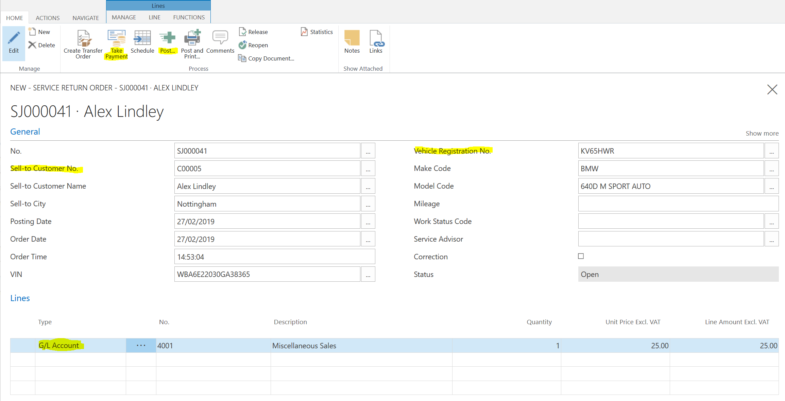

# What is a service return order?

A service return order is the document you use to issue your customers a refund, essentially its the opposite of a Jobsheet. It has the same functionality as a Jobsheet, such as labour allocation and take payment functions. 

# How to create a service return order

1. Select the service return order option from the home screen

2. Create a new service return order

3. Start by selecting a vehicle registration number, followed by your customer details 

4.	Decide on the item lines what you are refunding, you can choose from posting straight to the G/L Account, Items, Labour or External Service.  

 5.	If you are issuing a service return order for a non account customer, you may need to use the "take payment" functionality to account for the financial refund.  
  
6. Once the document is complete, simply press "post" or "post & print" located in the ribbon. 

