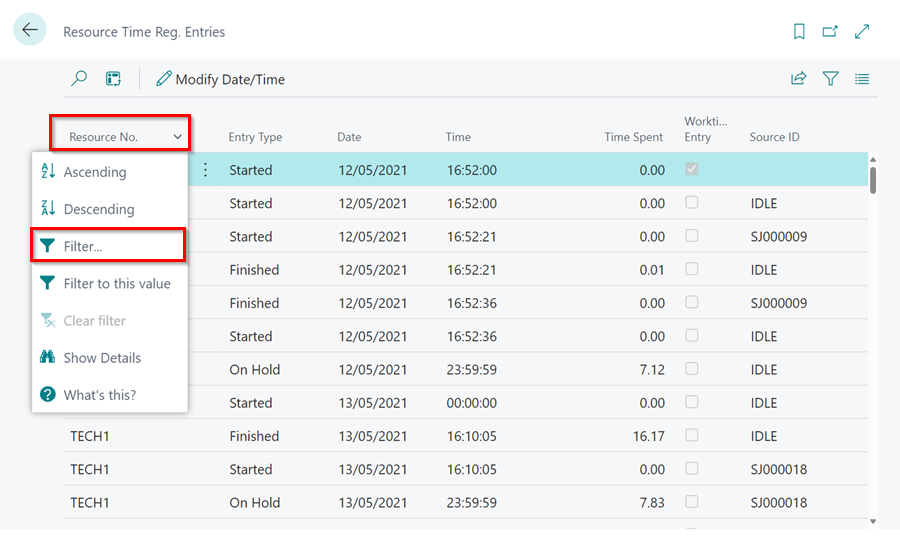

## In this article
1. [What are Resource Time Registration Entries](#what-are-resource-time-registration-entries)
2. [How to Modify a Time Registration Entry](#how-to-modify-a-time-registration-entry)
3. [How to View the Original Time Before Adjustments Were Made](#how-to-view-the-original-time-before-adjustments-were-made)

### What are Resource Time Registration Entries
**Resource Time Registration Entries** is the table that contains all the information about your technicians' clocking activity. Our reporting software will use this table to assess your technicians' efficiency and attendance. The table stores the following records:

   * Work time entries
   * Idle allocations
   * Jobsheet allocations
   * Break time entries
   * Standard events, such as housekeeping

To find your resource time registration entries, choose the  icon, enter **Resource Time Reg. Entries**, and select the related link.

   

It is highly recommended to filter the columns by specific days and resources in order to view and modify the information. You can do this by right-clicking on the header of a column and selecting **filter**.

   

[Go back to top](#top)

### How to Modify a Time Registration Entry
1. Select the time registration entry you wish to modify, then select the **Modify Date/Time** action in the menu bar. 

   

2. Adjust the **Time**. If this is the finished entry, you must also adjust the **Time Spent** option. Once you have adjusted the time, press **OK**. 

   

3. Check the time registration entries to ensure you are satisfied with the adjustments you have made.

[Go back to top](#top)

### How to View the Original Time Before Adjustments Were Made
To view the original time before adjustments were made, personalise the table by clicking on the **Settings** icon at the top right corner. Then, select **Personalise** and click on **+Field**. Drag and drop the following columns:

   * Original Date
   * Original Time
   * Original Time Spent

   

This will display the original times alongside your modified times.

[Go back to top](#top)

