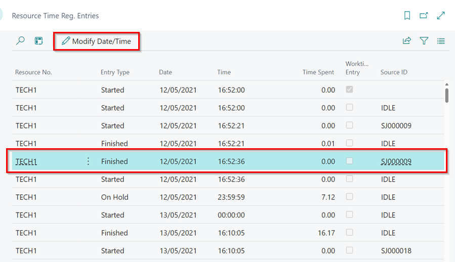

# What are resource time registration entries and can I modify them?

To find your resource time registration entries please search for "Resource Time Reg. Entries"

Resource time registration entries is a table where Garage Hive stores all the information about your technicians clocking activity. Our reporting software will use this table to determine your technicians efficiencies and attendance.

The following records are stored here
* Worktime entries
* Idle allocations
* Jobsheet allocations
* Break time entries
* Standard events, such as housekeeping

**It is highly recommend that you filter the columns to specific days and resources to help view and modify the information, you can do this by right clicking on the header of a column and selecting "filter"**

This information can be modified using the "Modify Date/Time" button in the ribbon, please note you can only modify existing entires, you can't delete existing or add new entries manually. 

# How to modify a time registration entry

1. Select the time registration entry you wish to modify, then select the "Modify Date/Time" button in the ribbon. 

2. Adjust the time, if this is an ending entry, you must adjust the "Time Spent" option too. Once you have adjust the time press OK. Check the time registration entries to make sure you are happy with the adjustments that you have made. 

# How can I see the original time before I adjusted it?

We have added the option of additional columns allowing you to view the original un-adjusted times, simply right click on a column header and select 

Select the following options

* Original Date
* Original Time
* Original Time Spent

This will display the original times along side your modified times. 