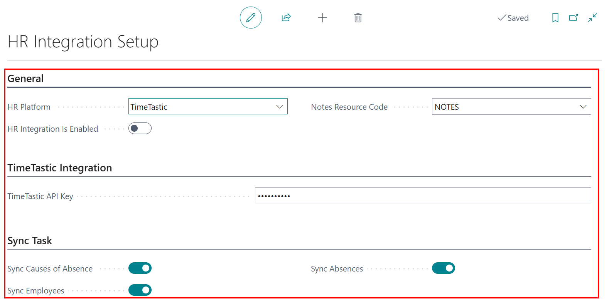

# Timetastic Integration with Garage Hive
The Timetastic integration allows Garage Hive users who already use the Timetastic HR system to sync employee data, including holidays and absence records. Once integrated, employee details can be linked to the resources in your Garage Hive system. This ensures that any holidays or absences automatically block out time in the schedule, helping you manage team availability more effectively and avoid booking conflicts.

## In this article
1. [Integrating Timetastic With Garage Hive](#integrating-timetastic-with-garage-hive)
2. [Syncing Employees and Linking Them to Resources](#syncing-employees-and-linking-them-to-resources)
3. [Syncing Causes of Absence](#syncing-causes-of-absence)
4. [Syncing Registered Absences](#syncing-registered-absences)
5. [Calculation of Schedule Available Hours with Timetastic](#calculation-of-schedule-available-hours-with-timetastic)

### Integrating Timetastic With Garage Hive
1. To begin the integration between Timetastic and Garage Hive, you'll first need your **Timetastic API Key**. To get this key, log into your Timetastic account and go to the **Settings** menu, located in the top-right corner.

   

2. From the **Settings** menu, select **Integrations** and scroll down to the **API & Webhooks** section. Click on **Set up API & Webhooks**.

   

3. In the **API Key** section, click on **Generate new key**. 

   

4. A new API key will be generated. Click on the key to automatically copy it.

   

5. Next, log into your Garage Hive account. Choose the  icon in the top right corner, enter **HR Integration Setup**, and select the related link.

   

6. In the **HR Integration Setup** page, set **HR Platform** to **Timetastic**, paste the API Key you copied into the **Timetastic API Key** field, and enable the **HR Integration is Enabled** slider. You can also select specific sync options in the **Sync Task** section. Once done, exit the setup.

   

[Go back to top](#top)

### Syncing Employees and Linking Them to Resources
1. To sync employees from Timetastic, choose the  icon in the top right corner, enter **Employees**, and select the related link.

   

2. Under the Home menu, click on **Get Employee Info from HR System**.

   

3. To link an employee to a resource in Garage Hive, open the **Employee Card**, scroll down to the **Administration** FastTab, and select the appropriate resource in the **Resource No.** field.

   

[Go back to top](#top)

### Syncing Causes of Absence
1. To sync the list of Causes of Absence from **Timetastic**, choose the  icon in the top right corner, enter **Causes of Absence**, and select the related link.

   

2. Click on **Get Info from HR System** to sync the absence causes from Timetastic.

   

[Go back to top](#top)

### Syncing Registered Absences
1. To sync the registered absences from Timetastic, choose the  icon in the top right corner, enter **Absence Registration**, and select the related link.

   

2. Click on **Get Absences from HR System** to sync registered absences from Timetastic.

   

3. If an employee is linked to a resource in the system, their registered absences will now appear in the schedule.

   

4. To delete a synced absence from the schedule, click **Related** in the schedule menu, then choose **Resource Calendar Changes**.

   

5. Delete the lines corresponding to the technician you want to make available in the schedule.

   

[Go back to top](#top)

### Calculation of Schedule Available Hours with Timetastic
When an absence is registered in Timetastic, the schedule's available hours are recalculated based on a specific method. Here's how the calculation works:
1. Here are key working hours to understand:
   * **Default Capacity (Hours):** The standard number of hours a technician is expected to work each day.
   * **Allowed Working Time (Hours):** The maximum hours a technician can work in the schedule.
1. For example:
   * If the Default Capacity is 8 hours and the Allowed Working Time is 10 hours, the technician is expected to work 8 hours per day but is permitted to work up to 10 hours if needed.

      

1. Garage Hive calculates the **Available Hours** per day by multiplying the number of technicians by the **Default Capacity (Hours)**.

   > For example:
   Assume there are 6 technicians, each with a Default Capacity of 8 hours from Monday to Friday.
   > Total Available Hours per day:
   (6 technicians × 8 hours) = 48 hours

   

2. When an Absence Request is made (e.g., ½ day in the afternoon), the calculation adjusts the available hours using a coefficient based on the difference between **Allowed Working Time** and **Default Capacity**.
   * **Coefficent formula:** Default Capacity ÷ Allowed Working Time = 8÷10 = 0.8
   * Assume the working hours for a day are 8:00 AM to 6:00 PM:
     - Morning: 4 hours (8:00 AM–12:00 PM.
     - Afternoon: 6 hours (12:00 PM–6:00 PM)
   * **Absence Calculation (½ day, afternoon):**
     - Absence hours: 6 hours
     - Adjusted Absence (using the coefficient): 6 × 0.8 = 4.8 hours

   
3. If the technician’s total available hours for the week were initially 48 hours, the available working hours after the absence would be:

  **48 - 4.8 = 43.2 hours**

   
   

[Go back to top](#top)