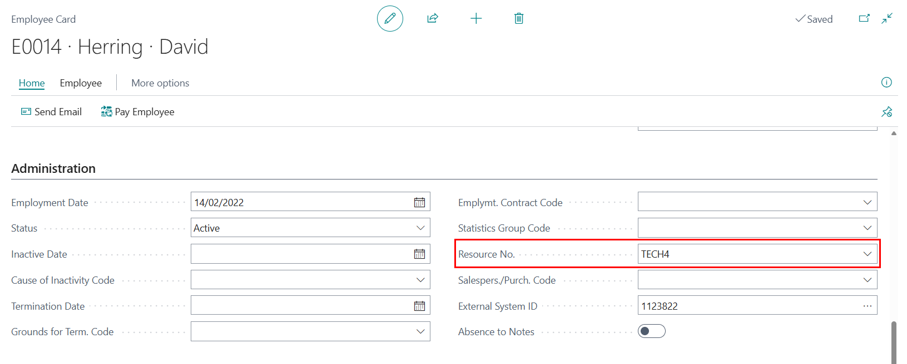
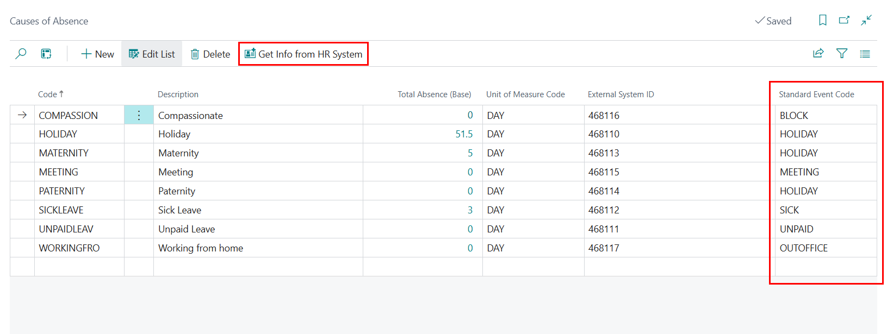
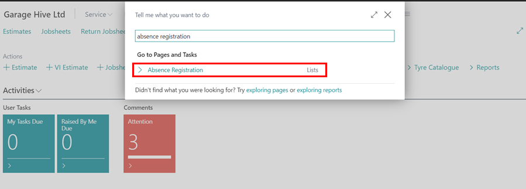
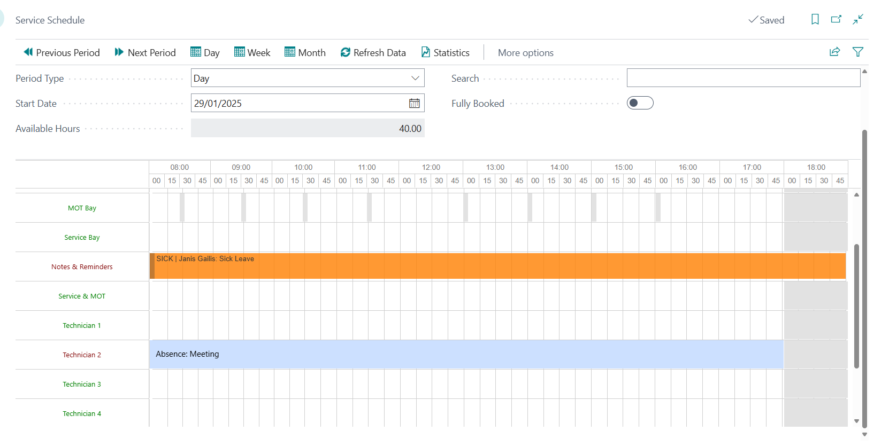

# We are still working on this article!
We are currently reviewing this article before it is published, check back later.

# Timetastic Integration with Garage Hive
The Timetastic integration allows Garage Hive users who already use the Timetastic HR system to sync employee data, including holidays and absence records. Once integrated, employee details can be linked to the resources in your Garage Hive system. This ensures that any holidays or absences automatically block out time in the schedule, helping you manage team availability more effectively and avoid booking conflicts.

## In this article
1. [Integrating Timetastic With Garage Hive](#integrating-timetastic-with-garage-hive)
2. [Syncing Employee Data](#syncing-employee-data)
3. [Google Tag Manager Setup](#google-tag-manager-setup)

### Integrating Timetastic With Garage Hive
1. To begin the integration between Timetastic and Garage Hive, you'll first need your **Timetastic API Key**. To get this key, log into your Timetastic account and go to the **Settings** menu, located in the top-right corner.

   

2. From the **Settings** menu, select **Integrations** and scroll down to the **API & Webhooks** section. Click on **Set up API & Webhooks**.

   

3. In the **API Key** section, click on **Generate new key**, and make sure to copy the key that is generated.

   

4. Next, log into your Garage Hive account. Choose the  icon in the top right corner, enter **HR Integration Setup**, and select the related link.

   

5. In the **HR Integration Setup** page, set **HR Platform** to **Timetastic**, paste the API Key you copied into the **Timetastic API Key** field, and enable the **HR Integration is Enabled** slider. You can also select specific sync options in the **Sync Task** section. Once done, exit the setup.

   

[Go back to top](#top)

### Syncing Employees and Linking Them to Resources
1. To sync employees from Timetastic, choose the  icon in the top right corner, enter **Employees**, and select the related link.

   

2. Under the Home menu, click on **Get Employee Info from HR System**.

   

3. To link an employee to a resource in Garage Hive, open the **Employee Card**, scroll down to the **Administration** FastTab, and select the appropriate resource in the **Resource No.** field.

   

[Go back to top](#top)

### Syncing Causes of Absence
1. To sync the list of Causes of Absence from **Timetastic**, choose the  icon in the top right corner, enter **Causes of Absence**, and select the related link.

   

2. Click on **Get Info from HR System** to sync the absence causes from Timetastic.

   

[Go back to top](#top)

### Syncing Registered Absences
1. To sync the registered absences from Timetastic, choose the  icon in the top right corner, enter **Absence Registration**, and select the related link.

   

2. Click on **Get Absences from HR System** to sync registered absences from Timetastic.

   

3. If an employee is linked to a resource in the system, their registered absences will now appear in the schedule.

   

4. To delete a synced absence from the schedule, click **Related** in the schedule menu, then choose **Resource Calendar Changes**.

   

5. Delete the lines corresponding to the technician you want to make available in the schedule.

   

[Go back to top](#top)
