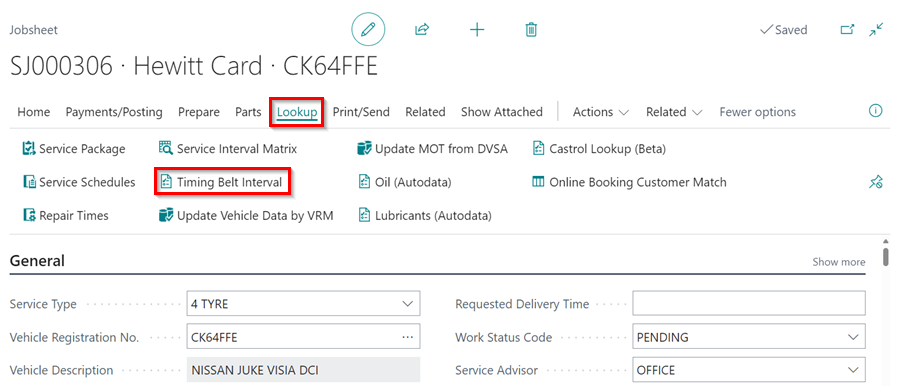
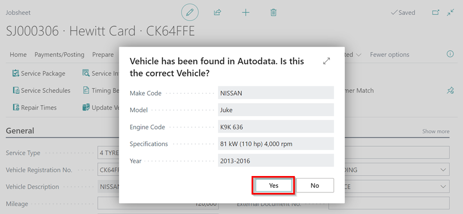
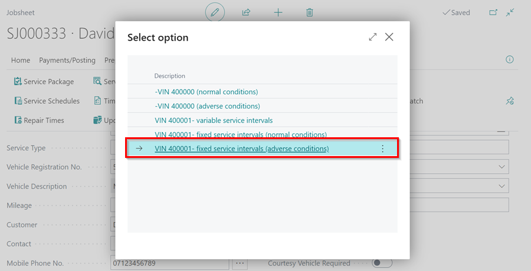

# How to Use the Timing Belt Intervals Feature

Depending on the make and model of the vehicle, the timing belt should be replaced at a specific interval. It is critical that you keep the vehicle owner informed at the appropriate time.

## In this article
1. [Checking Timing Belt Interval From the Menu Bar](#checking-timing-belt-interval-from-the-actions-bar)
2. [Checking Timing Belt Interval From the Vehicle Reminder Dates Section](#checking-timing-belt-interval-from-the-vehicle-reminder-dates-section)
3. [Manual Selection of Timing Belt Interval from Autodata](#manual-selection-of-timing-belt-interval-from-autodata)

### Checking Timing Belt Interval from the Menu Bar
To check the timing belt interval from the menu bar:
1. In the menu bar, select **Lookup**. and click the **Timing Belt Interval** action.

   

2. When the pop-up window opens, confirm the vehicle details by clicking **Yes**. If the details don't match, click **No** and select the correct vehicle.

   

3. The following information is displayed in the **Autodata Timing Belt Intervals** page:
   * **Mileage**: The mileage of the vehicle at the time of booking, as indicated on the document.
   * **Age in Months**: The age of the vehicle at the time of booking.
   * **Average Annual Mileage (Miles)**: This is calculated by dividing the vehicle's current mileage by its current age.
   * **Service Interval**: This is based on the manufacturer's specifications obtained from Autodata.
   * **Calculated Next Service Date**: Suggested timing belt service date based on the manufacturer's recommendation in miles or months.
   * **Action**: By clicking on the action, you can set the timing belt service date as recommended in the Calculated Next Service Date field.

      

4. The information icon (ℹ️) indicates that the suggested **Service Interval** is applicable for countries with high levels of dust when clicked.

   

5. Choose your preferred date from the calculated timing belt service dates in miles or months, and click on the **Set This Due Date** in the Action column. The selected date is added into the **Timing Belt Due Date** field in the vehicle reminder dates section.

   

[Go back to top](#top)

### Checking Timing Belt Interval from the Vehicle Reminder Dates Section
The timing belt interval information box is also accessible via the vehicle reminder dates section:
1. In the document, navigate to the FastTab titled **Vehicle Reminder Dates**.
2. Select the **Timing Interval Lookup** link above the **Timing Belt Due Date** field.
3. The timing belt information box appears.

   



[Go back to top](#top)

### Manual Selection of Timing Belt Interval from Autodata
Manual selection can be used to get data from Autodata for any vehicle and is not specific to any market. To view and add the data using manual selection:
1. If the vehicle registration is not automatically detected, a pop-up window will appear. Select **Other** and then click **OK** to choose the vehicle make and model from Autodata.

   

2. In the window that opens, search for the **Model** of the vehicle and click on the **Description** to select it.

   

3. After that, you should select the **Vehicle Type** based on the **Engine Code** of the vehicle in the next window that opens.

   

4. Then, select the appropriate option for the vehicle.

   

[Go back to top](#top)