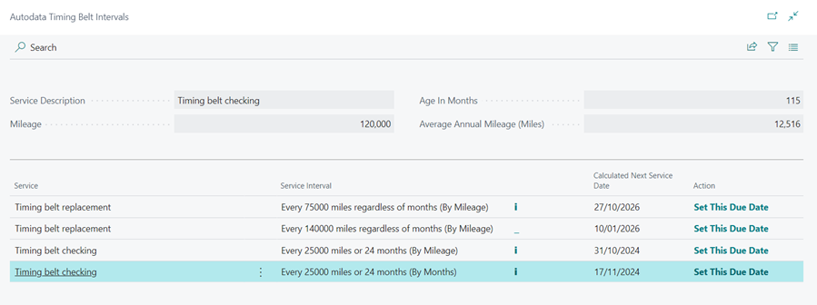

# How to Use the Timing Belt Intervals Feature
Depending on the make and model of the vehicle, the timing belt should be replaced at a specific interval. It is critical that you keep the vehicle owner informed at the appropriate time. There are two ways to check the vehicle timing belt interval, which is pulled from the autodata, in Garage Hive.

## In this article

1. [Checking Timing Belt Interval From the Actions Bar](#checking-timing-belt-interval-from-the-actions-bar)
2. [Checking Timing Belt Interval From the Vehicle Reminder Dates Section](#checking-timing-belt-interval-from-the-vehicle-reminder-dates-section)

### Checking timing belt interval from the actions bar
To check the timing belt interval from the actions bar:
1. In the actions bar, select **Lookup**.
2. Click **Timing Belt Interval** to open a pop-up information box.

   

3. The following information is displayed in the pop-up information box:
   * **Timing belt interval in Miles or Months** - This is based on the manufacturer's specifications, which were obtained from the **Autodata**.
   * **Current mileage of the vehicle (miles)** - The mileage on the vehicle at the time of booking, as indicated on the document.
   * **Current age of the vehicle (months)** - The age of the vehicle at the time of booking. 
   * **Average miles per year** - This is calculated by dividing the vehicle's **current mileage** by its **current age**. 
   * **Next recommended timing belt change date (in miles)** - Based on the manufacturer's recommended timing belt change interval in miles. 
   * **Next Suggested Timing Belt Change Date (in Months)** - Based on the manufacturer's recommended timing belt change interval in months.

   

4. Choose your preferred date from the suggested timing belt change dates in miles or months, and then click OK. The selected date is added into the **Timing Belt Due Date** field in the vehicle reminder dates section.

   

### Checking timing belt interval from the vehicle reminder dates section
The timing belt interval information box is also accessible via the vehicle reminder dates section:
1. In the document, navigate to the section titled "Vehicle Reminder Dates."
2. Select the **Timing Interval Lookup** link above the **Timing Belt Due Date** field.
3. The timing belt information box appears.

   


