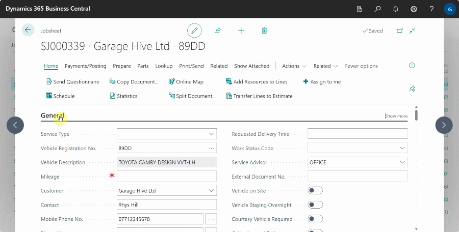

# Tips and Tricks When Working With Garage Hive

When working with Garage Hive, there are some tips and tricks that you can use to help you increase your productivity and save time. In this article, we list some of the most used and easy to understand:

## Page personalisation
Page personalisation provides the ability to modify screens to suit users needs. You can add, hide, or move fields among other things.

## Focus mode
Focus mode allows users to expand the view of line item sections on pages, making them easier to edit, navigate, and review. The focus mode can be activated by clicking the focus mode icon or by use of keyboard shortcut **Ctrl+Shift+F12**.

## Calculate data in numeric fields
Users can enter the formula for the total sum quantity, e.g., 20+17, in fields that contain numeric data, such as cost or quantity, instead of doing the calculation elsewhere.

## Resizing tables
When using tables with line items, columns can be resized manually by dragging the cursor to the desired size or autofit by double-clicking.

## Quick data entry
With quick entry, users can choose which fields are highlighted when the enter key is pressed. This is useful for windows with plenty of options. Excluded fields are skipped when Enter is pressed, whereas included fields are highlighted.

## Bookmarking pages
When users click on a page or report's bookmark icon (looks like a ribbon-style bookmark), the page or report is added to the Role Centre's navigation menu. This makes finding regularly used pages or reports a lot easier.

## Expand or collapse FastTabs or Fact Boxes
FastTabs and Fact Boxes can be expanded or collapsed to improve performance and optimise memory usage.

## Pop-up windows
When users click on the Pop-out icon, users can work on two different documents or pages at the same time.

[Go back to top](#top)
