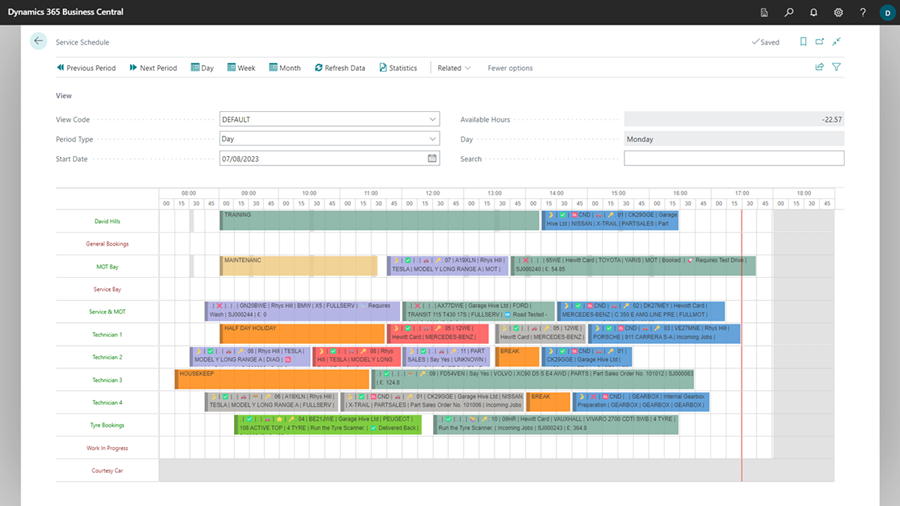
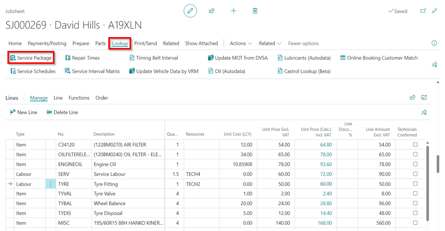
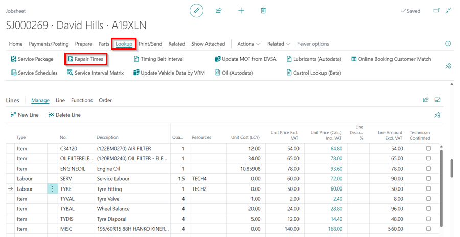

---
layout: docs
title: Garage Hive Training Module 1 for Beginners - Service Advisor
--- 

# Garage Hive Training Modules: Service Advisor
## Module 1 - Getting Started
These training modules are designed to train **Service Advisor** users on the basic processes in Garage Hive. Users will be tested on all the modules before your go-live date and scored on progress. 

It is important to understand all elements of the process to benefit from all the value Garage Hive has to offer. 

In the training Modules we'll cover the following topics:

   |              |                                                                                                                                                                                                               |
   | :----------- | :------------------------------------------------------------------------------------------------------------------------------------------------------------------------------------------------------------ |
   | **Module 1** | [Getting Started (This includes the Role Centre, Creating a Booking and Populating a Jobsheet)](garagehive-training-module-1.html){:target="_blank"}                                                          |
   | **Module 2** | [Purchasing (This includes Creating a Purchase Order, Processing a Purchase Order, Viewing Items to Return Report and Creating a Purchase Return Order)](garagehive-training-module-2.html){:target="_blank"} |
   | **Module 3** | [Processing a Jobsheet and Invoice (This includes Processing a Vehicle Arriving, Processing a Jobsheet to Invoice)](garagehive-training-module-3.html){:target="_blank"}                                      |
   | **Module 4** | [Estimates and Vehicle Inspections (This Includes Creating an Estimate, Processing a Vehicle Inspection)](garagehive-training-module-4.html){:target="_blank"}                                                |

Module 1 looks at logging into Garage Hive for the first time, creating a booking and populating a jobsheet with some labours and items. 

### Welcome to Your Role Centre
Your Role Centre Looks as shown below:

   

1. **Navigation Menu:** The top-level navigation menu provides access to the main roles of the business, with the option to expand submenus relevant to the main roles. They include Service, Purchasing, Catalogues and Posted/Archived Documents.The top-level navigation menu provides access to the main roles of the business, with the option to expand submenus relevant to the main roles. They include Service, Purchasing, Catalogues and Posted/Archived Documents.
2. **Navigation Bar:** The second-level navigation menu provides access to the most useful entities in your business process, such as your customer, their vehicle and item data stored on the system.
3. **Menu Bar:** The menu bar provides submenus of the most often used tasks that enable you to create a relevant page quickly.
4. **Data Tiles:** Each tile provides a visual representation of business data, such as total Jobsheets open and vehicle inspections, for the vehicles in your workshop booked in for repairs. These tiles will also change to red when action needs to be taken, which prompts you or your service advisor to open it to complete a task relevant to that tile. 

Learn more: [Video: Welcome to your Role Centre](https://www.youtube.com/watch?v=R_mLcdbFWdo){:target="_blank"}

### How to Create a Booking
Here are the steps to follow to make a booking using the Schedule from the Role Centre:

   

   |            |                                                                                                                                                                                               |
   | :--------- | :-------------------------------------------------------------------------------------------------------------------------------------------------------------------------------------------- |
   | **Step 1** | Open the Schedule.                                                                                                                                                                            |
   | **Step 2** | On the left-hand side, select the resource you want to book. Then, click and hold the left mouse button from the starting time to the ending time to choose the desired time for the booking. |
   | **Step 3** | You will be presented with different **allocation types**. You can choose the one that you require and click **OK**.                                                                          |
   | **Step 4** | If you select the existing Jobsheet, choose from the list of created Jobsheets and click **OK**.                                                                                              |
   | **Step 5** | If you select a **Standard Event**, choose from the list of available standard events and click **OK**.                                                                                       |
   |            |                                                                                                                                                                                               |

With the allocations, the booking schedule should look more like this:

   

Learn more: [Video: How to create a booking](https://www.youtube.com/watch?v=MJqFUQyV2Tc){:target="_blank"}

#### How to Populate a Jobsheet
Here are a few methods on how to populate the Jobsheet:
1. **Manually Populating a Jobsheet** - This involves adding the items and labours one by one in the **Lines** FastTab.

   |            |                                                                                                                                              |
   | :--------- | :------------------------------------------------------------------------------------------------------------------------------------------- |
   | **Step 1** | Open the Jobsheet.                                                                                                                           |
   | **Step 2** | Scroll down to the **Lines** FastTab.                                                                                                        |
   | **Step 3** | Select the type of entity to add in the **Type** column. It can either be **Item** or **Labour**.                                            |
   | **Step 4** | Then select the number for the Item or Labour in the **No.** column. If the item is not in stock, you can use a **Placeholder Item** number. |
   | **Step 5** | Repeat this for all the items and labour you want to add.                                                                                    |
   |            |                                                                                                                                              |

   

2. **Service Packages** - These are pre-created packages which includes items and labours put together to help create jobs faster, simplify job pricing, increase consistency and so on.

   |            |                                                                                                                                                                                                                          |
   | :--------- | :----------------------------------------------------------------------------------------------------------------------------------------------------------------------------------------------------------------------- |
   | **Step 1** | Open the Jobsheet.                                                                                                                                                                                                       |
   | **Step 2** | Select **Lookup** from the Menu bar, followed by **Service Packages**.                                                                                                                                                   |
   | **Step 3** | Select the **Service Package** to add and click **OK**. If you don't have service packages created, you can [learn how](garagehive-service-packages.html){:target="_blank"} to create one and add it or contact support. |
   | **Step 4** | The Service Package Items and Labour is added to the Lines FastTab.                                                                                                                                                      |
   |            |                                                                                                                                                                                                                          |

   

3. **Repair Times** - This refers to the vehicle repair information obtained from external providers, like Autodata, which includes both labours and items.
   
   |            |                                                                                                                                                        |
   | :--------- | :----------------------------------------------------------------------------------------------------------------------------------------------------- |
   | **Step 1** | Open the Jobsheet.                                                                                                                                     |
   | **Step 2** | From the menu bar, Select **Lookup**, and then **Repair Times**.                                                                                       |
   | **Step 3** | Double-check the vehicle details to ensure that the correct data is pulled.                                                                            |
   | **Step 4** | Select the correct **Repair Category** to add, followed by the **Repair Groups**.                                                                      |
   | **Step 5** | In the **Repair Summary** page, select the checkbox in the **include** column for the lines you want to add to the Jobsheet.                           |
   | **Step 6** | After selecting the lines you want, click on the **Add Lines to Document** option from the menu bar. This will add the selected lines to the Jobsheet. |
   |            |                                                                                                                                                        |

   

Learn more: [Video: How to populate a Jobsheet](https://www.youtube.com/watch?v=ABnKqYB4f3A){:target="_blank"}

#### Links for Further Learning in Module 1

* [Learn how to create an Item card](garagehive-create-an-item-card.html){:target="_blank"}
* [Understand the schedule better](garagehive-understanding-the-schedule.html){:target="_blank"}
* [Learn how to create a Customer card](garagehive-create-a-customer-card.html){:target="_blank"}
* [Learn how to use comments in Garage Hive](garagehive-comments-extended.html){:target="_blank"}
* [Learn how to create a Labour card and using standard times](garagehive-create-a-labour-card.html){:target="_blank"}
* [Learn more about the Service Packages](garagehive-service-packages.html){:target="_blank"}

|              |                                                                                                                                                                                                               |
| :----------- | :------------------------------------------------------------------------------------------------------------------------------------------------------------------------------------------------------------ |
| **Module 1** | [Getting Started (This includes the Role Centre, Creating a Booking and Populating a Jobsheet)](garagehive-training-module-1.html){:target="_blank"}                                                          |
| **Module 2** | [Purchasing (This includes Creating a Purchase Order, Processing a Purchase Order, Viewing Items to Return Report and Creating a Purchase Return Order)](garagehive-training-module-2.html){:target="_blank"} |
| **Module 3** | [Processing a Jobsheet and Invoice (This includes Processing a Vehicle Arriving, Processing a Jobsheet to Invoice)](garagehive-training-module-3.html)                                                        |
| **Module 4** | [Estimates and Vehicle Inspections (This Includes Creating an Estimate, Processing a Vehicle Inspection)](garagehive-training-module-4.html)                                                                  |

[Go back to top](#top)
