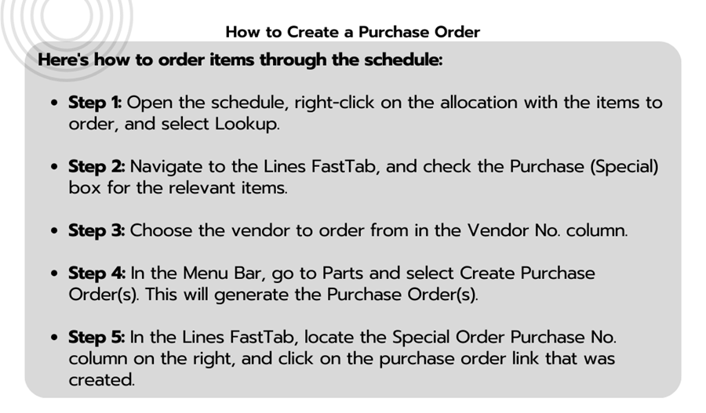
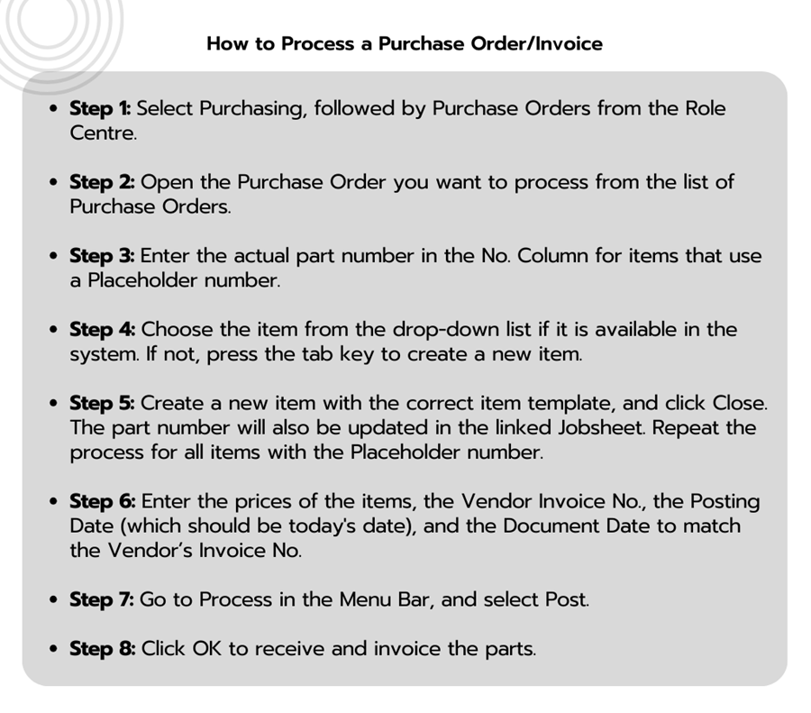

---
layout: docs
title: Garage Hive Training Module 2 for Beginners - Service Advisor
--- 

# We are still working on this article!
We are currently reviewing this article before it is published, check back later.

## Module 2 - Purchasing

Module 2 looks at purchasing in Garage Hive. In this module you will learn how to raise a purchase order from a Jobsheet and how to process the purchase order once the invoice has arrived. You will also how to view your items to return report and how to raise a purchase return order. 

#### How to Create a Purchase Order
Here's how to order items through the schedule:

   

Learn more: [Video: How to create a purchase order](https://www.youtube.com/watch?v=M1KB7dSiZrY)

#### How to Process a Purchase Order/Invoice
Follow these steps to process a Purchase Order after items have been received:

   

Learn more: [Video: How to process a purchase order/invoice](https://www.youtube.com/watch?v=M1KB7dSiZrY)

#### How to View Items to Return
The Items to Return Report allows you to keep track of which parts are in stock and need to be returned based on the criteria listed below:
- The item is not in a Jobsheet.
- The item is not on a Purchase Return Order.
- The item doesn’t have any reorder policy.

Here is how to view the report:

   

Learn more: [Video: How to process a purchase order/invoice](https://www.youtube.com/watch?v=EyVbV50EwaQ)

#### How to create a purchase return order

   

### Module 2 test

* Creating multiple purchase orders
* Processing a purchase order
* Creating an item card
* Posting a purchase order
* Viewing your items to return report
* Creating a purchase return order
* Shipping items on return
* Posting a purchase return order