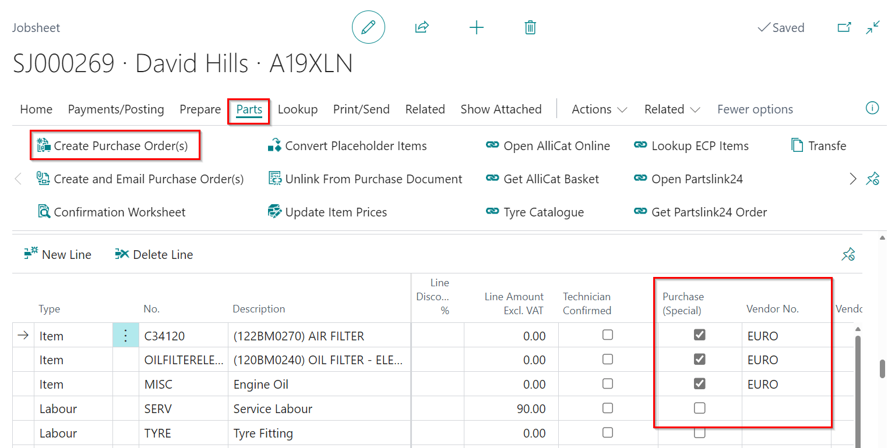
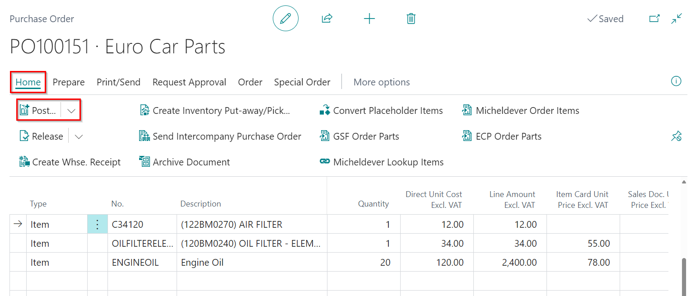

---
layout: docs
title: Garage Hive Training Module 2 for Beginners - Service Advisor
--- 

# We are still working on this article!
We are currently reviewing this article before it is published, check back later.

## Module 2 - Purchasing
Module 2 looks at purchasing in Garage Hive. In this module you will learn how to raise a purchase order from a Jobsheet and how to process the purchase order once the invoice has arrived. You will also how to view your items to return report and how to raise a purchase return order. 

In the training Modules we'll cover the following topics:

   |              |                                                                                                                                                                                                               |
   | :----------- | :------------------------------------------------------------------------------------------------------------------------------------------------------------------------------------------------------------ |
   | **Module 1** | [Getting Started (This includes the Role Centre, Creating a Booking and Populating a Jobsheet)](garagehive-training.html){:target="_blank"}                                                                   |
   | **Module 2** | [Purchasing (This includes Creating a Purchase Order, Processing a Purchase Order, Viewing Items to Return Report and Creating a Purchase Return Order)](garagehive-training-module-2.html){:target="_blank"} |
   | **Module 3** | [Processing a Jobsheet and Invoice (This includes Processing a Vehicle Arriving, Processing a Jobsheet to Invoice)](garagehive-training-module-3.html){:target="_blank"}                                      |
   | **Module 4** | [Estimates and Vehicle Inspections (This Includes Creating an Estimate, Processing a Vehicle Inspection)](garagehive-training-module-4.html){:target="_blank"}                                                |
   |              |                                                                                                                                                                                                               |

#### How to Create a Purchase Order
Here's how to order items through the schedule:

   |            |                                                                                                                                                 |
   | :--------- | :---------------------------------------------------------------------------------------------------------------------------------------------- |
   | **Step 1** | Open the schedule, right-click on the allocation with the items to order, and select **Lookup**.                                                |
   | **Step 2** | Navigate to the **Lines** FastTab, and tick the **Purchase (Special)** box for the relevant items.                                              |
   | **Step 3** | Choose the vendor to order from in the **Vendor No.** column.                                                                                   |
   | **Step 4** | In the Menu Bar, go to **Parts** and select **Create Purchase Order(s)**. This will generate the **Purchase Order(s)**.                         |
   | **Step 5** | In the **Lines** FastTab, locate the **Special Order Purchase No.** column on the right, and click on the purchase order link that was created. |
   |            |                                                                                                                                                 |

   

Learn more: [Video: How to create a purchase order](https://www.youtube.com/watch?v=M1KB7dSiZrY){:target="_blank"}

#### How to Process a Purchase Order/Invoice
Follow these steps to process a Purchase Order after items have been received:

   |            |                                                                                                                                                                                                                                |
   | :--------- | :----------------------------------------------------------------------------------------------------------------------------------------------------------------------------------------------------------------------------- |
   | **Step 1** | From the Role Centre, select **Purchasing** followed by **Purchase Orders**.                                                                                                                                                   |
   | **Step 2** | From the list of Purchase Orders, click on the **Purchase Order** you want to process so as to open it.                                                                                                                        |
   | **Step 3** | For the items that you used the P**laceholder** number, enter the actual part number in the **No.** column.                                                                                                                    |
   | **Step 4** | If the item was available in the system, select it from the drop-down list, if not available press the tab key, and you’ll get the option to **create a new** item.                                                            |
   | **Step 5** | Create a new Item, with the correct **Item Template**, and click **Close**. The part number will also be updated in the linked Jobsheet. Repeat the process for all Items with the placeholder number.                         |
   | **Step 6** | Add the prices of the items, enter the **Vendor Invoice No.** to match the invoice you’ve received from the vendor, enter the **Posting Date** to be today’s date, and the **Document Date** to match the Vendor’s Invoice No. |
   | **Step 7** | In the Menu Bar, go to **Process** and select **Post**.                                                                                                                                                                        |
   | **Step 8** | Click **OK**, to **Receive and Invoice** the parts.                                                                                                                                                                            |
   |            |                                                                                                                                                                                                                                |

   

Learn more: [Video: How to process a purchase order/invoice](https://www.youtube.com/watch?v=M1KB7dSiZrY){:target="_blank"}

#### How to View Items to Return
The Items to Return Report allows you to keep track of which parts are in stock and need to be returned based on the criteria listed below:
- The item is not in a Jobsheet.
- The item is not on a Purchase Return Order.
- The item doesn’t have any reorder policy.

Here is how to view the report:

   |            |                                                                                                                                                |
   | :--------- | :--------------------------------------------------------------------------------------------------------------------------------------------- |
   | **Step 1** | Go to the Role Centre and click on **Reports** from the **Actions Menu**. Then, select **Additional** and click on **Items to Return**.        |
   | **Step 2** | This will open the **Items to Return Report**. To review an item's history, choose the item and select **History Overview** from the Menu Bar. |
   |            |                                                                                                                                                |

   

Learn more: [Video: How to process a purchase order/invoice](https://www.youtube.com/watch?v=EyVbV50EwaQ){:target="_blank"}

#### How to create a purchase return order

   |            |                                                                                                                                                                                                                |
   | :--------- | :------------------------------------------------------------------------------------------------------------------------------------------------------------------------------------------------------------- |
   | **Step 1** | Go to the Role Centre and select **Purchasing**, followed by **Purchase Return Order**.                                                                                                                        |
   | **Step 2** | Click **New** to create a new **Purchase Return Order**.                                                                                                                                                       |
   | **Step 3** | Fill in the **Vendor Name** field with the name of the vendor you wish to return items to.                                                                                                                     |
   | **Step 4** | On the **Lines** FastTab, add the items that you want to return.                                                                                                                                               |
   | **Step 5** | Notify the vendor/supplier of your intention to return the items.                                                                                                                                              |
   | **Step 6** | In the pop-up notification, choose **Ship** and click **OK**. This will update the **Return Qty. Shipped** column in the **Lines** FastTab.                                                                    |
   | **Step 7** | When you receive the **Credit Note** from the supplier, ensure that it matches the **Purchase Return Order** details. Then, enter the **Vendor Cr. Memo No.** as the one on the Credit Note from the supplier. |
   | **Step 8** | Set the **Posting Date** as today and the **Document Date** as the date on the Credit Note.                                                                                                                    |
   | **Step 9** | Click **Process** and select **Post**. In the pop-up notification, choose **Invoice** and click **OK**.                                                                                                        |
   |            |                                                                                                                                                                                                                |

   

Learn more: [Video: How to create a Purchase Return Order](https://www.youtube.com/watch?v=X81T5UAOTNU){:target="_blank"}

#### Links for Further Learning in Module 2

* [How to create and use Purchase Orders](garagehive-create-a-purchase-order.html){:target="_blank"}
* [Creating an item card](garagehive-create-an-item-card.html){:target="_blank"}
* [Viewing your items to return report](garagehive-items-to-return.html){:target="_blank"}
* [Creating a Purchase Return Order and Purchase Credit Memo](garagehive-shipped-items-purchase-return-order.html){:target="_blank"}

|              |                                                                                                                                                                                             |
| :----------- | :------------------------------------------------------------------------------------------------------------------------------------------------------------------------------------------ |
| **Module 1** | [Getting Started (This includes the Role Centre, Creating a Booking and Populating a Jobsheet)](garagehive-training.html){:target="_blank"}                                                 |
| **Module 2** | [Purchasing (This includes Creating a Purchase Order, Processing a Purchase Order, Viewing Items to Return Report and Creating a Purchase Return Order)](garagehive-training-module-2.html) |
| **Module 3** | [Processing a Jobsheet and Invoice (This includes Processing a Vehicle Arriving, Processing a Jobsheet to Invoice)](garagehive-training-module-3.html)                                      |
| **Module 4** | [Estimates and Vehicle Inspections (This Includes Creating an Estimate, Procoessing a Vehicle Inspection)](garagehive-training-module-4.html)                                               |

[Go back to top](#top)