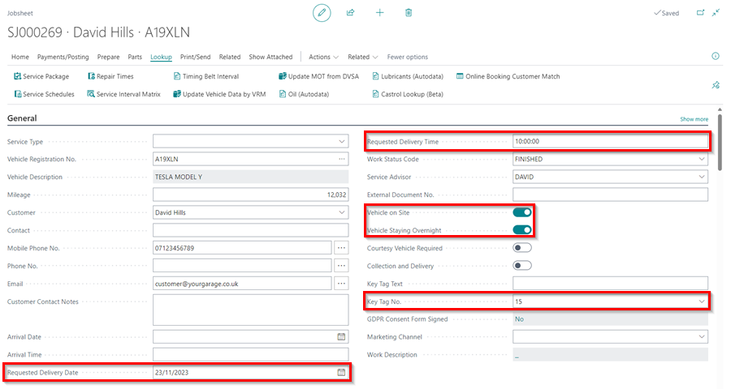
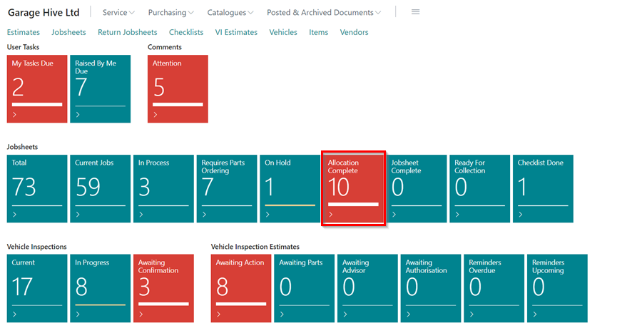

---
layout: docs
title: Garage Hive Training Module 3 for Beginners - Service Advisor
--- 

# We are still working on this article!
We are currently reviewing this article before it is published, check back later.

## Module 3 - Processing Jobsheets & Invoicing

Module 3 covers the process of when a customer arrives to drop off their vehicle. You will learn to use features to mark vehicles as on-site, assign parking locations and key numbers, and add expected collection times. Additionally, in module 3, you will learn how to process a Jobsheet from complete to ready for collection, and how to convert a Jobsheet into an invoice.  

In the training Modules we'll cover the following topics:

   |              |                                                                                                                                                                                                               |
   | :----------- | :------------------------------------------------------------------------------------------------------------------------------------------------------------------------------------------------------------ |
   | **Module 1** | [Getting Started (This includes the Role Centre, Creating a Booking and Populating a Jobsheet)](garagehive-training.html){:target="_blank"}                                                                   |
   | **Module 2** | [Purchasing (This includes Creating a Purchase Order, Processing a Purchase Order, Viewing Items to Return Report and Creating a Purchase Return Order)](garagehive-training-module-2.html){:target="_blank"} |
   | **Module 3** | [Processing a Jobsheet and Invoice (This includes Processing a Vehicle Arriving, Processing a Jobsheet to Invoice)](garagehive-training-module-3.html){:target="_blank"}                                      |
   | **Module 4** | [Estimates and Vehicle Inspections (This Includes Creating an Estimate, Processing a Vehicle Inspection)](garagehive-training-module-4.html){:target="_blank"}                                                |

#### How to Process a Vehicle Arriving
The following steps outline how to process an arriving vehicle that was pre-booked:

   |            |                                                                                                                                                                             |
   | :--------- | :-------------------------------------------------------------------------------------------------------------------------------------------------------------------------- |
   | **Step 1** | Open the schedule to access the booking allocation.                                                                                                                         |
   | **Step 2** | Right-click on the allocation and select **Lookup**.                                                                                                                        |
   | **Step 3** | On the **General** FastTab, enable the **Vehicle on Site** slider to confirm that the vehicle has arrived.                                                                  |
   | **Step 4** | Allocate the key number for the vehicle in the **Key Tag No.** field.                                                                                                       |
   | **Step 5** | If the vehicle is staying overnight, enable the **Vehicle Staying Overnight** slider.                                                                                       |
   | **Step 6** | If there is a requested time and date to return the vehicle, enter the date in the **Requested Delivery Date** field and the time in the **Requested Delivery Time** field. |
   | **Step 7** | Scroll down to the **Comments** FastTab and add any customer comments.                                                                                                      |
   | **Step 8** | Ensure that the right items and labour are added in the **Lines** FastTab. Close the Jobsheet when done.                                                                    |
   | **Step 8** | The Job will now be ready to allocate to a technician.                                                                                                                      |
   |            |                                                                                                                                                                             |

   

Learn more: [Video: How to Process a Vehicle Arriving](https://www.youtube.com/watch?v=pBSymFc-9m8){:target="_blank"}

#### How to Process a Jobsheet to Invoice
The following steps outline how to process a Jobsheet to an Invoice:

   |            |                                                                                                                                                                                                                                                       |
   | :--------- | :---------------------------------------------------------------------------------------------------------------------------------------------------------------------------------------------------------------------------------------------------- |
   | **Step 1** | Once the technician has completed the Job, the Jobsheet will appear in the **Allocation Complete** tile on the Role Centre and the tile will turn red. In the schedule, it is represented by a **purple** allocation.                                 |
   | **Step 2** | Click on the tile and open the completed Jobsheet from the list of **Jobsheets**. If the technician has added any comments, they will appear in the **Comments** FastTab.                                                                             |
   | **Step 3** | In the **Lines** FastTab, under the **Technician Confirmed** column, labour done by the technician and the fitted items will be shown. The technician's name will appear in the **Resources** column for the labour.                                  |
   | **Step 4** | If the **Check** column in the **Lines** FastTab has an emoji, it indicates that there is an issue that needs to be addressed. To view the issue, click on the emoji.                                                                                 |
   | **Step 5** | After addressing all the issues in the **Check** column, change the work status to **Ready for Collection** in the **Work Status Code** field under the **General** FastTab. This will move the Job to the **Jobsheets - Ready for Collection** tile. |
   | **Step 6** | Send an SMS or email to the customer to inform them that the vehicle is ready for collection. To do this, click on the ellipsis (...) in the **Mobile Phone No.** field, or the **Email** field under the **General** FastTab.                        |
   | **Step 7** | When the customer arrives to collect the vehicle, open the Jobsheet to take the payment. Select **Payments/Posting** in the menu bar, followed by **Take Payment**.                                                                                   |
   | **Step 8** | After taking the payment, select **Payments/Posting** again, followed by **Post and Print** to post the document and print a copy of the document for the customer.                                                                                   |
   |            |                                                                                                                                                                                                                                                       |

   

Learn more: [Video: How to Process a Jobsheet to Invoice](https://www.youtube.com/watch?v=SdgMs_uS9Y0){:target="_blank"}

### Module 3 test

* [Managing Key Numbers](garagehive-managing-key-numbers-in-the-system.html){:target="_blank"}
* [How to Use Comments](garagehive-comments-extended.html){:target="_blank"}
* [Taking a Payment and Posting a Jobsheet](garagehive-jobsheet-taking-payment.html){:target="_blank"}
* [Using the Jobsheet](garagehive-create-a-jobsheet.html){:target="_blank"}
* [Creating a New Jobsheet From Various Places](garagehive-jobsheet-create-from-various-places.html){:target="_blank"}
* [Understanding the Jobsheet Line Checker Notifications](garagehive-line-checker.html){:target="_blank"}

|              |                                                                                                                                                                                                               |
| :----------- | :------------------------------------------------------------------------------------------------------------------------------------------------------------------------------------------------------------ |
| **Module 1** | [Getting Started (This includes the Role Centre, Creating a Booking and Populating a Jobsheet)](garagehive-training.html){:target="_blank"}                                                                   |
| **Module 2** | [Purchasing (This includes Creating a Purchase Order, Processing a Purchase Order, Viewing Items to Return Report and Creating a Purchase Return Order)](garagehive-training-module-2.html){:target="_blank"} |
| **Module 3** | [Processing a Jobsheet and Invoice (This includes Processing a Vehicle Arriving, Processing a Jobsheet to Invoice)](garagehive-training-module-3.html){:target="_blank"}                                      |
| **Module 4** | [Estimates and Vehicle Inspections (This Includes Creating an Estimate, Processing a Vehicle Inspection)](garagehive-training-module-4.html){:target="_blank"}                                                |

[Go back to top](#top)
