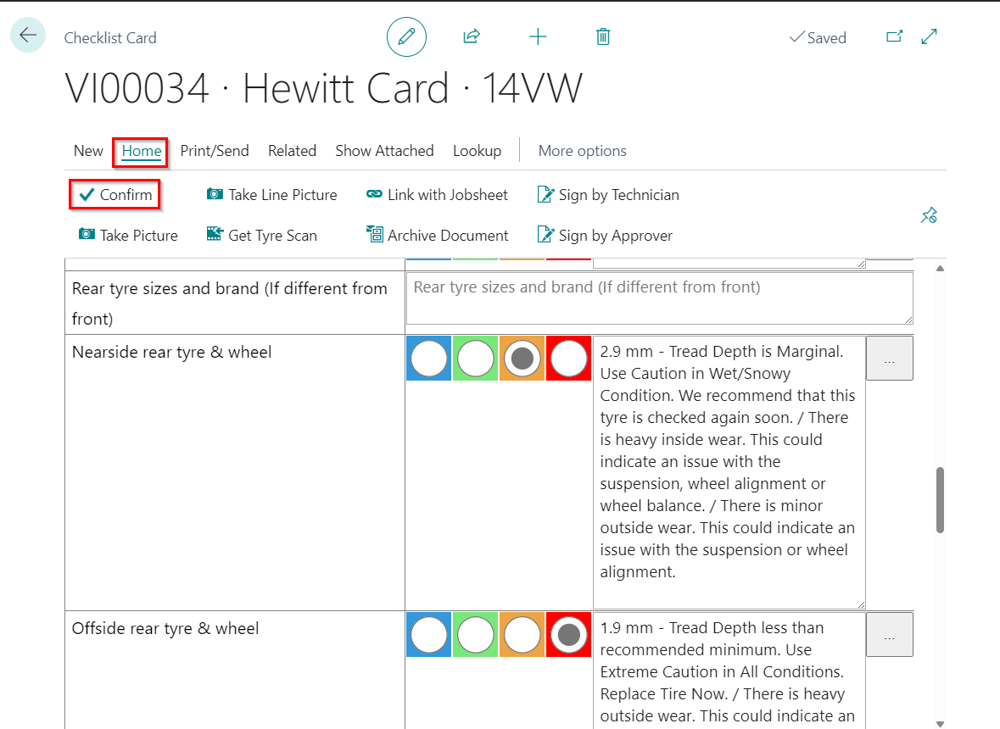

---
layout: docs
title: Garage Hive Training Module 4 for Beginners - Service Advisor
--- 

## Module 4 - Estimates & Vehicle Inspections

In Module 4, the focus is on differentiating between an Estimate and a Vehicle Inspection Estimate. You'll learn how to create an estimate and convert it into a Jobsheet. Additionally, you will understand how to process a Vehicle Inspection, convert it into an Estimate, and copy the approved work onto the Jobsheet.

In the training Modules we'll cover the following topics:

   |              |                                                                                                                                                                                                               |
   | :----------- | :------------------------------------------------------------------------------------------------------------------------------------------------------------------------------------------------------------ |
   | **Module 1** | [Getting Started (This includes the Role Centre, Creating a Booking and Populating a Jobsheet)](garagehive-training-module-1.html){:target="_blank"}                                                          |
   | **Module 2** | [Purchasing (This includes Creating a Purchase Order, Processing a Purchase Order, Viewing Items to Return Report and Creating a Purchase Return Order)](garagehive-training-module-2.html){:target="_blank"} |
   | **Module 3** | [Processing a Jobsheet and Invoice (This includes Processing a Vehicle Arriving, Processing a Jobsheet to Invoice)](garagehive-training-module-3.html){:target="_blank"}                                      |
   | **Module 4** | [Estimates and Vehicle Inspections (This Includes Creating an Estimate, Processing a Vehicle Inspection)](garagehive-training-module-4.html){:target="_blank"}                                                |

####  How to Create an Estimate

The following steps outline how to create an Estimate in Garage Hive:

   |            |                                                                                                                                                                                                                                                          |
   | :--------- | :------------------------------------------------------------------------------------------------------------------------------------------------------------------------------------------------------------------------------------------------------- |
   | **Step 1** | Click on **Estimate** in the Role Centre, located under the **Actions** menu.                                                                                                                                                                            |
   | **Step 2** | Enter the vehicle registration number in the **Vehicle Registration No.** field. If the vehicle is already in the system, the customer linked to the vehicle will be added automatically.                                                                |
   | **Step 3** | For new vehicles, the vehicle data will be pulled from autodata. Create a new customer to link with the vehicle.                                                                                                                                         |
   | **Step 4** | In the **Lines** FastTab, add labour and items to quote the customer, along with their quantity and selling price. Use the **Placeholder Item** number for items that don't have item numbers.                                                           |
   | **Step 5** | Note that, you can also populate the estimate using the **Service Packages** or **Repair Times** as demonstrated in **Training Module 1** for Jobsheets.                                                                                                 |
   | **Step 6** | After pricing up the estimate, send an SMS or Email to the customer with the total price, or call the customer and discuss the estimate. Change the **Estimate Status** to **Awaiting Authorisation** under the **General** FastTab.                     |
   | **Step 7** | Once the customer authorises the Estimate, select **Process** from the menu bar, and then **Make Jobsheet** if the customer authorised everything.                                                                                                       |
   | **Step 8** | If the customer authorised only some of the lines in the Estimate, tick the authorised lines in the **Customer Authorised** column under the **Lines** FastTab. Select **Process** from the menu bar, followed by **Copy Authorised Lines to Jobsheet**. |
   | **Step 8** | After converting the Estimate to a Jobsheet, open the schedule and allocate the created Jobsheet to the date when the customer says they will book their vehicle.                                                                                        |
   |            |                                                                                                                                                                                                                                                          |

Learn more: [Video: Creating an Estimate](https://www.youtube.com/watch?v=otMUsW5hGAA){:target="_blank"}

#### How to Process a Vehicle Inspection

The following steps outline how to process an arriving vehicle that was pre-booked:

   |            |                                                                                                                                                                                                                                                                                            |
   | :--------- | :----------------------------------------------------------------------------------------------------------------------------------------------------------------------------------------------------------------------------------------------------------------------------------------- |
   | **Step 1** | Once a technician completes a Vehicle Inspection, the tile **Awaiting Confirmation** under **Vehicle Inspection** turns red. Click on the tile to view the list of completed Vehicle Inspections, and select the one to view.                                                              |
   | **Step 2** | In the Vehicle Inspection, you'll see colour codes that indicate the extent to which a line requires attention, and at the end of each line, you'll find comments from the technician. Go through all the lines to confirm what the technician has done.                                   |
   | **Step 3** | After checking all the lines, select **Process** from the menu bar, followed by **Confirm** to confirm the Vehicle Inspection. You will receive a notification asking you if you want to create a **VIE**. Click **YES**.                                                                  |
   | **Step 4** | Click **OK** in the next notifications, and the created Vehicle Inspection Estimate will open.                                                                                                                                                                                             |
   | **Step 5** | In the Vehicle Inspection Estimate, click on **Prepare** from the menu bar, and select **Add Checklist Attention Lines**. This will add the advisory and requires urgent attention lines as a group, under the **Group Items** FastTab. You can edit the group heading in the group lines. |
   | **Step 6** | Next, add **Items** and Labour" with their quantity and prices in the **Lines** FastTab, and link them with the groups created in the **Group Items** FastTab. Click on the **Group Description** column to link them with the group.                                                      |
   | **Step 7** | When done adding the Items and Labour, send an **SMS or Email** to the customer with the total price, or call the customer and discuss the Vehicle Inspection Estimate. Change the **VIE Status** to **Awaiting Authorisation** under the **General** FastTab.                             |
   | **Step 8** | Tick the authorised lines in the **Customer Authorised** column under the **Lines** FastTab.                                                                                                                                                                                               |
   | **Step 8** | Once the customer authorises the Vehicle Inspection Estimate, click **Process**"** from the menu bar, then **Copy Authorised Lines to Jobsheet**. Select the Jobsheet to copy the lines to and click **OK**.                                                                               |
   | **Step 8** | Change the **VIE Status** to "Complete".                                                                                                                                                                                                                                                   |
   |            |                                                                                                                                                                                                                                                                                            |

Learn more: [Video: Processing a Vehicle Inspection](https://www.youtube.com/watch?v=LldJYN6HkeU){:target="_blank"}

### Links for Further Learning in Module 4

* [Using an Estimate](garagehive-create-an-estimate.html){:target="_blank"}
* [Vehicle Inspection Estimate](garagehive-VHC.html){:target="_blank"}
* [How to perform a Vehicle Inspection Checklist as a Technician](garagehive-technicians-vehicle-inspections.html){:target="_blank"}

|              |                                                                                                                                                                                                               |
| :----------- | :------------------------------------------------------------------------------------------------------------------------------------------------------------------------------------------------------------ |
| **Module 1** | [Getting Started (This includes the Role Centre, Creating a Booking and Populating a Jobsheet)](garagehive-training-module-1.html){:target="_blank"}                                                          |
| **Module 2** | [Purchasing (This includes Creating a Purchase Order, Processing a Purchase Order, Viewing Items to Return Report and Creating a Purchase Return Order)](garagehive-training-module-2.html){:target="_blank"} |
| **Module 3** | [Processing a Jobsheet and Invoice (This includes Processing a Vehicle Arriving, Processing a Jobsheet to Invoice)](garagehive-training-module-3.html){:target="_blank"}                                      |
| **Module 4** | [Estimates and Vehicle Inspections (This Includes Creating an Estimate, Processing a Vehicle Inspection)](garagehive-training-module-4.html){:target="_blank"}                                                |

[Go back to top](#top)