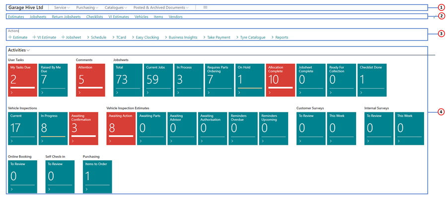
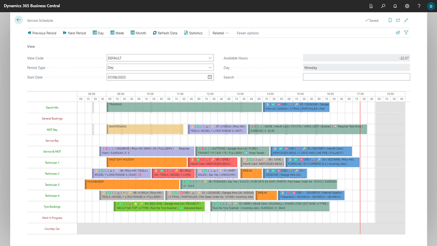
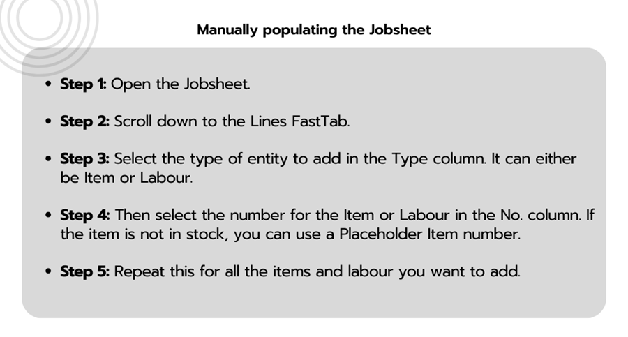
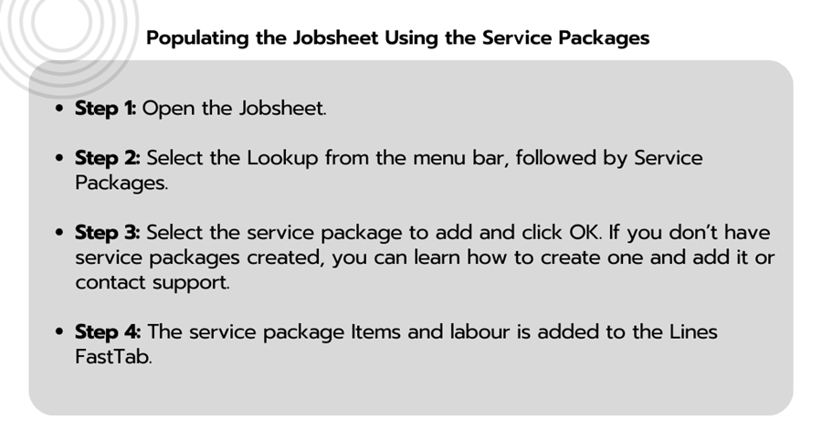
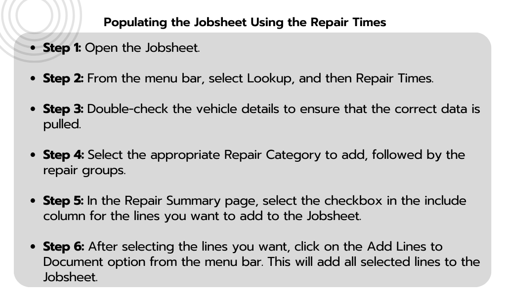

---
layout: docs
title: Garage Hive Training Modules for Beginners - Service Advisor
--- 

# Garage Hive Training Modules: Service Advisor
These training modules are designed to train **Service Advisor** users on the basic processes in Garage Hive. Users will be tested on all the modules before your go-live date and scored on progress. 

It is important to understand all elements of the process to benefit from all the value Garage Hive has to offer. 

## Module 1 - Getting started

Module 1 looks at logging into Garage Hive for the first time, creating a booking and populating a jobsheet with some labours and items. 

### Welcome to Your Role Centre
Your Role Centre Looks as shown below:

   

1. **Navigation Menu:** The top-level navigation menu provides access to the main roles of the business, with the option to expand submenus relevant to the main roles. They include Service, Purchasing, Catalogues and Posted/Archived Documents.The top-level navigation menu provides access to the main roles of the business, with the option to expand submenus relevant to the main roles. They include Service, Purchasing, Catalogues and Posted/Archived Documents.
2. **Navigation Bar:** The second-level navigation menu provides access to the most useful entities in your business process, such as your customer, their vehicle and item data stored on the system.
3. **Menu Bar:** The menu bar provides submenus of the most often used tasks that enable you to create a relevant page quickly.
4. **Data Tiles:** Each tile provides a visual representation of business data, such as total Jobsheets open and vehicle inspections, for the vehicles in your workshop booked in for repairs. These tiles will also change to red when action needs to be taken, which prompts you or your service advisor to open it to complete a task relevant to that tile.

Learn more: [Video: Welcome to your Role Centre](https://www.youtube.com/watch?v=R_mLcdbFWdo){:target="_blank"}

### How to Create a Booking
Here are the steps to follow to make a booking using the Schedule from the Role Centre:

   

With the allocations, the booking schedule should look more like this:

   

Learn more: [Video: How to create a booking](https://www.youtube.com/watch?v=MJqFUQyV2Tc){:target="_blank"}

#### How to Populate a Jobsheet
Here are a few methods on how to populate the Jobsheet:
1. **Manually Populating a Jobsheet** - This involves adding the items and labours one by one in the **Lines** FastTab.
2. **Service Packages** - These are pre-created packages which includes items and labours put together to help create jobs faster, simplify job pricing, increase consistency and so on.
3. **Repair Times** - This refers to the vehicle repair information obtained from external providers, like Autodata, which includes both labours and items.

Let's take a look at how you can use each of them:

   

   

   

Learn more: [Video: How to populate a Jobsheet](https://www.youtube.com/watch?v=ABnKqYB4f3A){:target="_blank"}

#### Links for Further Learning in Module 1

* [Learn how to create an Item card](garagehive-create-an-item-card.html)
* [Understand the schedule better](garagehive-understanding-the-schedule.html)
* [Learn how to create a Customer card](garagehive-create-a-customer-card.html)
* [Learn how to use comments in Garage Hive](garagehive-comments-extended.html)
* [Learn how to create a Labour card and using standard times](garagehive-create-a-labour-card.html)
* [Learn more about the Service Packages](garagehive-service-packages.html)

[**Continue to Module 2**](garagehive-training-module-2.html)