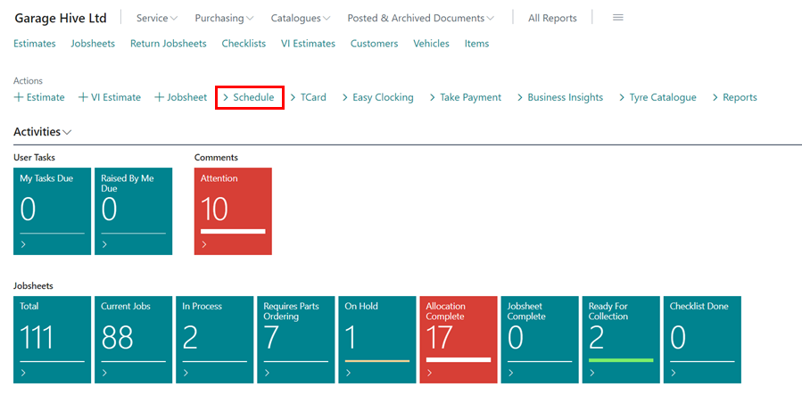
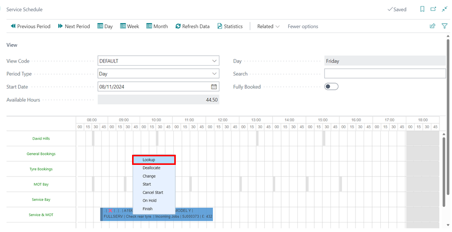
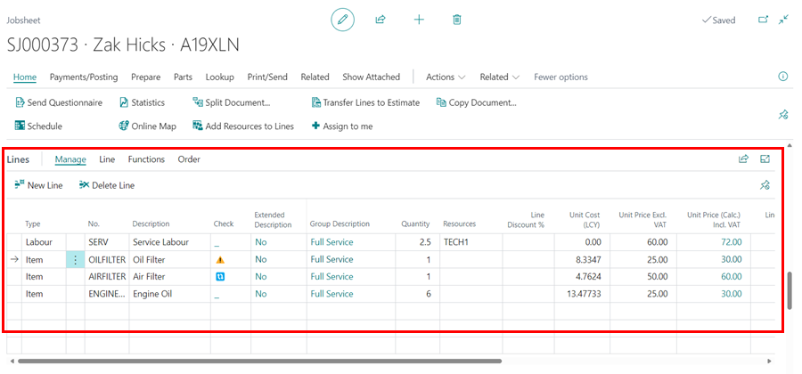
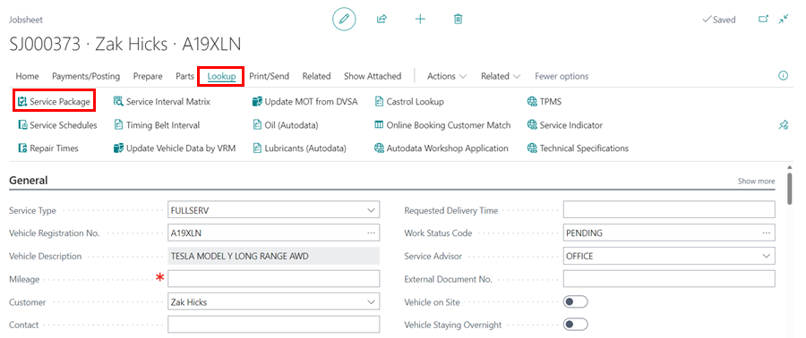
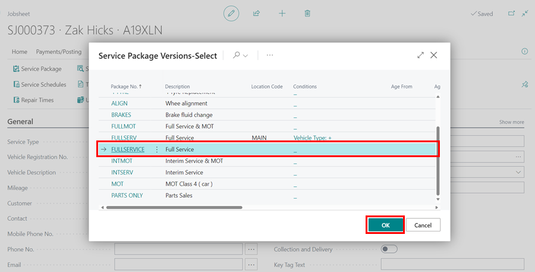
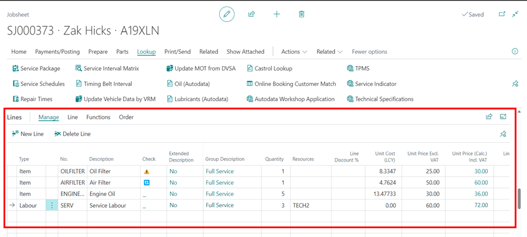

# Adding Items and Labour to a Jobsheet in Your Trial

When a booking is made and all information added, the next step is adding items and labour in the service document created. In this article, we are going to look at the various ways of adding items and labour.

## In this article

1. [Open the Jobsheet via the Schedule](#open-the-jobsheet-via-the-schedule)
2. [Adding Items and Labour in the Jobsheet Manually](#adding-items-and-labour-in-the-jobsheet-manually)
3. [Adding Items and Labour in the Jobsheet Using Service Packages](#adding-items-and-labour-in-the-jobsheet-using-service-packages)

### Open the Jobsheet via the Schedule
To open the schedule from the Role Centre:
1. Click on **Schedule** from the Role Centre.

   

2. Right-click on the booking or Jobsheet you want to access. 
3. Select **Look Up** to open the Jobsheet.

   

4. Scroll down to the **Lines** section, to add the items and labour.

   



[Go back to top](#top)

### Adding Items and Labour in the Jobsheet Manually
There are several ways to add items and labour lines to a Jobsheet. One way is to do it manually:
1. Select the first line cell on the **Type column** and add item or labour on the drop-down menu.
2. Press the tab button to move to the next cell. 
3. In the next cell, select the specific code or **No.**, used to identify the item or labour. You can use a placeholder item number such as **MISC** in the **No.** column for the items that don't exist in the system.
4. Next, add the **Quantity** and **Unit Price** (selling price) on the respective columns. The unit price can be updated manually or by use of the margin calculator.  

   

 

[Go back to top](#top)

### Adding Items and Labour in the Jobsheet Using Service Packages
The second method to add items and labour lines to a Jobsheet is through service packages:
1. Click on **Look Up** at the top-level navigation bar and select **Service Packages** from the submenus.

   

2. From the list that appears, select a service package that applies to the vehicle on the Jobsheet and click **OK**.

   

3. The items and labour lines are automatically added to the Jobsheet.

   



[Go back to top](#top)

### **See Also**

[Video: How to add items and labour to a Jobsheet](https://www.youtube.com/watch?v=ABnKqYB4f3A){:target="_blank"} \
[Welcome to Your Role Centre](garagehive-trial-welcome-to-the-role-centre.html){:target="_blank"} \
[Create Your First Booking](garagehive-trial-creating-your-first-booking.html){:target="_blank"} \
[Creating a Purchase Order](garagehive-trial-creating-a-purchase-order.html){:target="_blank"} \
[Processing a Purchase Order/Invoice](garagehive-trial-processing-a-purchase-order.html){:target="_blank"} \
[Viewing Items to Return](garagehive-trial-viewing-items-to-return.html){:target="_blank"} \
[Creating a Purchase Return Order](garagehive-trial-creating-a-purchase-return-order.html){:target="_blank"} \
[Processing a Vehicle Arriving](garagehive-trial-processing-a-vehicle-arriving.html){:target="_blank"} \
[Processing a Jobsheet to Invoice](garagehive-trial-processing-a-jobsheet-to-invoice.html){:target="_blank"} \
[Creating an Estimate](garagehive-trial-creating-an-estimate.html){:target="_blank"} \
[Processing a Vehicle Inspection Estimate](garagehive-trial-processing-a-vehicle-inspection-estimate.html){:target="_blank"}