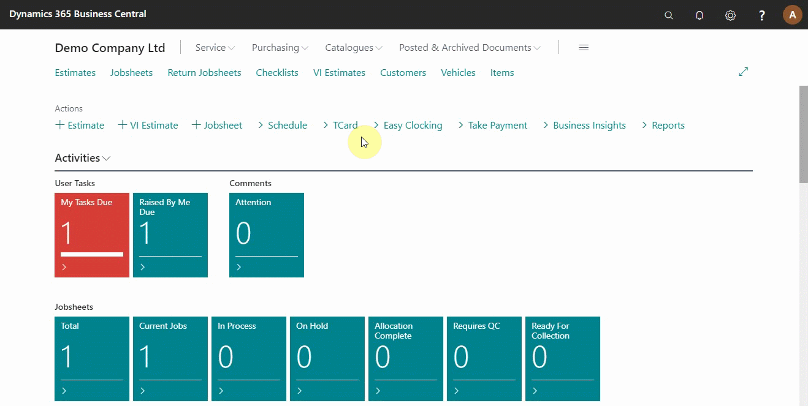
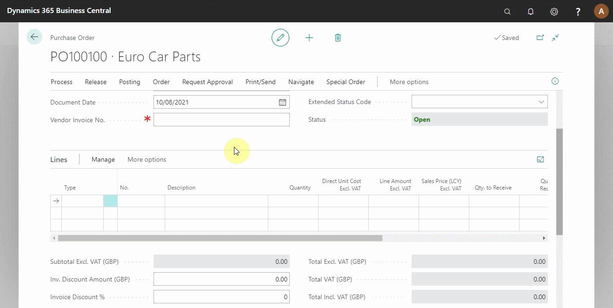
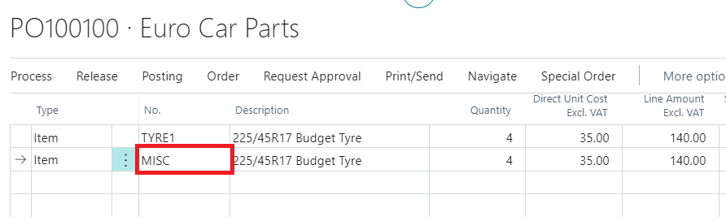
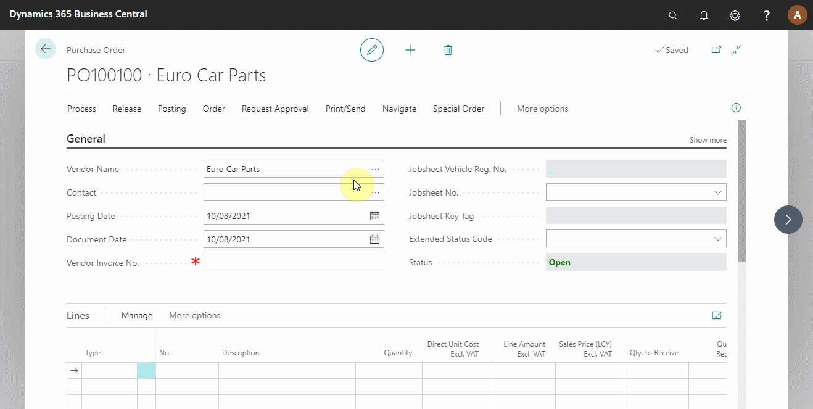
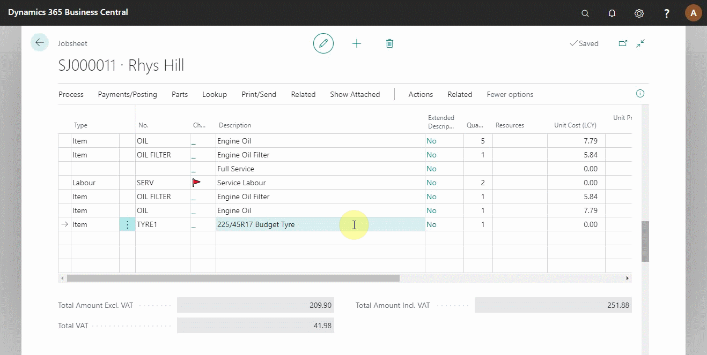

# Creating a Purchase Order in Your Trial

To start communicating with the suppliers/vendors, you need to prepare the purchase orders, which indicate the items you need to buy. The purchase orders can be prepared directly from the purchase orders page or the jobsheet. Let’s look at the different methods.

## In this article

1. [Creating a purchase order from the purchase orders page](#creating-a-purchase-order-from-the-purchase-orders-page)
2. [Linking a purchase order with the jobsheet](#linking-a-purchase-order-with-the-jobsheet)
3. [Creating a purchase order from the jobsheet](#creating-a-purchase-order-from-the-jobsheet) 

### Creating a purchase order from the purchase orders page
From the navigation menu on the role centre, click on **Purchasing** to access the submenus and select **Purchase Orders**. The purchase orders page opens; click on **+New** to create a new purchase order and enter the vendor details from the **General** fast tab (see below).

After adding the vendor details, add the item(s) to the purchase order **Lines**, specifying the item **No.**, **Quantity** and **Description**. For the non-stock items, you can use **Misc** for item **No.** as you wait for the correct **No.** from the supplier's invoice (See Below).

 

### Linking a purchase order with the jobsheet
To link a Purchase order with a jobsheet, scroll up to the **General** fast tab, fill in the **Jobsheet No.** field, or choose from the list. All the items in the purchase order will now be automatically added to the linked jobsheet. Do this before adding any items to the purchase order.

> **Note**
> 
> You can only link a purchase order to a jobsheet once you receive the supplier invoice.

### Creating a purchase order from the jobsheet
To create a purchase order from the jobsheet, select the item lines you want to order by ticking on the box in column **Purchase(Special)**; this selects the items and adds them to the purchase order. Fill in the vendor to order from on the **Vendor No.** column. Click on **Parts** from the actions bar, select **Create Purchase Order(s)** from the submenu, and a purchase order is created (see below).

### **See Also**

[Video: How to create a purchase order](https://www.youtube.com/watch?v=M1KB7dSiZrY&:target="_blank")