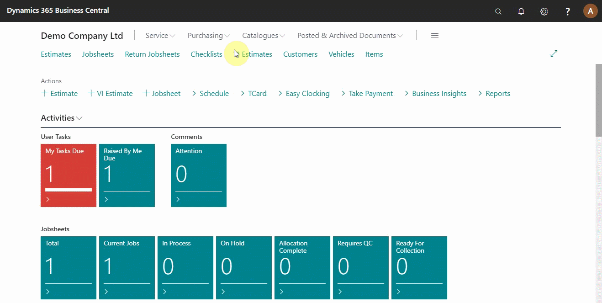
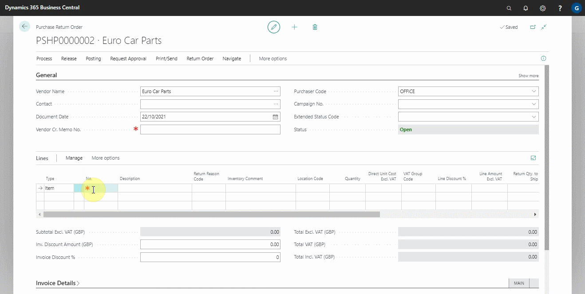
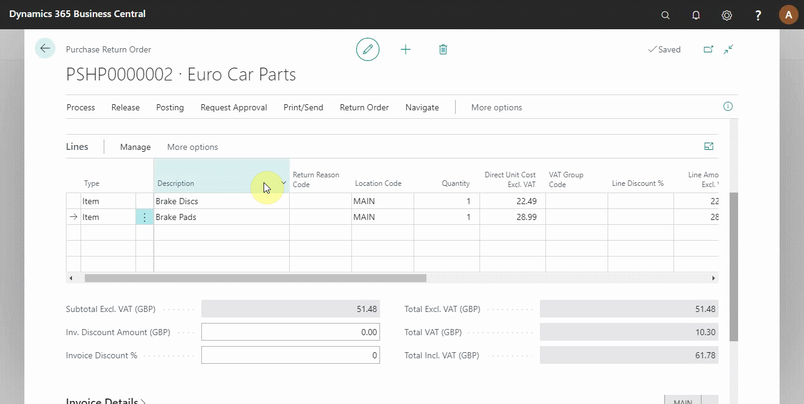

# Creating a Purchase Return Order in Your Trial

Purchase return orders are documents you use to monitor and maintain all your returns. They help you track items you ship back to the supplier and receive a credit memo when processed by the supplier.

## In this article

1. [Creating a purchase return order](#creating-a-purchase-return-order)
2. [Shipping the items to the supplier](#shipping-the-items-to-the-supplier)
3. [Posting a credit memo from the supplier](#posting-a-credit-memo-from-the-supplier)

### Creating a purchase return order
1. From the role centre, click on **Purchasing** and select **Purchase Return Orders**. 
2. Click on **+New** to create a new purchase return order. 
3. Enter the vendor details and the items to return.

   

4. When you add items to return, the **Inventory Comment** field is automatically populated with a comment about when the item was last purchased and in which invoice. You can also manually edit the **Inventory Comment** field.

   

### Shipping the items to the supplier
When the purchase return order is created, the items must be returned to the supplier for a credit memo to be processed:
1. Click **Posting** from the actions bar and select **Post** from the submenus.
2. The pop-up menu gives you three options to choose from, select **Ship** as you wait for the supplier credit memo; this means the items have been returned to the supplier, and now you are waiting for a credit memo from the supplier.

 

### Posting a credit memo from the supplier
After receiving a credit memo from the supplier: 
1. Ensure that all the details on the credit memo match the purchase return order; the date, document number, and the amounts. 
2. Click on **Posting** from the actions bar and select **Post** from the submenus. 
3. Select **Invoice** from the three options, which posts the purchase return order to update the relevant ledger accounts and balance the stock levels.

### **See Also**

[Video: How to create a purchase return order](https://www.youtube.com/watch?v=X81T5UAOTNU&t=83s){:target="_blank"} \
[Welcome to Your Role Centre](garagehive-trial-welcome-to-the-role-centre.html) \
[Create Your First Booking](garagehive-trial-creating-your-first-booking.html) \
[Adding Items and Labour to a Jobsheet](garagehive-trial-adding-items-and-labour-to-a-jobsheet.html) \
[Creating a Purchase Order](garagehive-trial-creating-a-purchase-order.html) \
[Processing a Purchase Order/Invoice](garagehive-trial-processing-a-purchase-order.html) \
[Viewing Items to Return](garagehive-trial-viewing-items-to-return.html) \
[Processing a Vehicle Arriving](garagehive-trial-processing-a-vehicle-arriving.html) \
[Processing a Jobsheet to Invoice](garagehive-trial-processing-a-jobsheet-to-invoice.html) \
[Creating an Estimate](garagehive-trial-creating-an-estimate.html) \
[Processing a Vehicle Inspection Estimate](garagehive-trial-processing-a-vehicle-inspection-estimate.html)