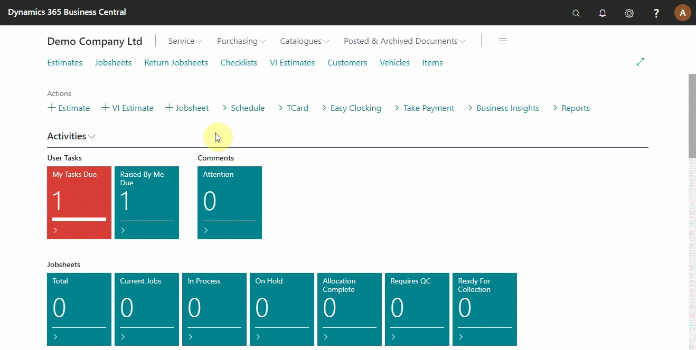
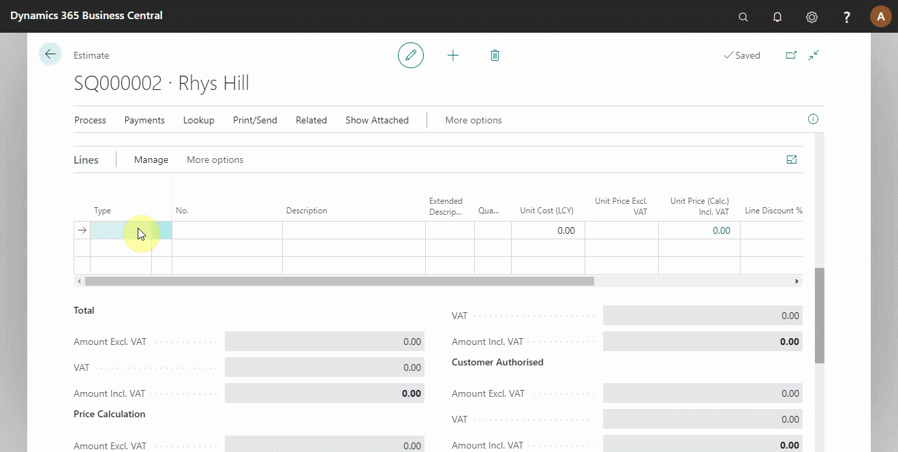
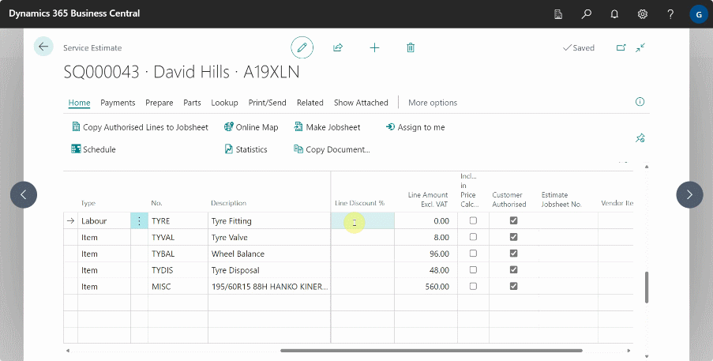
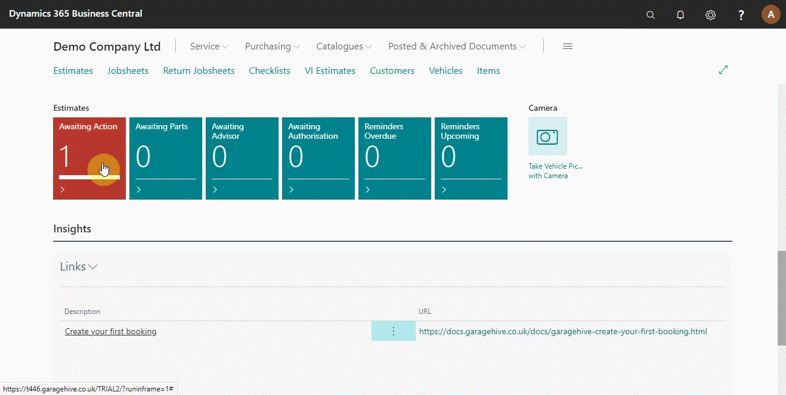

# Creating an Estimate in Your Trial
There are two types of estimates available in Garage Hive: 
1. Normal **Estimate** where the customer calls the business and requests to be sent a quotation on a job they need,
2. **Vehicle Inspection Estimate** where the customer brings the vehicle for an inspection, after which an estimate is created depending on the issues found on the vehicle.

In this article,  we are going to look at the normal estimate.

## In this article

1. [Create an estimate](#open-the-jobsheet-via-the-schedule)
2. [Copy authorised lines into a jobsheet](#adding-items-and-labour-in-the-jobsheet-manually)
3. [Convert an estimate into a jobsheet](#adding-items-and-labour-in-the-jobsheet-using-service-packages)

### Create an estimate
To create a new estimate from the role centre:
1. Click on **+Estimate** from the actions bar. 
2. Fill in the vehicle and customer details on the **General** FastTab.

   

3. Add items and labour from the **Lines** section. For the items which don't exist in the system(for example, items that you've not used before), you can use a placeholder item **No.** for example, **MISC** as you wait for the correct item **No.**.

   

4. If you click on any amount under the **Totals Including VAT**, which is below the estimate lines, a pop-up window appears which shows the **Document Total**, **Price Calculation**, **Customer Authorised** totals and **Customer Unauthorised** totals.

   

### Copy authorised lines into a jobsheet
There are two ways to convert an estimate into a jobsheet, first is copying the customer authorised lines into a jobsheet:
1. Click on **Process** from the actions bar and select **Copy Authorised Lines Into a Jobsheet**. A jobsheet is automatically created, if no previous jobsheet was available. 
2. If a jobsheet was available, you could merge the estimate and the jobsheet.

### Make an estimate into a jobsheet

The other method to convert an estimate into a jobsheet:
1. Use the option **Make Jobsheet**, which means that the customer has approved all the items and labour in the estimate.
2. Click on **Process** from the actions bar and select **Make Jobsheet** from the submenus. The jobsheet is automatically created, and the estimate is archived.



### **See Also**

[Video: How to create an estimate](https://www.youtube.com/watch?v=otMUsW5hGAA&:target="_blank") \
[Welcome to Your Role Centre](garagehive-trial-welcome-to-the-role-centre.html) \
[Create Your First Booking](garagehive-trial-creating-your-first-booking.html) \
[Adding Items and Labour to a Jobsheet](garagehive-trial-adding-items-and-labour-to-a-jobsheet.html) \
[Creating a Purchase Order](garagehive-trial-creating-a-purchase-order.html) \
[Processing a Purchase Order/Invoice](garagehive-trial-processing-a-purchase-order.html) \
[Viewing Items to Return](garagehive-trial-viewing-items-to-return.html) \
[Creating a Purchase Return Order](garagehive-trial-creating-a-purchase-return-order.html) \
[Processing a Vehicle Arriving](garagehive-trial-processing-a-vehicle-arriving.html) \
[Processing a Jobsheet to Invoice](garagehive-trial-processing-a-jobsheet-to-invoice.html) \
[Processing a Vehicle Inspection Estimate](garagehive-trial-processing-a-vehicle-inspection-estimate.html)