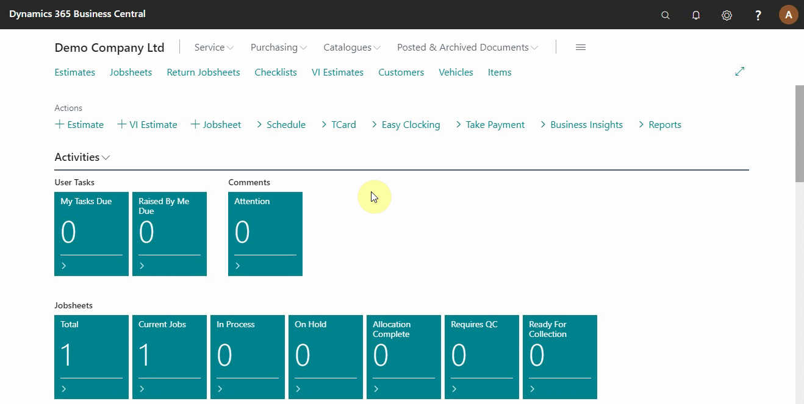
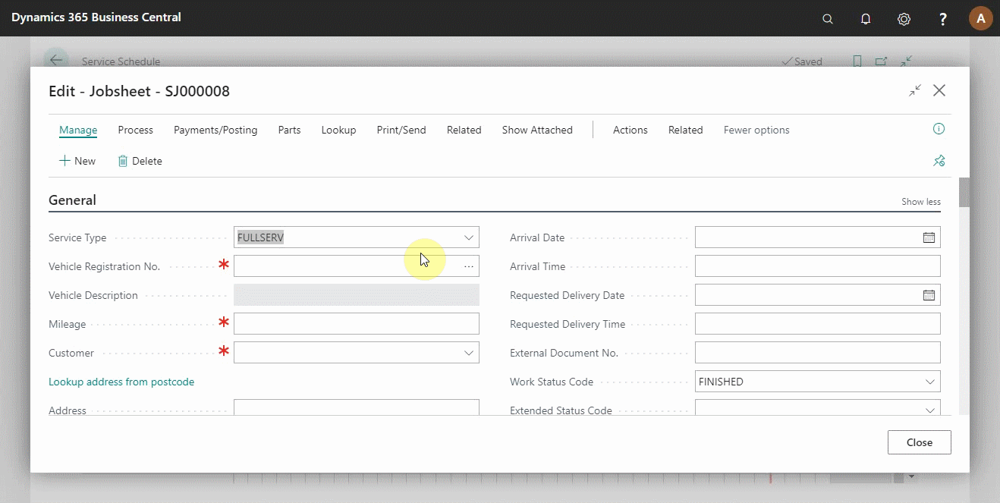
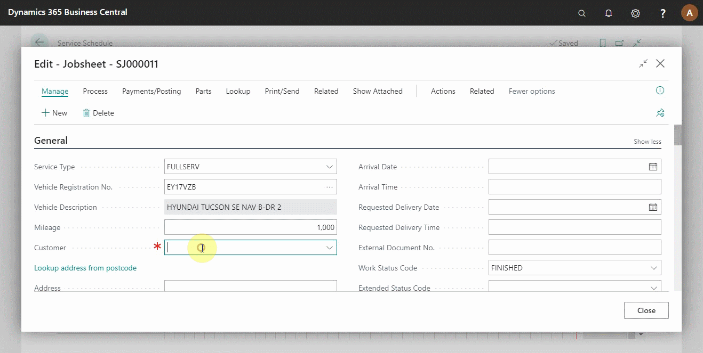
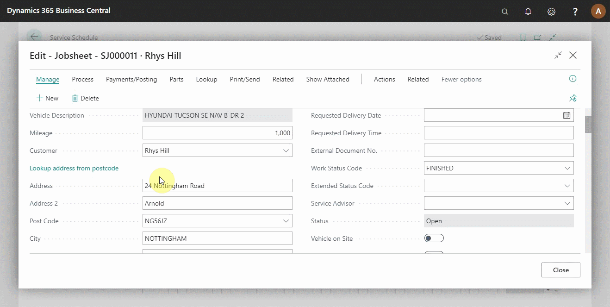

# Creating Your First Booking in Your Trial

One way to get started on Garage Hive is to make a booking. A booking ensures that you create a jobsheet and capture relevant information about the job.

## In this article
1. [Create a booking](#create-a-booking)
2. [Add vehicle details](#add-vehicle-details)
3. [Add customer details](#add-customer-details)
4. [Add comments](#add-comments)

### Create a booking

To create a booking from the home page, click on the **Schedule** from the actions bar, select the **Bay** or the **Technician** to allocate the booking, left click and drag horizontally on the right from the time the booking starts to the end of the booking, and then release. A pop-up window appears, **Select Allocation Type** for the booking and click okay (see below).

### Add vehicle details
 
 After clicking okay, a jobsheet is created and appears on the pop-up window. Start by typing in the vehicle registration number on the field **Vehicle Registration No.** and press the tab button; the vehicle details are added automatically (see below).

### Add customer details

If the vehicle was already added before, the customer details would be added automatically. If not, start typing the customer's name under the field **Customer** and press the tab button to create a new customer. From the pop-up window that appears, add the customer's address by searching on **Lookup address from postcode**, add the customer's phone number and email address on the respective fields. Scroll down to the **Payments** section and add the payments terms. Scroll up to add a credit limit on the **Credit Limit (LCY)** Field (if necessary) and then click close to create the customer's card (see below).

   
### Add comments

To add a comment, scroll down to the **Comments** section on the jobsheet, select the first cell under the **Type Code** column and add the type of comment. Select the next cell under the **Comment (Extended)** column, and a pop-up window appears, where you write your comment; you can maximize the window for a better view. After adding the comment, close the window to create the comment; the time and date of the comment are added automatically (see below).

> **Note:** 
>
> Unlike other fields in the system, the comment can be as long as you want.

### See Also
[Video: How to create your first booking](https://www.youtube.com/watch?v=MJqFUQyV2Tc).