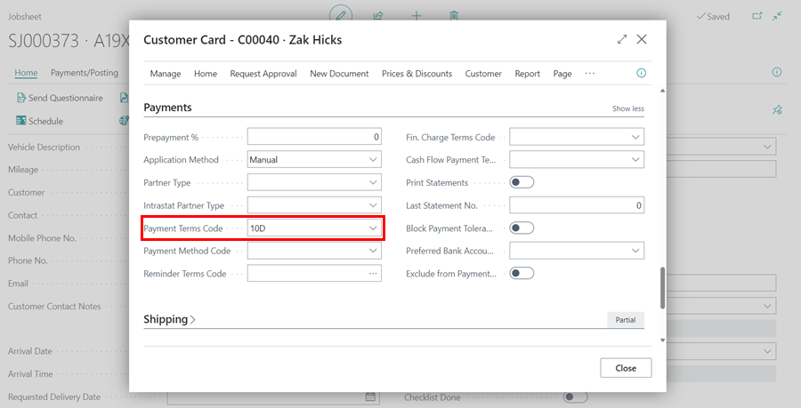

# Creating Your First Booking in Your Trial

One way to get started on Garage Hive is to make a booking. A booking ensures that you create a jobsheet and capture relevant information about the job.

## In this article
1. [Create a Booking](#create-a-booking)
2. [Adding Vehicle Details](#adding-vehicle-details)
3. [Adding Customer Details](#adding-customer-details)
4. [Adding Comments](#adding-comments)

### Create a Booking

To create a booking from the home page:
1. Click on the **Schedule** from the menu bar.
2. Select the **Bay** or the **Technician** to allocate the booking.
3. Left click and drag horizontally on the right from the time the booking starts to the end of the booking, and then release. 
4. A pop-up window appears, **Select Allocation Type** for the booking and click okay. After clicking okay, a jobsheet is created and appears on the pop-up window.

[Go back to top](#top)

### Adding Vehicle Details
1. In the **Vehicle Registration No.** field, enter the vehicle’s registration number and press the **Tab** key. If the vehicle already exists in the system, its details will be added automatically. If not, the information will be retrieved if available through the **Vehicle Data Lookup** provider.

   

2. If the vehicle is not available on any of the option, you'll get an option to create a new **Vehicle Card**.

    

[Go back to top](#top)

### Adding Customer Details
If the vehicle was already added before, the customer details would be added automatically. If not:
1. Enter the customer's name in the field **Customer** and press the tab button to create a new customer.

   

2. From the pop-up window that appears, select **Create a new customer card**.

   

3. Add the customer's address by searching on **Lookup address from postcode**.
4. Add the customer's phone number and email address on the respective fields.

   

5. If you have payment terms agreed with a customer (trade), for example, they pay every 30 days from the invoice date, you can add the terms by scrolling down to the **Payments** section.

   

6. Scroll up to add a credit limit on the **Credit Limit (LCY)** Field (if necessary)
7. Click close to create the customer's card.

   

[Go back to top](#top)

### Adding Comments
To add a comment:
1. Scroll down to the **Comments** section on the jobsheet.
2. Select the first cell under the **Type Code** column and add the type of comment.
3. Select the next cell under the **Comment (Extended)** column, and a pop-up window appears, where you write your comment; you can maximize the window for a better view. 
4. After adding the comment, close the window to create the comment; the time and date of the comment are added automatically.

   



[Go back to top](#top)

### See Also

[Video: How to create your first booking](https://www.youtube.com/watch?v=MJqFUQyV2Tc){:target="_blank"} \
[Welcome to Your Role Centre](garagehive-trial-welcome-to-the-role-centre.html){:target="_blank"} \
[Adding Items and Labour to a Jobsheet](garagehive-trial-adding-items-and-labour-to-a-jobsheet.html){:target="_blank"} \
[Creating a Purchase Order](garagehive-trial-creating-a-purchase-order.html){:target="_blank"} \
[Processing a Purchase Order/Invoice](garagehive-trial-processing-a-purchase-order.html){:target="_blank"} \
[Viewing Items to Return](garagehive-trial-viewing-items-to-return.html){:target="_blank"} \
[Creating a Purchase Return Order](garagehive-trial-creating-a-purchase-return-order.html){:target="_blank"} \
[Processing a Vehicle Arriving](garagehive-trial-processing-a-vehicle-arriving.html){:target="_blank"} \
[Processing a Jobsheet to Invoice](garagehive-trial-processing-a-jobsheet-to-invoice.html){:target="_blank"} \
[Creating an Estimate](garagehive-trial-creating-an-estimate.html){:target="_blank"} \
[Processing a Vehicle Inspection Estimate](garagehive-trial-processing-a-vehicle-inspection-estimate.html){:target="_blank"}