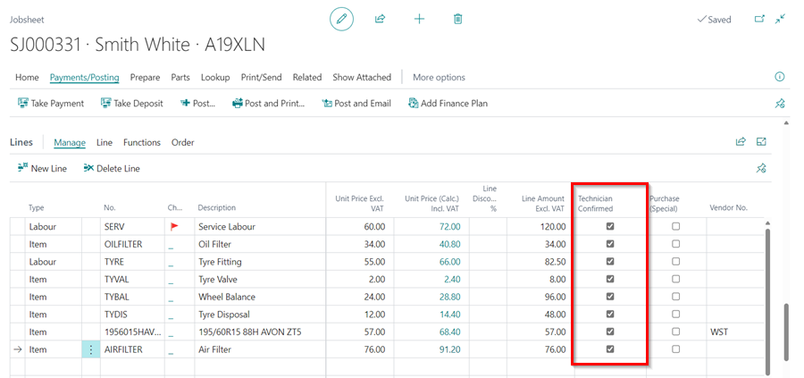
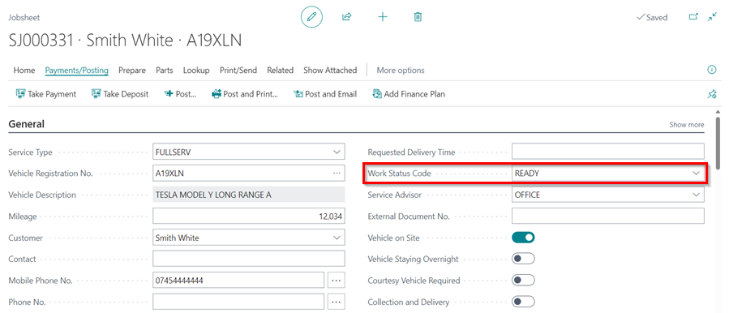
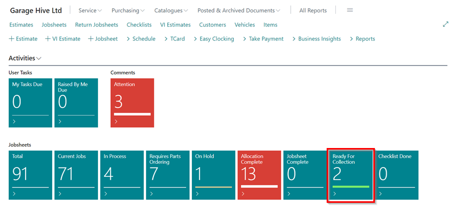
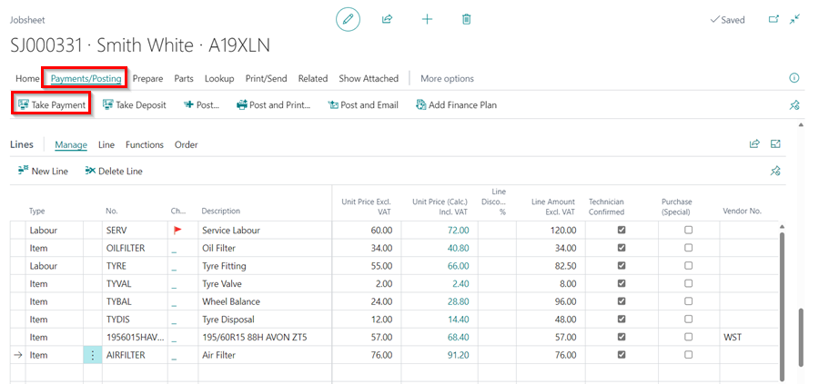
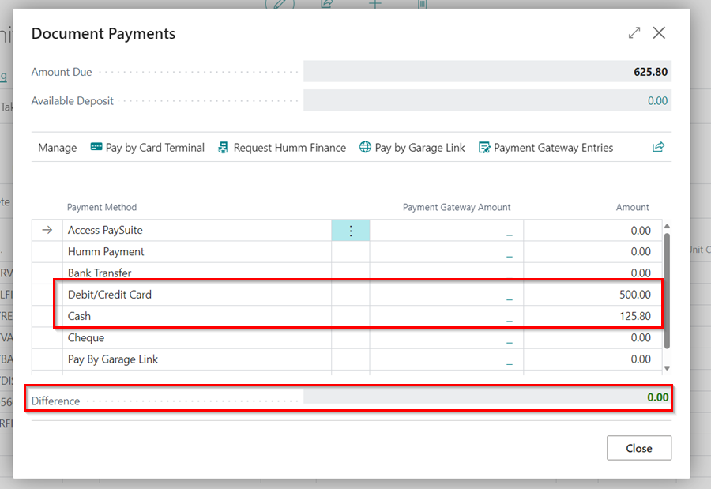
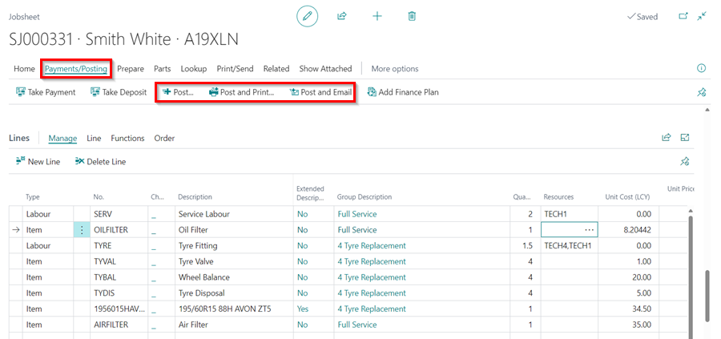
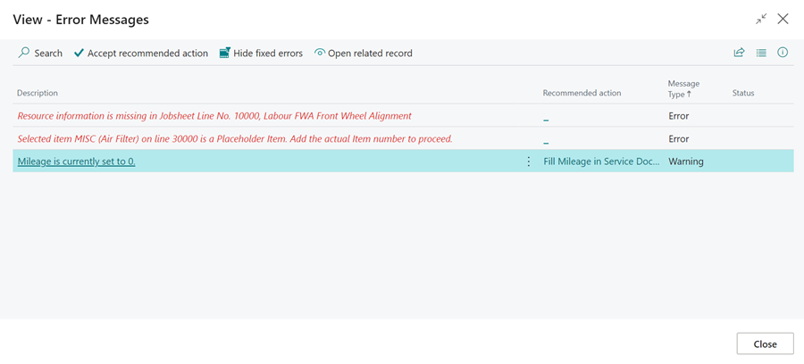

# Processing a Jobsheet to Invoice in Your Trial

When a Jobsheet is done, all the information is correct, and all the work is done, it's time to make the Jobsheet an invoice to share with the customer. In this article, we learn about how to turn a Jobsheet into an invoice.

## In this article

1. [Mark the Jobsheet Ready for Collection](#mark-the-jobsheet-ready-for-collection)
2. [Taking Payments on a Jobsheet](#taking-payments-on-a-jobsheet)
3. [Posting a Jobsheet and Creating an Invoice](#posting-a-jobsheet-and-creating-an-invoice)

### Mark the Jobsheet Ready for Collection
When the work on the vehicle is finished:
1. Confirm that everything in the Jobsheet lines is ticked by the technician on the **Technician Confirmed** column. 

   

2. Select **Ready for Collection** in the field **Work Status Code** under the **General** FastTab.

   

3. This moves the Jobsheet to **Ready for Collection** tile in the Role Centre.

   



[Go back to top](#top)

### Taking Payments on a Jobsheet
To receive payment from the customer:
1. Click **Payments/Posting** from the menu bar and select **Take Payment**. 

   

2. Various methods are available to receive the Payment; select the exact method(s) the customer has used.
3. The amount is automatically updated at the bottom **Difference** row. Click on **Close** when done. 

   

### Posting a Jobsheet and Creating an Invoice
After receiving the payment, the next step is to post the Jobsheet:
1. Confirm that all the details in the Jobsheet are correct; the dates, amount, items signed out and customer details.
2. The posting date should be today's date (the day you are posting).
3. Then from the menu bar, select **Payment/Posting**, then you can select either of the following options:
  * **Post** - Post/invoice this Jobsheet without the option of printing or emailing it.
  * **Post and Print** - Post/invoice this Jobsheet and print a copy of the invoice.
  * **Post and Email** - Post/invoice this Jobsheet and email a copy of the invoice to the **Bill-To Customer**.

   

4. The following **Error Messages** window will display errors and warnings occuring from posting the Jobsheet.

   

[Go back to top](#top)

### **See Also**

[Video: How to process a jobsheet to invoice](https://www.youtube.com/watch?v=SdgMs_uS9Y0&t=62s){:target="_blank"} \
[Welcome to Your Role Centre](garagehive-trial-welcome-to-the-role-centre.html){:target="_blank"} \
[Create Your First Booking](garagehive-trial-creating-your-first-booking.html){:target="_blank"} \
[Adding Items and Labour to a Jobsheet](garagehive-trial-adding-items-and-labour-to-a-jobsheet.html){:target="_blank"} \
[Creating a Purchase Order](garagehive-trial-creating-a-purchase-order.html){:target="_blank"} \
[Processing a Purchase Order/Invoice](garagehive-trial-processing-a-purchase-order.html){:target="_blank"} \
[Viewing Items to Return](garagehive-trial-viewing-items-to-return.html){:target="_blank"} \
[Creating a Purchase Return Order](garagehive-trial-creating-a-purchase-return-order.html){:target="_blank"} \
[Processing a Vehicle Arriving](garagehive-trial-processing-a-vehicle-arriving.html){:target="_blank"} \
[Creating an Estimate](garagehive-trial-creating-an-estimate.html){:target="_blank"} \
[Processing a Vehicle Inspection Estimate](garagehive-trial-processing-a-vehicle-inspection-estimate.html){:target="_blank"}