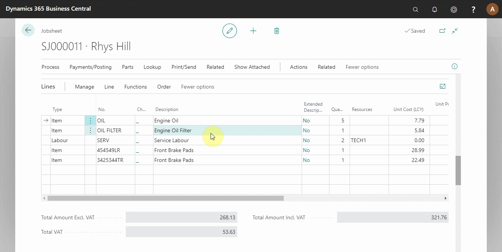
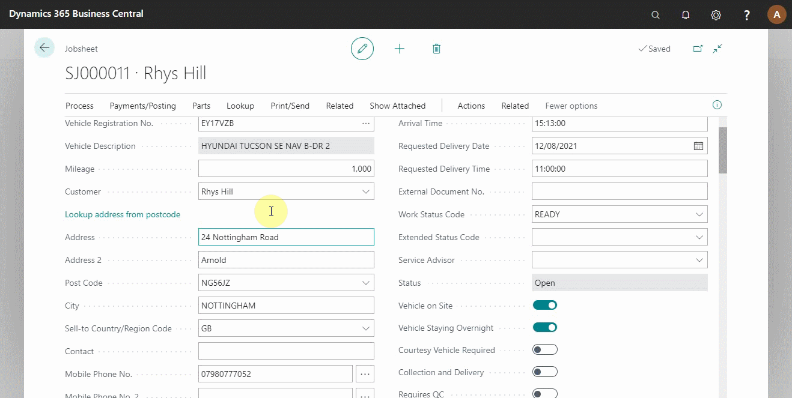
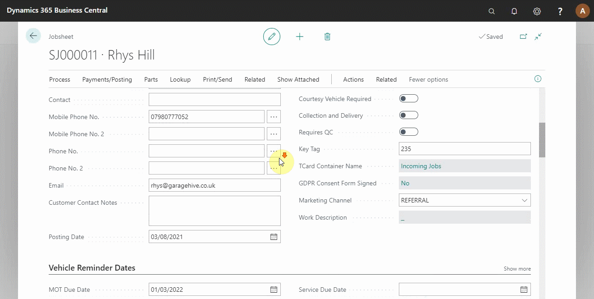

# Processing a Jobsheet to Invoice in Your Trial

When a jobsheet is done, all the information is correct, and all the work is done, it's time to make the jobsheet an invoice to share with the customer. In this article, we learn about how to turn a jobsheet into an invoice.

## In this article

1. [Mark the jobsheet ready for collection](#mark-the-jobsheet-ready-for-collection)
2. [Taking payments on a jobsheet](#taking-payments-on-a-jobsheet)
3. [Posting a jobsheet and creating an invoice](#posting-a-jobsheet-and-creating-an-invoice)

### Mark the jobsheet ready for collection
When the work on the vehicle is finished, confirm that everything in the jobsheet lines is ticked by the technician on the **Technician Confirmed** column and mark the jobsheet ready for collection by select the field **Work Status Code** and enter the **Ready for Collection** status from the options; this moves the jobsheet to **Ready for Collection** tile (see below).

> **Note:** 
>
> For the jobsheet to be complete, the technician must mark it **Complete**.

### Taking payments on a jobsheet
To receive payment from the customer, click **Payments/Posting** from the actions bar and select **Take Payment**. Various methods are available to receive the Payment; select the exact method(s) the customer has used. The amount is automatically updated at the bottom **Difference** row. Click on **Close** (see below). 

### Posting a jobsheet and creating an invoice
After receiving the payment, the next step is to post the jobsheet. Confirm that all the details in the jobsheet are correct; the dates, amount, items signed out and customer details. The posting date should be today's date (the day you are posting). Click on **Payments/Posting** from the actions bar and select **Post and Print**. The invoice is downloaded and ready to print (see below).

 

### **See Also**

[Video: How to process a jobsheet to invoice](https://www.youtube.com/watch?v=SdgMs_uS9Y0&t=62s&:target="_blank")