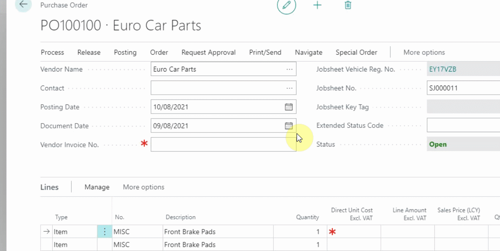
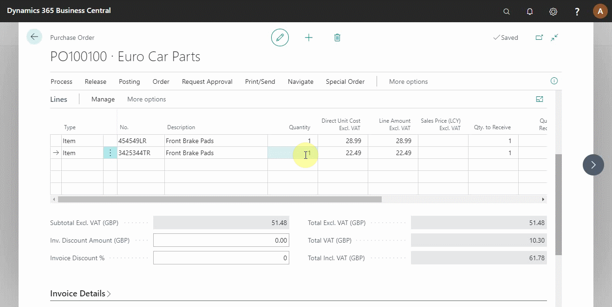

# Processing a Purchase Order/Invoice in Your Trial 

To process a purchase order means receiving the items ordered from the supplier and updating the respective ledger accounts for the items and vendor. To do this, you must have the supplier invoice with you. 

## In this article

1. [Match the supplier invoice with the purchase order](#match-the-supplier-invoice-with-the-purchase-order)
2. [Receive and post the purchase order](#receive-and-post-the-purchase-order)

### Match the supplier invoice with the purchase order
To post a purchase order in the system:
1. All the details from the supplier invoice must match with the purchase order; this includes the date, document number, part numbers, and the total amount.
2. Open the purchase order with the items to receive, update the **Document No.** to match the supplier document number, and the posting date must be the date today. 
3. For the items with the placeholder item **No.** like **Misc**, update to match the correct item **No.** and the **Unit Cost**. Here, you will be reminded that this purchase order is linked to a jobsheet, and by selecting yes the item **No.** will be copied over to the jobsheet.



### Receive and post the purchase order
After ensuring that all the information in the purchase order is correct, the purchase order needs to be posted:
1. From the actions bar, click on **Posting** and select **Post** from the submenus.
2. Select **Receive and Invoice** from the pop-up menu; since you are now receiving the items with the supplier invoice available. The document is now posted and updated (see below).

 

### **See Also**

[Video: How to process a purchase order/invoice](https://www.youtube.com/watch?v=eKXEvrj1QQQ){:target="_blank"} \
[Welcome to Your Role Centre](garagehive-trial-welcome-to-the-role-centre.html) \
[Create Your First Booking](garagehive-trial-creating-your-first-booking.html) \
[Adding Items and Labour to a Jobsheet](garagehive-trial-adding-items-and-labour-to-a-jobsheet.html) \
[Creating a Purchase Order](garagehive-trial-creating-a-purchase-order.html) \
[Viewing Items to Return](garagehive-trial-viewing-items-to-return.html) \
[Creating a Purchase Return Order](garagehive-trial-creating-a-purchase-return-order.html) \
[Processing a Vehicle Arriving](garagehive-trial-processing-a-vehicle-arriving.html) \
[Processing a Jobsheet to Invoice](garagehive-trial-processing-a-jobsheet-to-invoice.html) \
[Creating an Estimate](garagehive-trial-creating-an-estimate.html) \
[Processing a Vehicle Inspection Estimate](garagehive-trial-processing-a-vehicle-inspection-estimate.html)