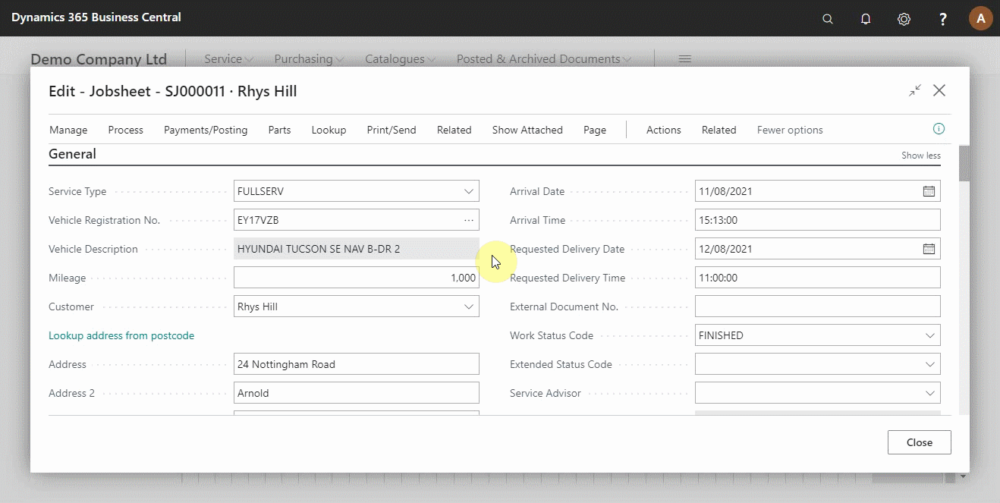

# Processing a Vehicle Arriving in Your Trial

There are several things to process when the vehicle arrives to help in communicating with the technicians working on the vehicle, etc.

## In this article

1. [Check-in arrival date, arrival time, and mark vehicle on-site](#check--in-arrival-date,-arrival-time,-and-mark-vehicle-on--site)
2. [Adding customer comment and allocating job to the technician on schedule](#adding-customer-comment-and-allocating-job-to-the-technician-on-schedule)

### Check-in arrival date, arrival time, and mark vehicle on-site
When the customer arrives with the vehicle, open the jobsheet, fill in the **Arrival Date** and **Arrival Time** from the general fast tab and select **Vehicle On Site** to confirm the vehicle is on-site. If the vehicle is staying overnight, select **Vehicle Staying Overnight**. If the customer has requested delivery date and time, add the **Requested Delivery Date** and **Requested Delivery Time** fields. Give the vehicle key a tag for easier tracking and add the tag number to the system. (see below).

### Adding customer comment and allocating job to the technician
To add customer comments, scroll down on the jobsheet page to the **Comment Section**, select **Customer** from the **Type Code** and add the customer comments; this helps the technicians understand what other issues the customer might have highlighted. Now, you are ready to assign the job to a technician. Close the jobsheet page and go to the **Schedule**, left click and hold on the booking and drag it to the technician and time you want to allocate. Release when in the correct position (see below).

### **See Also**

[Video: How to process a vehicle arrival](https://www.youtube.com/watch?v=pBSymFc-9m8&t=159s).