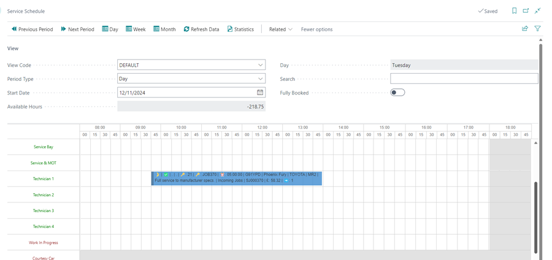

# Processing a Vehicle Arriving in Your Trial

There are several things to do when the vehicle arrives for repairs, and that is what we look at here.

## In this article

1. [Checking in the Vehicle](#checking-in-the-vehicle)
2. [Adding Customer Comment and Allocating Job to the Technician on Schedule](#adding-customer-comment-and-allocating-job-to-the-technician-on-schedule)

### Checking in the Vehicle
When the customer arrives with the vehicle:
1. Open the Jobsheet, fill in the **Arrival Date** and **Arrival Time** from the **General** FastTab and select **Vehicle On Site** to confirm the vehicle is on-site.
2. If the vehicle is staying overnight, select **Vehicle Staying Overnight**. 
3. If the customer has requested delivery date and time, add the **Requested Delivery Date** and **Requested Delivery Time** fields. 
4. Give the vehicle key a tag for easier tracking and add the tag number to the system.

   

[Go back to top](#top)

### Adding Customer Comment and Allocating Job to the Technician on Schedule
To add customer comments:
1. Scroll down on the Jobsheet page to the **Comment Section**, select **Customer** from the **Type Code** and add the customer comments; this helps the technicians understand what other issues the customer might have highlighted.

   

2. Now, you are ready to assign the job to a technician. Close the Jobsheet page and go to the **Schedule**, left click and hold on the booking and drag it on the technician up to time you want to allocate. 
3. Release when in the correct position.

   

[Go back to top](#top)

### **See Also**

[Video: How to process a vehicle arrival](https://www.youtube.com/watch?v=pBSymFc-9m8&t=159s){:target="_blank"} \
[Welcome to Your Role Centre](garagehive-trial-welcome-to-the-role-centre.html){:target="_blank"} \
[Create Your First Booking](garagehive-trial-creating-your-first-booking.html){:target="_blank"} \
[Adding Items and Labour to a Jobsheet](garagehive-trial-adding-items-and-labour-to-a-jobsheet.html){:target="_blank"} \
[Creating a Purchase Order](garagehive-trial-creating-a-purchase-order.html){:target="_blank"} \
[Processing a Purchase Order/Invoice](garagehive-trial-processing-a-purchase-order.html){:target="_blank"} \
[Viewing Items to Return](garagehive-trial-viewing-items-to-return.html){:target="_blank"} \
[Creating a Purchase Return Order](garagehive-trial-creating-a-purchase-return-order.html){:target="_blank"} \
[Processing a Jobsheet to Invoice](garagehive-trial-processing-a-jobsheet-to-invoice.html){:target="_blank"} \
[Creating an Estimate](garagehive-trial-creating-an-estimate.html){:target="_blank"} \
[Processing a Vehicle Inspection Estimate](garagehive-trial-processing-a-vehicle-inspection-estimate.html){:target="_blank"}