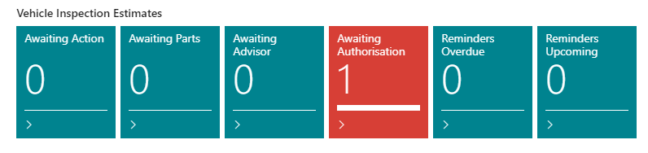

# Processing a Vehicle Inspection Estimates (VIEs) in Your Trial

VIE in Garage Hive offer the ability to manage and monitor your up-sell, additional authorisation and estimates across all of your service staff. VIE are created by confirming a checklist such as, [Vehicle Inspection Checklist](/docs/garagehive-technicians-vehicle-inspections.html "How to perform a Vehicle Inspection") or **Quality Control Checklist**.

## In this article
1. [Create a VIE from a checklist template](#create-a-vie-from-a-checklist-template)
2. [Carry out the vehicle checks from the checklist template](#carry-out-the-vehicle-checks-from-the-checklist-template)
3. [Confirm the checklist to create a vehicle inspection estimate](#confirm-the-checklist-to-create-a-vehicle-inspection-estimate)
4. [Add items and labour to the vehicle inspection estimate and change status](#add-items-and-labour-to-the-vehicle-inspection-estimate-and-change-status)
5. [Add customer authorisation and copy the authorised lines to jobsheet](#add-customer-authorisation-and-copy-the-authorised-lines-to-jobsheet)

### Create a VIE from a Checklist Template
To create a vehicle inspection estimate from a checklist template:
1. Click on **Checklists** from the navigation menu, and select **+New**. You can choose to link the Checklist with a Jobsheet or not.

   

2. From the **Template Code** field, select the type of checklist you want to do.

   

### Carry Out the Vehicle Checks from the Checklist Template
1. The checklist template created has fields to be filled according to the actual checks on the vehicle. 
2. For each field, there is colour codes to indicate the level of priority required (refer to the colour key). 
3. Besides every colour codes, you can add a comment.

   

### Confirm the Checklist to Create a Vehicle Inspection Estimate
After completing the vehicle checks, the checklist is now ready for the next stage:
1. Click on **Home** from the menu bar and select **Confirm**.
2. You will get a query if you want to create a vehicle inspection estimate, click **Yes**.

   



### Add Items and Labour to the Vehicle Inspection Estimate and Change Status
From the Role Centre, you can check the status tiles of the vehicle inspection estimate.

After creating a VIE from the checklist, the status is **Awaiting Action**, to give the service advisor an alert to take action:
1. Click on the **Awaiting Action** tile to open the VIE list, and select the VIE to work on.
2. Add items and labour to the VIE according to the checks done.
3. Change the **VIE Status** to **Awaiting Authorisation** from the customer, which moves it from the **Awaiting Action** to **Awaiting Authorisation** tile.

   

    

   

4. If you click on any amount under the **Totals Including VAT**, which is below the vehicle inspection estimate lines.

   

5. A pop-up window appears which shows the **Document Total**, **Price Calculation**, **Jobsheet Value (Current)** totals, **Customer Authorised** totals, **Customer Unauthorised** totals and **Combined Total (Authorised)**.

   

### Add Customer Authorisation and Copy the Authorised Lines to Jobsheet
You've already communicated with the customer and been advised on what work needs to be done at this point. The following step is to approve the document lines. There are two methods for authorising the document lines:
1. The first is from the document lines:
   * Scroll to the right on the document until you reach the **Customer Authorised** column. Tick all of the lines that the customer has approved.
   * From the menu bar, select **Home** and then **Copy Authorized Lines to Jobsheet**. You have the option of creating a new Jobsheet or merging it with an existing one; you can do either, depending on your preferences.

       

2. Alternatively, from the group items where the document lines have been added:
   * Scroll up to the section **Group Items** (see [Grouping document lines](garagehive-group-items-grouping-document-lines.html){:target="_blank"}), where the groups have already been created.
   * Select the group items that have been approved from the **Customer Authorised** column. When a group is checked, all document lines within that group are approved. A single document line that is already part of a group cannot be separately authorised.
   * From the menu bar, select **Home** and then **Copy Authorized Lines to Jobsheet**.
   * Select the document to copy to from the page that appears, then click **OK**.

      

   * You will be prompted, 'Do you want to copy comments related to the current VIE?' ** Select **Yes** to copy the comments to the Jobsheet.
         
      

   * Press the **Ctrl** key on your keyboard to select all of the comments to copy to the Jobsheet, then click **OK**.
   * This will add the selected lines and comments to the selected Jobsheet.
   
      



### **See Also**

[Welcome to Your Role Centre](garagehive-trial-welcome-to-the-role-centre.html){:target="_blank"} \
[Create Your First Booking](garagehive-trial-creating-your-first-booking.html){:target="_blank"} \
[Adding Items and Labour to a Jobsheet](garagehive-trial-adding-items-and-labour-to-a-jobsheet.html){:target="_blank"} \
[Creating a Purchase Order](garagehive-trial-creating-a-purchase-order.html){:target="_blank"} \
[Processing a Purchase Order/Invoice](garagehive-trial-processing-a-purchase-order.html){:target="_blank"} \
[Viewing Items to Return](garagehive-trial-viewing-items-to-return.html){:target="_blank"} \
[Creating a Purchase Return Order](garagehive-trial-creating-a-purchase-return-order.html){:target="_blank"} \
[Processing a Vehicle Arriving](garagehive-trial-processing-a-vehicle-arriving.html){:target="_blank"} \
[Processing a Jobsheet to Invoice](garagehive-trial-processing-a-jobsheet-to-invoice.html){:target="_blank"} \
[Creating an Estimate](garagehive-trial-creating-an-estimate.html){:target="_blank"}
