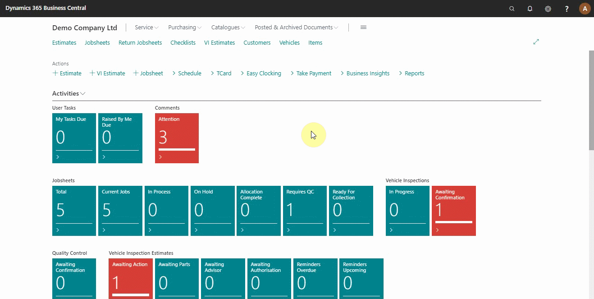
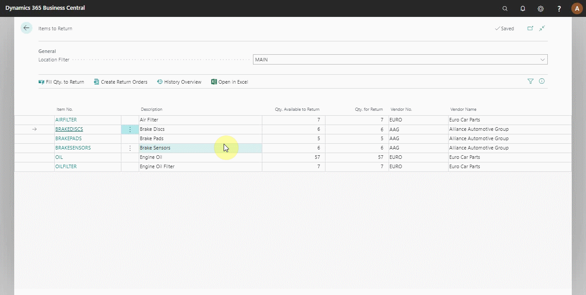

# Viewing Items to Return in Your Trial

The items to return report is the report of items you shouldn’t have in stock. The report is generated based on the following:
-	The item is not in a jobsheet
-	The item is not on a return order
-	The item doesn’t have a reorder policy

## In this article

1. [Open the items to return report](#open-the-items-to-return-report)
2. [View the history of items in the return report](#view-the-history-of-items-in-the-return-report)

### Open the items to return report
To access the items to return report from the **Role Centre** (home page):
1. Click on **Reports** from the actions bar. 
2. Point the mouse on **Additional** from the submenus, and select **Items to Return**, which opens a list of items to be returned.

### View the history of items in the return report
From the opened report of **Items to Return**:
1. Select an item you want to view the history.
2. Click on **History** from the actions bar.
3. Select **History Overview** (see below).

### **See Also**

[Video: How to use items to return](https://www.youtube.com/watch?v=WH-hKLISWds) \
[Create Your First Booking](garagehive-trial-creating-your-first-booking.html) \
[Adding Items and Labour to a Jobsheet](garagehive-trial-adding-items-and-labour-to-a-jobsheet.html) \
[Creating a Purchase Order](garagehive-trial-creating-a-purchase-order.html) \
[Processing a Purchase Order/Invoice](garagehive-trial-processing-a-purchase-order.html) \
[Creating a Purchase Return Order](garagehive-trial-creating-a-purchase-return-order.html) \
[Processing a Vehicle Arriving](garagehive-trial-processing-a-vehicle-arriving.html) \
[Processing a Jobsheet to Invoice](garagehive-trial-processing-a-jobsheet-to-invoice.html) \
[Creating an Estimate](garagehive-trial-creating-an-estimate.html) \
[Processing a Vehicle Inspection Estimate](garagehive-trial-processing-a-vehicle-inspection-estimate.html)