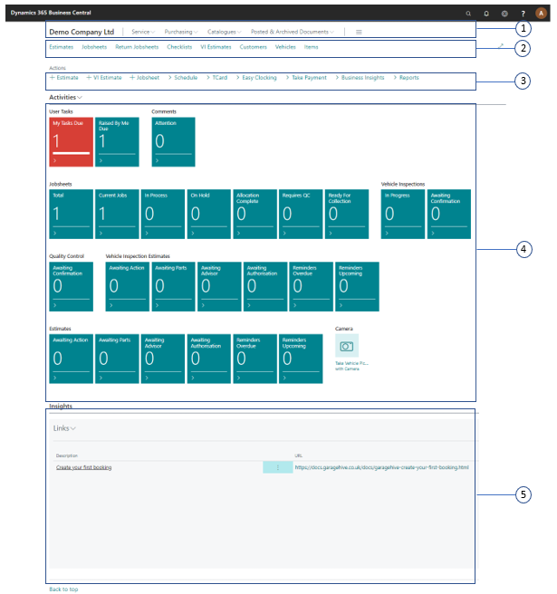
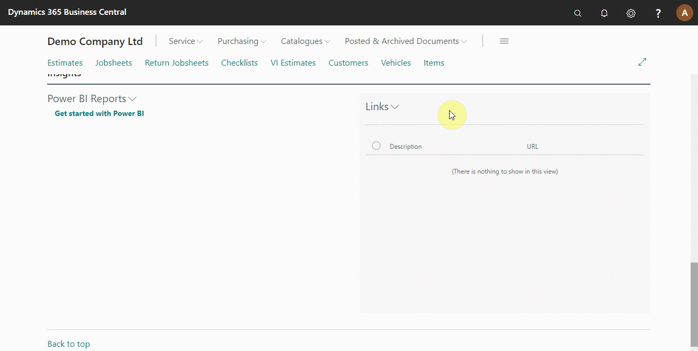

# Welcome to Your Trial Role Centre (Home Screen)
The Role Centre is your entry point and home page for your Garage Hive system. From this page, you will have quick access to the most important information to your daily work and easily navigate to relevant pages for viewing data and doing tasks.

### Role centre sections

The Service Advisor home screen (Role Centre) is divided into the following areas:    

#### 1. Navigation menu

The top-level navigation menu provides access to the main roles of the business, with the option to expand submenus relevant to the main roles. They include **Service**, **Purchasing**, **Catalogues** and **Posted/Archived Documents**.

To access the submenus under service: Click on **Service** and then select an option from the submenus menu.

#### 2. Navigation bar

The second-level navigation menu provides access to the most useful entities in the business process to help in quick navigation as soon as the home screen is opened.

To access the jobsheets page, click on **Jobsheets** from the navigation bar.

#### 3. Actions bar

The actions bar provides submenus of the most often used tasks that enable you to create a relevant page quickly.

To create a new estimate, click on **+Estimate**.

#### 4. Data cues

The data cues provide a visual representation of the business data, such as the number of total jobsheets created. There is a header on every data cue, which explains what the data is about.

Click on a specific data cue to access the specified data content. Sometimes the cues are red (depending on settings), which means a call to action for the service advisor.

#### 5. Chart

The Chart area shows a graphical and interactive representation of your business data from the **Power BI App**.

To connect to Power BI, click on **Power BI Reports** and select get **started with Power BI**, follow the prompts. For any support on this, please get in touch with our support team.

#### 6. Listpart page

The list Part page displays a list of the external links that you often use for easier access.

Click on the search icon (top right corner) and search **branch profile setup** to add external links. From the window that appears, select **Main** with the **Profile ID** of **GHV Service Advisor**, click **Links +**, and add the link with a description. Go back to the role centre (see below).

### **See Also**

[Video: Welcome to the role centre](https://www.youtube.com/watch?v=R_mLcdbFWdo).
