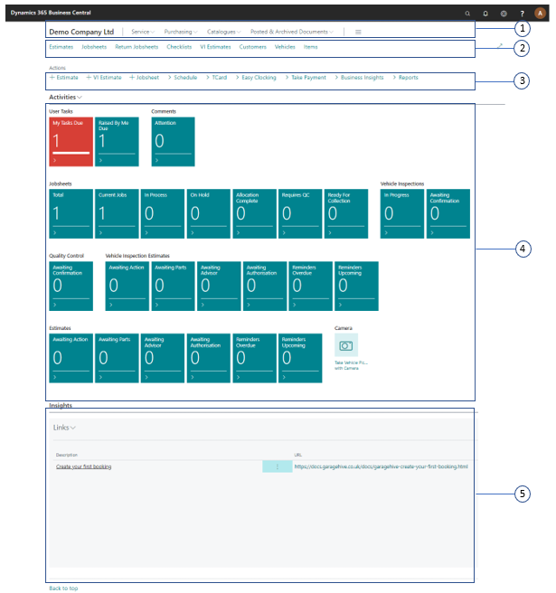

# Welcome to Your Trial Role Centre (Home Screen)
The Role Centre is your entry point and home page for your Garage Hive system. From this page, you will have quick access to the most important information to your daily work and easily navigate to relevant pages for viewing data and doing tasks.

### Role centre sections

The Service Advisor Role Centre (Home Screen) is divided into the following sections:    

#### 1. Navigation menu

The top-level navigation menu provides access to the main roles of the business, with the option to expand submenus relevant to the main roles. They include **Service**, **Purchasing**, **Catalogues** and **Posted/Archived Documents**.

To access the submenus under service:
1. Click on **Service**
2. Select an option from the submenus.

#### 2. Navigation bar

The second-level navigation menu provides access to the most useful entities in your business process, such as your customer, their vehicle and item data stored on the system. You can also check any open jobsheets, checklists, and estimates.

To access the jobsheets page, cLick on **Jobsheets** from the navigation bar.

#### 3. menu bar

The menu bar provides submenus of the most often used tasks that enable you to create a relevant page quickly.

To create a new estimate, click on **+Estimate**.

#### 4. Data tiles

Each tile provides a visual representation of business data, such as total jobsheets open and vehicle inspections, for the vehicles in your workshop booked in for repairs. These tiles will also change to red when action needs to be taken, which prompts you or your service advisor to open it to complete a task relevant to that tile.

Click on a specific data tile to access the specified data content.

#### 5. Web links Area

This area allows you to add commonly used web links such as Power BI, tyre or parts suppliers so you can click on them and open them up for easier access. To add a link or manage the list:
1. Click the **Links** down arrow and choose either **New** to add a new link or **Manage List** to manage the current list.
2. You can delete an existing link by selecting **Delete Line**.

   

### **See Also**

[Video: Welcome to the role centre](https://www.youtube.com/watch?v=R_mLcdbFWdo){:target="_blank"} \
[Create Your First Booking](garagehive-trial-creating-your-first-booking.html){:target="_blank"} \
[Adding Items and Labour to a Jobsheet](garagehive-trial-adding-items-and-labour-to-a-jobsheet.html){:target="_blank"} \
[Creating a Purchase Order](garagehive-trial-creating-a-purchase-order.html){:target="_blank"} \
[Processing a Purchase Order/Invoice](garagehive-trial-processing-a-purchase-order.html){:target="_blank"} \
[Viewing Items to Return](garagehive-trial-viewing-items-to-return.html){:target="_blank"} \
[Creating a Purchase Return Order](garagehive-trial-creating-a-purchase-return-order.html){:target="_blank"} \
[Processing a Vehicle Arriving](garagehive-trial-processing-a-vehicle-arriving.html){:target="_blank"} \
[Processing a Jobsheet to Invoice](garagehive-trial-processing-a-jobsheet-to-invoice.html){:target="_blank"} \
[Creating an Estimate](garagehive-trial-creating-an-estimate.html){:target="_blank"} \
[Processing a Vehicle Inspection Estimate](garagehive-trial-processing-a-vehicle-inspection-estimate.html){:target="_blank"}