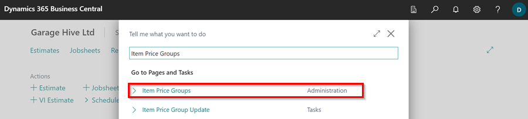
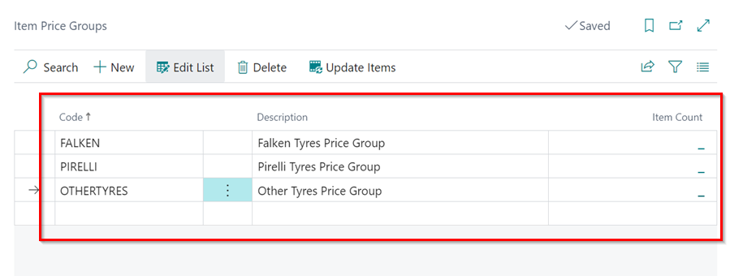
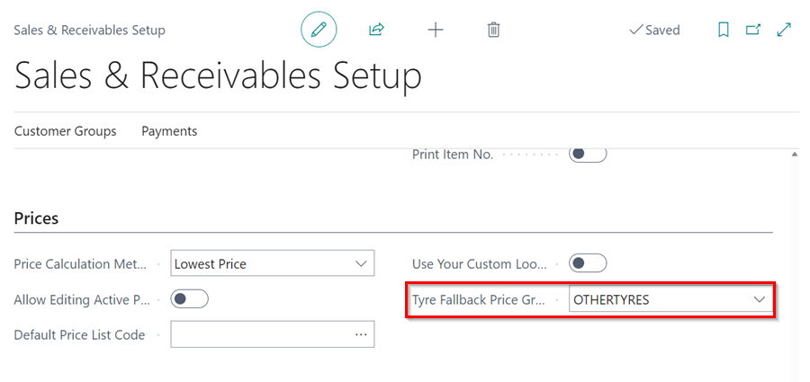
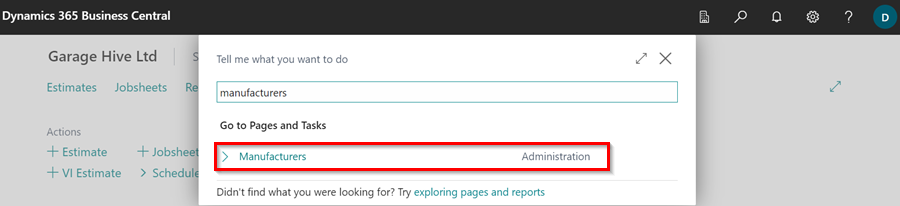
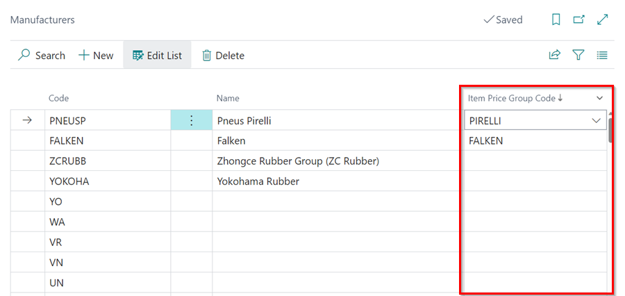
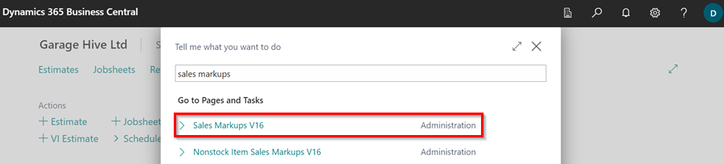
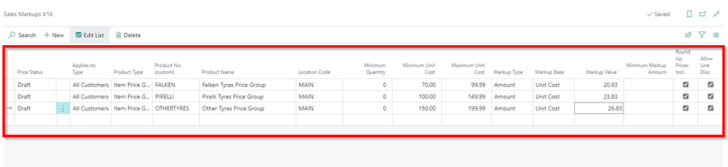
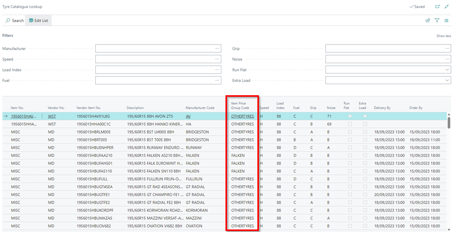

# How to Use Tyre Manufacturer Price Groups in Garage Hive
**Tyre Manufacturer Price Groups** is a pricing table in Garage Hive that links tyre manufacturers with the Item Price Groups. This helps pricing up the tyres and automatically adding markups for the tyres.

## In this article
1. [Creating an Item Price Group](#creating-an-item-price-group)
2. [Linking the Item Price Group to the Manufacturer](#linking-the-item-price-group-to-the-manufacturer)
3. [Setting Prices for the Item Price Groups](#setting-prices-for-the-item-price-groups)

### Creating an Item Price Group
To create Item Price Groups in the system:
1. In the top right corner, choose the  icon, enter **Item Price Groups**, and select the related link.

   

2. Create the price groups you require in the table that opens, and then add a fallback price group named **OTHERTYRES** for the tyres that don't have a price group to use.

   

3. You now need to set the **OTHERTYRES** price group as the fallback pricing group by default. Search for **Sales & Receivables Setup** in the top right corner  icon. Scroll down to the **Prices** FastTab, and select **OTHERTYRES** price group in the **Tyre Fallback Price Group Code** field.

   

4. The price groups can now be applied to items in the system.

[Go back to top](#top)

### Linking the Item Price Group to the Manufacturer
To link the Item Price Groups with the manufacturer in the system:
1. In the top right corner, choose the  icon, enter **Manufacturers**, and select the related link.

   

2. Scroll to the manufacturer to which you want to add a price group, and select the price group code in the **Item Price Group Code** column. If the column is hidden, you can make it visible by using [personalization](garagehive-personalising-garage-hive.html#adding-fields-to-pages){:target="_blank"}.

   

3. The Price groups are now linked to the specific manufacturers.

[Go back to top](#top)

### Setting Prices for the Item Price Groups
You can now set the prices for the Item Price Groups, using the **Sales Prices V16, Sales Markups V16 or Sales Discounts v16**. To set these prices:
1. In the top right corner, choose the  icon, enter **Sales Markups v16**, and select the related link.

   

2. Select the **Applies-to Type** as **All Customers**, the **Product Type** as **Item Price Group** and the **Product No.** as the price groups you have created. Set the costs and markups in the the other columns. Follow this link to learn more about [Automatic Sales Price, Sales Markup, and Sales Discount Calculations](garagehive-automatic-price-markup-and-discount-calculations.html).

   

3. The price Group in an Item Card is ignored and the manufacturers or fallback price group is used for tyres.
4. When you click on the **Tyre Catalogue** action in the Role Centre and search for a tyre, the **Item Price Group Code** column, will have the set price group for the manufacturer and those without a set price group will have **OTHERTYRES** price group as the fallback price group.

   

[Go back to top](#top)