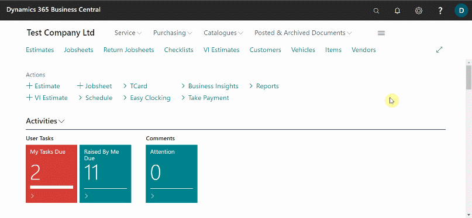
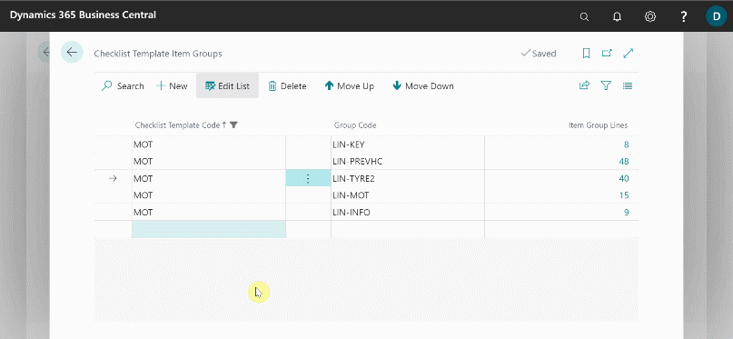
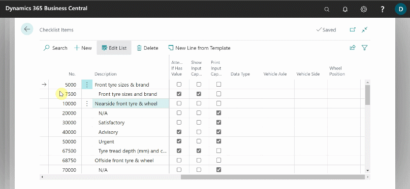

# Tyre Scanner Integration in Garage Hive

## In this article
1. [Tyre Scanner New Account Registration](#tyre-scanner-new-account-registration)
2. [Tyre Scanner System Setup](#tyre-scanner-system-setup)
3. [Tyre Scanner Checklist Template](#tyre-scanner-checklist-template)
4. [Getting the Tyre Scanner Report](#getting-the-tyre-scanner-report)
5. [Create VIE from the Tyre Scanner Report](#create-vie-from-the-tyre-scanner-report)

### Tyre Scanner New Account Registration
As a new **Tyre Scanner** customer, you should first register as follows:

 > # Tyre Scanner new account registration link: <ins>[tSCAN UK Account Information](https://docs.google.com/forms/d/e/1FAIpQLSfM5vv00IhOp3UTMwX0VPKpmUkvgaQle8uPVELZTlyVtbwBFw/viewform){:target="_blank"}</ins>

1. Click on the link above to enter the necessary information required for the creation and setup of your customer account.
2. To obtain the **Endpoint URL**, which is required in the form, select the  icon, enter **Tyre Scan Setup**, and select the related link.

   

3. In the **Tyre Scan Setup** page, click **Get Endpoint Url** and copy the URL from the pop-up notification.

     

4.  When you've finished filling out the form, click **Submit** and wait to hear back from the **tScan** team.

[Go back to top](#top)

### Tyre Scanner System Setup
To connect the **Tyre Scanner** to the system:
1. In the top right corner, choose the  icon, enter **Tyre Scan Setup**, and select the related link.

   

2. Create a new text template code to be used in the Checklists in the field **Alignment Text Template Code**. 
3. Click **New** at the bottom left of the drop-down list, enter the **Code** as **ALIGNMENT**, and enter the **Text** that will inform the customer about the report, such as "*Based on tyre thread depth scans, we recommend performing wheel alignment.*".
4. Select the **Align** service package in the **Service Package Filter** column to use when quoting for the alignment. When completed, click **OK**.
5. Then, to enable the Tyre Scan in the system, slide the **Enable** slider to the right.

   

[Go back to top](#top)

### Tyre Scanner Checklist Template
The Tyre Scanner is used in conjunction with the Checklist, which is where the Tyre Scan report is obtained. To achieve this, you should create a checklist template to be used with the tyre scanner report. Here's how to do it:
1. In the top right corner, choose the  icon, enter **Checklist Templates**, and select the related link.
2. Select the **MOT** checklist template from the list, and then click on **Linked Item Groups** in the menu bar.

   

3. Select the one related to the **Tyres** on the **Checklist Template Item Groups** page, and then click on the number in the column **Item Group Lines**. Click on **Edit List**, to enable editing on this page.
4. If the **Data Type**, **Vehicle Axle**, **Vehicle Side**, and **Wheel Position** columns are not visible in the **Checklist Items** page, add them through [personalisation](garagehive-personalising-garage-hive.html#adding-fields-to-pages){:target="_blank"} and move them closer together.

   

5. Customize the **Checklist Items** lines with tyres for the vehicle by filling in the following fields:

   | Checklist Item Description  | Data Type | Vehicle Axle | Vehicle Side | Wheel Position |
   | :-------------------------- | :-------- | :----------- | :----------- | :------------- |
   | Nearside front tyre & wheel | Tyres     | 1            | N/S          | Inner          |
   | Offside front tyre & wheel  | Tyres     | 1            | O/S          | Inner          |
   | Nearside rear tyre & wheel  | Tyres     | 2            | N/S          | Inner          |
   | Offside rear tyre & wheel   | Tyres     | 2            | O/S          | Inner          |
   | Wheel alignment             | Alignment | *blank*      | *blank*      | *blank*        |

   

6. Then, in the **Value Category** column, select **Satisfactory**, **Advisory**, and **Urgent** under each tyre, which should match the description on each line. When finished, close the pages.

   

7. This Checklist Template setup allows the system to automatically fill in the fields from the Tyre Scan.

[Go back to top](#top)

### Getting the Tyre Scanner Report
After scanning the tyres and sending the report to the system, you should create a new Checklist or select an existing one to get the Tyre Scanner Report. Here's how:
1. Open the Jobsheet for the vehicle in which you scanned the tyres and scroll down to the **Checklist** sub-page. Select **Create Vehicle Inspection**.

   

2. Then choose the **MOT** checklist template that you have already set up on the page that appears. Click **OK**.

   

3. Click on the Checklist **No.** to open it. To make the Checklist editable, click on the **Edit** icon at the top.
4. Select **Home** menu, then **Get Tyre Scan** from the menu bar, and the report will be applied to the Checklist.

   

5. Scroll down to the **Tyres and Wheels** section of the Checklist to see the applied report.
6. A comment and a photo have been added to each tyre line, and you can view the photo by clicking on the ellipsis (...) at the end of the line.

   

7. Select **Show Line Pictures**.

    

8. You can also view the Tyre Scanner's actual PDF report by selecting **Related** from the menu bar and then **Vehicle Tyre Scans**.

   

9.  Select **Open Report** from the **View** column on the **Tyre Scans Page**.

   

The Report looks like this.

   

[Go back to top](#top)

### Create VIE from the Tyre Scanner Report
1. To create a VIE from the tyre scanner report, select **Related** from the menu bar, then **Show VIE**.

   

2. If no VIE is linked with the checklist, the system will prompt you to create one; click **Yes**.

   

3. Select **Prepare** from the menu bar of the newly created VIE, followed by **Add Checklist Attention Lines**.

   

4. The checklist attention lines will be added in the VIE under the **Group Items** FastTab.

   

[Go back to top](#top)