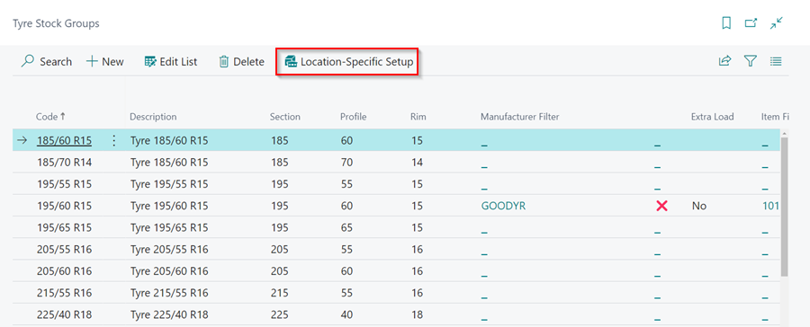
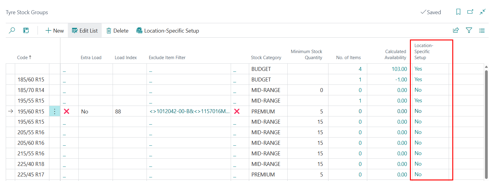

# Tyre Stock Groups
**Tyre Stock Groups** is a feature in Garage Hive where you can easily create and manage various tyre groups available in the market, allowing you to effectively organise your tyre inventory based on these groups.

## In this article
1. [Creating Tyre Stock Groups](#creating-tyre-stock-groups)
2. [Creating Tyre Stock Categories](#creating-tyre-stock-categories)
3. [Add Location Specific Setup to Tyre Stock Groups](#add-location-specific-setup-to-tyre-stock-groups)
4. [Enable Tyre Stock Group Ordering in Requisition Worksheet](#enable-tyre-stock-group-ordering-in-requisition-worksheet)

### Creating Tyre Stock Groups
To create **Tyre Stock Groups**:
1. In the top right corner, choose the  icon, enter **Tyre Stock Groups**, and select the related link.

   

2. In the **Tyre Stock Groups** page, select **New** from the menu bar.

   

3. Enter the details of the **Tyre Stock Group**. For example, enter the code for the tyre stock group as **195/60 R15** and specify the tyre's **Section**, **Profile**, and **Rim** sizes in their respective fields.

   

4. Other fields you can add include **Manufacturer** when you need to specify the tyres from a specific manufacturer, **Load Index** to specify the tyres weight a tyre can safely support when properly inflated, **Item Filters** when you want to have specific tyres in a group of their own, and **Minimum Stock Quantity** to set the number of minimum tyres to have in stock for the group.

   

5. You can have as many **Tyre Stock Groups** as you need.

   

[Go back to top](#top)

### Creating Tyre Stock Categories
**Tyre Stock Categories** help in categorising the **Tyre Stock Groups** based on the criteria you choose. Here is how to create the categories:
1. In the top right corner, choose the  icon, enter **Tyre Stock Categories**, and select the related link.

   

2. Enter the categories you want to use in the **Tyre Stock Categories** page. When you're finished, close the page.

   

3. Open the **Tyre Stock Groups** page, go to the **Stock Category** field, select the tyres to which you want to add a category and add the categories there.

   

[Go back to top](#top)

### Add Location Specific Setup to Tyre Stock Groups
Location Specific setup helps in the creation of the Tyre Stock Group for a specific location, meaning that it is only available in that location. To add **Location-Specific Setup**:
1. Open the **Tyre Stock Groups** page, select the **Tyre Stock Group** to which you want to add a location, and then select **Location-Specific Setup** from the menu bar.

   

2. Choose the location you want to have in the group. You can add one or more locations to the group. 
3. You could also specify the **Minimum Stock Quantity** for each location. When you're finished, close the page.

   

4. The other way to add the **Location** to a group is from the **Location-Specific Setup** column within the **Tyre Stock Groups** page. 
5. Select the group that you want to add a particular location, and click on the **Location-Specific Setup** column. If the page is not editable, make sure to click on **Edit List** to enable editing.

   

6. Select **New** from the menu bar, and choose the location you want to have in the group.

   

[Go back to top](#top)

### Enable Tyre Stock Group Ordering in Requisition Worksheet
If you want the requisition worksheet to work with Tyre Stock Groups instead of individual tyre items when selecting items to order, you need to create tyre placeholder items and categorise all the tyre stock groups. Here’s how to do it:
1. In the top right corner, choose the  icon, enter **Tyre Stock Groups**, and select the related link.

   

2. In the **Tyre Stock Placeholder Item** column, create new placeholder items for each category you have.

   

3. Make sure the item card is set up as a **Tyre** item template and marked as a **Placeholder Item**.

   

4. After adding a **Tyre Stock Placeholder Item** for each category, go to the tyre item card and add the **Reordering Policy** as **Maximum Qty.** and the **Reorder Point** as point when to reorder.

   

5.  In the **Tyre Fields** FastTab of the item card, ensure that the **Stock Category** is included.

   

6. Next, click on the **Items to Order** tile.

   

7. Click on **Calculate Plan** in the **Requisition Worksheet Express**, and it will give you the number of tyre category to order.

   

[Go back to top](#top)