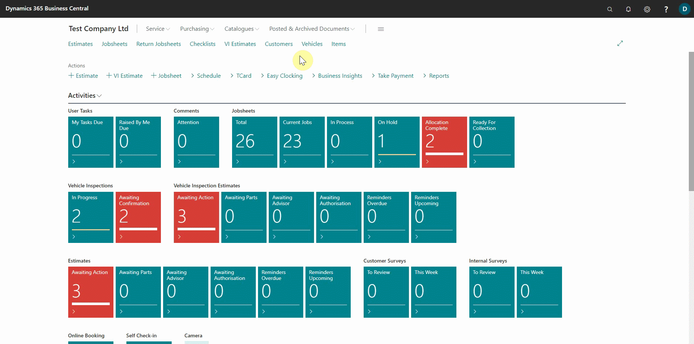

# Unapplying and reversing transactions
You may have applied a payment to the wrong invoice, made a payment to the wrong customer, completed the wrong transaction to a customer, and so on; in all of these cases, Garage Hive provides a way to have the transactions corrected or reversed.

## In this article
1. [Unapplying transactions](#unapplying-transactions)
2. [Reversing transactions](#reversing-transactions)

### Unapplying transactions
Unapplying payments means that you want to deallocate or unlink a transaction from a customer's invoice so that you can reallocate it to another one. To undo an applied transaction:
1. Select the customer's list from the role centre, and then select the customer to whom the transaction was incorrectly applied.
2. Select **Customer** and then **Ledger Entries** from the customer's card actions bar.

   

3. Select the payment that was incorrectly applied in the **Customer Ledger Entries** page, then go to the actions bar and select **Process** and then **Unapply Entries**.
4. Select the three dots at the top of the **Unapply Customer Entries** pop-up window to show more actions, then select **Unapply**. The transactions will now be successfully unapplied.

   

5. You can now re-apply the entry by selecting another customer's invoice.

### Reversing transactions

> **Note:**
>
> You can only reverse entries that are posted from journals.

Reversing transactions means completely undoing the entry and removing it from the system. To completely reverse a transaction, use the following process:
1. Select the customer's list from the role centre, and then select the customer to whom the transaction is applied.
2. Select **Customer** and then **Ledger Entries** from the customer's card actions bar.

   

3. Select the entry that you want to completely remove in the system from the **Customer Ledger Entries** page, then go to the actions bar and select **Process** and then **Reverse Transaction**.
4. Select **Reverse** from the actions menu in the **Reverse Transaction Entries** pop-up window (you can also select **Reverse and Print** to print the transaction). The transaction has now been reversed successfully.

   

 

### **See Also**

[Cash Receipt Journals](garagehive-finance-cash-receipt-journal.html) \
[Registering Customer Payments](garagehive-registering-customer-payments.html) \
[Reconcile Customer Payments Manually From a List of Unpaid Sales Documents](garagehive-finance-how-reconcile-customer-payments-list-unpaid-sales-documents.html) \
[Working with Payment Reconciliation Journals](garagehive-payment-reconciliation-journals.html)
