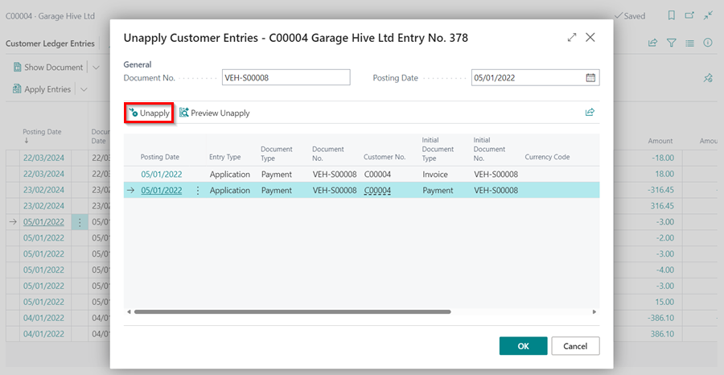

# Un-applying and Reversing Transactions
You may have applied a payment to the wrong invoice, made a payment to the wrong customer, completed the wrong transaction to a customer, and so on; in all of these cases, Garage Hive provides a way to have the transactions corrected or reversed.

## In this article
1. [Un&#8211;applying transactions](#un-applying-transactions)
2. [Reversing transactions](#reversing-transactions)

### Un-applying Transactions
Un-applying payments means that you want to deallocate or unlink a transaction from a customer's invoice so that you can reallocate it to another one. To undo an applied transaction:
1. Select the customer's list from the role centre, and then select the customer to whom the transaction was incorrectly applied.

   

2. Select **Customer** and then **Ledger Entries** from the customer's card menu bar.

   

3. Select the payment that was incorrectly applied in the **Customer Ledger Entries** page, then go to the menu bar and select **Home**, and then select the **Unapply Entries** option from the split button dropdown menu under **Apply Entries**.

   

4. Select **Unapply** in the **Unapply Customer Entries** pop-up window. Click **OK**. The transactions will now be successfully un-applied.

   

5. You can now re-apply the entry by selecting another customer's invoice.

### Reversing Transactions



Reversing transactions means completely undoing the entry and removing it from the system. To completely reverse a transaction, use the following process:
1. Select the customer's list from the Role Centre, and then select the customer to whom the transaction is applied.

   

2. Select **Customer** and then **Ledger Entries** from the customer's card menu bar.

   

3. Select the entry that you want to completely remove in the system from the **Customer Ledger Entries** page, then go to the menu bar and select **Home** and then **Reverse Transaction**.
4. Select **Reverse** from the actions menu in the **Reverse Transaction Entries** pop-up window (you can also select **Reverse and Print** to print the transaction). The transaction has now been reversed successfully.

   

 

### **See Also**

[Cash Receipt Journals](garagehive-finance-cash-receipt-journal.html){:target="_blank"} \
[Registering Customer Payments](garagehive-registering-customer-payments.html){:target="_blank"} \
[Reconcile Customer Payments Manually From a List of Unpaid Sales Documents](garagehive-finance-how-reconcile-customer-payments-list-unpaid-sales-documents.html){:target="_blank"} \
[Working with Payment Reconciliation Journals](garagehive-payment-reconciliation-journals.html){:target="_blank"}
